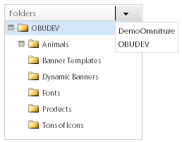
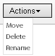
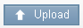
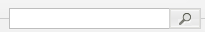
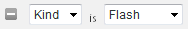
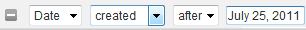

# Acerca de banners {#about-banners}

Puede utilizar Titulares para administrar las publicidades de banner que se encuentran en el sitio web.

## Uso de titulares {#concept_5BBE01FEC6134393B43CC917C8CC64DA}

<!-- 

c_about_banners.xml

 -->

Puede utilizar dos métodos para agregar publicidades de banner a su sitio web.

El primer método es agregar banners mediante Target, Search&amp;Promote. Los banners son fragmentos de código HTML que se muestran en el momento en que un cliente busca en el sitio web. El banner puede incluir texto o una imagen en formato GIF, JPEG o PNG, o una combinación de ambos. Puede seleccionar entre tamaños preestablecidos o definir sus propias dimensiones personalizadas para que se ajusten a su página. El código HTML que utiliza para mostrar el banner también puede especificar el estilo de fuente que se va a usar y el borde. Este método de añadir un banner ofrece funcionalidad básica y no requiere software adicional.

El segundo método es utilizar Adobe Dynamic Media Classic, un servicio de publicación y administración de medios dinámicos. Una cuenta de Adobe de Dynamic Media Classic válida le permite administrar y enviar contenido de banners directamente a Target, con Search&amp;Promote, mediante Dynamic Media Classic. En la búsqueda/comercialización del sitio, se configura el acceso a la cuenta de Dynamic Media Classic. A continuación, abra el explorador de medios de Dynamic Media Classic y elija un recurso de Dynamic Media que quiera que sirva como banner.

>[!NOTE]
>
>Para poder usar recursos de Dynamic Media como banners en la búsqueda o comercialización de sitios, primero se cargan y se preparan para su publicación en Scene7 Publishing System. Puede cargar recursos desde el interior de la búsqueda o comercialización del sitio y prepararlos automáticamente para su publicación por Scene7 Publishing System. O bien, puede cargar y publicar recursos desde Scene7 Publishing System.

## Integración de banners con Adobe Scene7 Publishing System {#section_D4D7ADEA6A6348E68EDA138E184FE579}

Puede utilizar los tipos de recursos de Dynamic Media Classic como banners en la búsqueda o comercialización de sitios, incluidas imágenes, banners dinámicos y plantillas, como plantillas de imágenes o plantillas de Flash.

Las plantillas son archivos de imagen en capas que se pueden crear y dirigir de forma dinámica, como archivos en capas en aplicaciones de edición de imágenes como Adobe Photoshop®. A diferencia de un archivo de imagen estático, una plantilla puede incluir parámetros. Mediante parámetros, puede personalizar propiedades de imagen variables y contenido de imagen.

>[!NOTE]
>
>También puede crear plantillas a partir de diseños basados en diseño mediante la Publicación de plantillas en Scene7 Publishing System y archivos de Adobe Illustrator y Adobe InDesign.

Consulte [Publicación de plantillas](https://help.adobe.com/en_US/scene7/using/WSFBFBAD30-2694-4b18-B7CE-894F9FC5CDDF.html) en la Guía del usuario de Dynamic Media Classic (Scene7).

Una plantilla puede contener cualquier número de capas de imagen y capas de texto. Puede convertir un archivo estático que contenga capas, como un archivo PSD en capas, en una plantilla o crear plantillas en Dynamic Media Classic. Puede crear capas de texto en plantillas utilizando las fuentes cargadas en Scene7 Publishing System. Después de agregar texto a una plantilla, puede darle formato cambiando su justificación, fuentes, tamaño de fuente y color.

Con la pantalla Parámetros de Dynamic Media Classic, puede convertir cualquier aspecto de una plantilla en un parámetro accesible. Al hacerlo, puede cambiar qué imagen en capas utilizar o qué valor de texto utilizar en la plantilla. Los parámetros se pasan con la cadena URL, lo que permite cambiar cualquier parámetro para personalizar dinámicamente la imagen de respuesta generada desde el servidor de imágenes.

Puede obtener más información sobre cómo utilizar Dynamic Media Classic para crear plantillas y parametrizar las propiedades de las capas para que pueda utilizarlas en banners.

Consulte [Conceptos básicos de plantilla](https://help.adobe.com/en_US/scene7/using/WS60B68844-9054-4099-BF69-3DC998A04D3C.html) en la Guía del usuario de Dynamic Media Classic (Scene7).

**Carga y publicación de recursos**

Debe cargar y publicar recursos en Dynamic Media Classic para poder utilizarlos en banners de búsqueda o comercialización de sitios. Este requisito previo también incluye los recursos que utiliza una plantilla de imagen o una plantilla de Flash. Utilice su cuenta de Dynamic Media Classic para cargar y publicar recursos digitales. O bien, puede usar la búsqueda o comercialización del sitio para cargar un recurso digital y hacer que Dynamic Media Classic lo publique automáticamente en función de la configuración de carga. Si intenta elegir un recurso que aún no se ha cargado ni publicado, se le notifica en la interfaz de usuario y se le da la opción de cargarlo antes de continuar.

Puede obtener más información sobre la carga y publicación de recursos digitales mediante Scene7 Publishing System.

Consulte [Cargar y publicar recursos](https://help.adobe.com/en_US/scene7/using/WS3673AD39-098B-4f08-8A24-CA51261B7366.html) en la Guía del usuario de Dynamic Media Classic (Scene7).

>[!NOTE]
>
>Para utilizar la funcionalidad de carga en el visualizador de recursos de Dynamic Media Classic, asegúrese de que la cuenta de Dynamic Media Classic que utiliza tenga la función &quot;Administrador de la empresa SPS&quot; ya establecida.

Consulte [Administration Setup](https://help.adobe.com/en_US/scene7/using/WS662101DF-D697-47a7-A7D8-B52FD8E94438.html) en la Guía del usuario de Dynamic Media Classic (Scene7).

**Cambio de los parámetros de plantilla de Dynamic Media Classic en un banner con reglas comerciales**

Si agregó un recurso de Dynamic Media Classic como banner, puede usar [!DNL Visual Rule Builder] en [!DNL Business Rules] para agregarlo a cualquier área de banner del sitio web. Por ejemplo, agregue el banner a las páginas de resultados de búsqueda, tal como lo haría con cualquier otro banner. También puede sustituir los valores de parámetro predeterminados en las plantillas de Dynamic Media Classic personalizándolos según sus necesidades específicas. Este tipo de funcionalidad le permite personalizar plantillas de Dynamic Media Classic con diferentes mensajes de marketing e hipervínculos a diferentes extremos.

Consulte también [Adición de una nueva regla comercial](../c-about-rules-menu/c-about-business-rules.md#task_BD3B31ED48BB4B1B8F1DCD3BFA2528E7).

Consulte también [Edición de una regla comercial](../c-about-rules-menu/c-about-business-rules.md#task_375CFA75D1D94D9E92A35DE1228E5087).

## Adición de un banner {#task_549D02B5F73B4158B105A94E39D937B7}

Puede utilizar [!DNL Banners] para administrar las publicidades de banner y dónde se colocan en el sitio web. Al añadir un banner, hace referencia a la imagen externamente mediante fragmentos de código HTML que se muestran en el momento de la búsqueda.

<!-- 

t_adding_a_new_banner.xml

 -->

Si tiene una cuenta de Adobe de Dynamic Media Classic válida, puede agregar anuncios de banners a través de Scene7 Publishing System.

Consulte [Adición de un banner con Adobe Dynamic Media Classic](../c-about-design-menu/c-about-banners.md#task_AD1E0C00A9E04B1FA819EB93288786B3).

Consulte [Configuración del acceso a su cuenta de Adobe Dynamic Media Classic](../c-about-settings-menu/c-about-account-options-menu.md#task_CEFF88C2033D41D0B2FE86C435EDAC6D).

**Para agregar un banner**

1. En el menú del producto, haga clic en **[!UICONTROL Design]** > **[!UICONTROL Banners]**.
1. En la página [!DNL Banners], en la lista desplegable **[!UICONTROL Add Banner]**, seleccione **[!UICONTROL HTML code]**.
1. En el cuadro de diálogo [!DNL Add Banner], defina las opciones que desee.

   <table> 
    <thead> 
      <tr> 
      <th colname="col1" class="entry"> 
Opción 
 </th> 
      <th colname="col2" class="entry"> 
Descripción 
 </th> 
      </tr> 
    </thead>
    <tbody> 
      <tr> 
      <td colname="col1"> 
Nombre 
 </td> 
      <td colname="col2"> 
Requerido. Identifica el nombre del banner. El nombre se usa para hacer referencia al banner cuando se agrega en el Generador de reglas visuales en Reglas comerciales. El nombre no aparece en el propio banner. 
 
Consulte <a href="../c-about-rules-menu/c-about-business-rules.md#task_BD3B31ED48BB4B1B8F1DCD3BFA2528E7" type="task" format="dita" scope="local"> Adición de una nueva regla comercial.</a> 
 </td> 
      </tr> 
      <tr> 
      <td colname="col1"> 
Banner HTML 
 </td> 
      <td colname="col2"> 
 Permite pegar el código HTML asociado al banner. 
 
Cualquier código HTML es aceptable, incluido el código CSS rodeado por 
        etiquetas <code>
          &lt;style&gt; 
        </code> o código JavaScript rodeado de 
        <code>
          &lt;script&gt; 
        </code> . Por ejemplo, el siguiente bloque de código es para un banner de texto del tipo Horizontal top : <code> &lt;div&nbsp;style="width:&nbsp;684px;&nbsp;background-image:&nbsp;url('https://www.brough.com/blackb.gif');&nbsp; 
          padding-top:&nbsp;10px;&nbsp;padding-bottom:&nbsp;10px;&nbsp;color:&nbsp;white;&nbsp;font-family:&nbsp;verdana;&nbsp; 
          text-align:&nbsp;center;&nbsp;font-size:&nbsp;20px;"&gt;&nbsp;Sound&nbsp;Study&nbsp;ships&nbsp;free!&nbsp;&lt;/div&gt; </code>En el siguiente ejemplo, el bloque de código es para una imagen de inicio completa: <code> &lt;img&amp;nbsp;src='https://geometrixx.com/images/GEOAds/geometrixx-beauty-home-01.jpg'&amp;nbsp;border="0"&amp;nbsp;/&gt; </code> 
 </td> 
      </tr> 
      <tr> 
      <td colname="col1"> 
Tipo  
 </td> 
      <td colname="col2"> 
Especifica los siguientes tipos de banners: 
        <ul id="ul_6423AEDB9E664049989EB529D63C4A62"> 
          <li id="li_BF6CD60B3ED748D49CFFB9C5D607661C">  [nuevo tipo]   
Permite especificar el tipo de banner que desea, incluidas las dimensiones y el nombre. 
 </li> 
          <li id="li_1A29AB22AD644E60A12298187B5E898E">  Completo splash   
La dimensión establecida de este tipo de banner es de 680 píxeles de ancho y 650 píxeles de alto. Si lo desea, puede especificar el nombre del tipo o aceptar el nombre predeterminado que es el nombre del tipo de banner en sí. 
 </li> 
          <li id="li_2BE06D013CB54DDE851051BFC038BB57">  Superior horizontal   
 El banner se coloca en la parte superior del sitio web. Este tipo es útil si desea agregar hipervínculos a la izquierda o a la derecha del banner. La dimensión establecida de este tipo de banner es de 468 píxeles de ancho y 60 píxeles de alto. Si lo desea, puede especificar el nombre del tipo o aceptar el nombre predeterminado que es el nombre del tipo de banner en sí. 
 </li> 
          <li id="li_EC35AB92234749F08AA8A9BD26D0EA8D">  Parte superior horizontal: anchura completa   
Este tipo es el predeterminado cuando se agrega un banner nuevo. El banner se coloca en la parte superior del sitio web y ocupa toda la anchura de la página. La dimensión establecida de este tipo de banner es de 670 píxeles de ancho y 150 píxeles de alto. Si lo desea, puede especificar el nombre del tipo o aceptar el nombre predeterminado que es el nombre del tipo de banner en sí. 
 </li> 
        </ul> 
 </td> 
      </tr> 
      <tr> 
      <td colname="col1"> 
Etiquetas 
 </td> 
      <td colname="col2"> 
Agrega etiquetas o "palabras clave" que desea asociar al banner. Si utiliza muchos banners, la adición de etiquetas puede ayudarle a restringir la búsqueda de banners para que pueda localizar rápidamente el banner adecuado según sus necesidades. También puede eliminar las etiquetas que haya añadido. 
 </td> 
      </tr> 
    </tbody> 
    </table>

1. Haga clic **[!UICONTROL Save]**.
1. (Opcional) Realice una de las siguientes acciones:

   * Haga clic en **[!UICONTROL History]** para revertir cualquier cambio que haya realizado.

      Consulte [Uso de la opción Historial](../t-using-the-history-option.md#task_70DD3F87A67242BBBD2CB27156F43002).

   * Haga clic **[!UICONTROL Live]**.

      Consulte [Visualización de la configuración de lanzamiento](../c-about-staging.md#task_401A0EBDB5DB4D4CA933CBA7BECDC10F).

   * Haga clic **[!UICONTROL Push Live]**.

      Consulte [Inserción de la configuración del escenario en directo](../c-about-staging.md#task_44306783B4C0408AAA58B471DAF2D9A4).

## Edición de un banner {#task_D4081083BE7B40F5A003D1A2F1435AEA}

Utilice [!DNL Edit Banner] para cambiar cosas como el nombre del banner, el HTML del banner, el tipo de banner y las etiquetas asociadas.

<!-- 

t_editing_a_banner.xml

 -->

Si agregó un banner mediante la búsqueda o comercialización del sitio, también edite el banner con Adobe Dynamic Media Classic.

Consulte también [Edición de un banner con Adobe Dynamic Media Classic](../c-about-design-menu/c-about-banners.md#task_C3E782477FBF428ABEA220751781ACA9).

**Para editar un banner**

1. En el menú del producto, haga clic en **[!UICONTROL Design]** > **[!UICONTROL Banners]**.
1. En la página [!DNL Banners], haga clic en .

   encima de la miniatura del banner que desea editar.
1. En la página [!DNL Edit Banner], configure las opciones que desee.

   Consulte la tabla de opciones en [Adición de un banner](../c-about-design-menu/c-about-banners.md#task_549D02B5F73B4158B105A94E39D937B7).
1. Cuando haya terminado de editar el banner, haga clic en **[!UICONTROL Save]**.
1. (Opcional) Realice una de las siguientes acciones:

   * Haga clic en **[!UICONTROL History]** para revertir cualquier cambio que haya realizado.

      Consulte [Uso de la opción Historial](../t-using-the-history-option.md#task_70DD3F87A67242BBBD2CB27156F43002).

   * Haga clic **[!UICONTROL Live]**.

      Consulte [Visualización de la configuración de lanzamiento](../c-about-staging.md#task_401A0EBDB5DB4D4CA933CBA7BECDC10F).

   * Haga clic **[!UICONTROL Push Live]**.

      Consulte [Inserción de la configuración del escenario en directo](../c-about-staging.md#task_44306783B4C0408AAA58B471DAF2D9A4).

## Adición de un banner con Adobe Dynamic Media Classic {#task_AD1E0C00A9E04B1FA819EB93288786B3}

Puede utilizar [!DNL Banners] para administrar las publicidades de banner del sitio web. Al agregar un banner con Adobe Dynamic Media Classic, puede elegir entre cualquier recurso digital que haya cargado en Scene7 Publishing System.

<!-- 

t_adding_a_banner_using_adobe_scene7.xml

 -->

Para agregar un banner con Adobe Dynamic Media Classic, asegúrese de que ha configurado el acceso a su cuenta válida de Dynamic Media Classic.

Consulte [Configuración del acceso a su cuenta de Adobe Dynamic Media Classic](../c-about-settings-menu/c-about-account-options-menu.md#task_CEFF88C2033D41D0B2FE86C435EDAC6D).

**Adición de un banner con Adobe Dynamic Media Classic**

1. En el menú del producto, haga clic en **[!UICONTROL Design]** > **[!UICONTROL Banners.]**
1. En la página [!DNL Banners], en la lista desplegable **[!UICONTROL Add Banner]**, haga clic en **[!UICONTROL Adobe Scene7]**.
1. En el cuadro de diálogo [!DNL Pick an Asset], en el panel izquierdo, utilice las opciones de navegación de la interfaz de usuario para localizar la carpeta que contiene el recurso digital que desea utilizar para un banner.

   Con la excepción de las opciones de navegación de recursos, todas las demás opciones dependen del recurso digital que haya seleccionado para agregar o editar.

   Utilice las opciones de navegación de recursos para localizar un recurso que desee utilizar para un nuevo titular en la búsqueda o comercialización del sitio. Las opciones de navegación se aplican a todos los tipos de recursos digitales seleccionados.

   >[!NOTE]
   >
   >Las opciones de navegación de recursos no aparecen cuando edita el banner en el cuadro de diálogo [!DNL Change Parameters].

   Consulte [Edición de un banner con Adobe Dynamic Media Classic](../c-about-design-menu/c-about-banners.md#task_C3E782477FBF428ABEA220751781ACA9).

   **Opciones de navegación de recursos**

   <table> 
    <thead> 
      <tr> 
      <th colname="col1" class="entry"> 
Opción de navegación 
 </th> 
      <th colname="col2" class="entry"> 
Descripción 
 </th> 
      </tr> 
    </thead>
    <tbody> 
      <tr> 
      <td colname="col1"> 
  
 </td> 
      <td colname="col2"> 
Permite seleccionar la cuenta de Dynamic Media Classic para una empresa en particular en la lista desplegable y también navegar por las carpetas de recursos digitales dentro de esa cuenta. 
 
Cuando selecciona una carpeta, el panel derecho del cuadro de diálogo  Elegir un recurso  le muestra todos los recursos digitales disponibles que se encuentran en esa carpeta. 
 </td> 
      </tr> 
      <tr> 
      <td colname="col1"> 
  
 </td> 
      <td colname="col2"> 
Permite avanzar o retroceder por el historial de navegación de carpetas. 
 </td> 
      </tr> 
      <tr> 
      <td colname="col1"> 
  
 </td> 
      <td colname="col2"> 
Actualiza la lista de recursos digitales que se muestran para una carpeta seleccionada. 
 
Es posible que tenga que hacer clic en este control si mueve, elimina o cambia el nombre de un recurso seleccionado mediante la lista desplegable  Acciones  . 
 </td> 
      </tr> 
      <tr> 
      <td colname="col1"> 
  
 </td> 
      <td colname="col2"> 
Muestra recursos digitales en una vista de lista. La lista muestra el icono o la imagen en miniatura asociados a cada recurso, el nombre del archivo, el tipo de recurso digital, las dimensiones (cuando corresponda) y la fecha en la que se editó por última vez. 
 
La vista de cuadrícula muestra los recursos digitales de la carpeta seleccionada como iconos, miniaturas o ambos. 
 </td> 
      </tr> 
      <tr> 
      <td colname="col1"> 
  
 </td> 
      <td colname="col2"> 
En la vista de lista, puede mover, eliminar o cambiar el nombre de un recurso digital seleccionado. 
 
En la vista de cuadrícula, puede mover o eliminar uno o varios recursos digitales seleccionados. 
 </td> 
      </tr> 
      <tr> 
      <td colname="col1"> 
  
 </td> 
      <td colname="col2"> 
Abre el cuadro de diálogo  Cargar  donde puede cargar un recurso digital seleccionado desde el escritorio o desde un servidor externo para que pueda utilizarlo como titular. 
 
Después de cargar el recurso, se programa automáticamente un trabajo de publicación en Scene7 Publishing System. 
 
Consulte la tabla de opciones en <a href="../c-about-design-menu/c-about-banners.md#task_AD1E0C00A9E04B1FA819EB93288786B3" type="reference" format="dita" scope="local"> Adición de un banner con Adobe Dynamic Media Classic </a>. 
 
Puede obtener más información sobre la carga y publicación de recursos digitales mediante Scene7 Publishing System. 
 
Consulte <a href="https://help.adobe.com/en_US/scene7/using/WS3673AD39-098B-4f08-8A24-CA51261B7366.html" scope="external" format="html"> Cargar y publicar recursos </a> en la Guía del usuario de Scene7 Publishing System. 
 </td> 
      </tr> 
      <tr> 
      <td colname="col1"> 
  
 </td> 
      <td colname="col2"> 
Permite buscar un recurso digital por palabra clave o por ubicación de archivo dentro de la carpeta seleccionada y sus subcarpetas asociadas. 
 
Al hacer clic en el campo de búsqueda, se agrega automáticamente un campo de filtro opcional. 
 </td> 
      </tr> 
      <tr> 
      <td colname="col1"> 
  
 </td> 
      <td colname="col2"> 
Agrega otro filtro de recursos para que pueda refinar aún más la lista de recursos digitales mostrados por tipo o por una fecha específica. 
 </td> 
      </tr> 
      <tr> 
      <td colname="col1"> 
  
 </td> 
      <td colname="col2"> 
Refine la lista de recursos digitales mostrados para mostrar solo aquellos de un tipo determinado, como Flash, Imagen, Plantilla o Cualquiera. 
 
Haga clic en  para eliminar el filtro de la búsqueda. 
 </td> 
      </tr> 
      <tr> 
      <td colname="col1"> 
  
 </td> 
      <td colname="col2"> 
Refine la lista de recursos digitales mostrados para mostrar solo aquellos creados o editados antes de una fecha determinada o después de una fecha determinada. 
 
Haga clic en  para eliminar el filtro de la búsqueda. 
 </td> 
      </tr> 
      <tr> 
      <td colname="col1"> 
  
 </td> 
      <td colname="col2"> 
Permite arrastrar el control deslizante hacia la izquierda o la derecha para reducir o ampliar la vista completa del panel de recursos digitales, respectivamente. 
 </td> 
      </tr> 
    </tbody> 
    </table>

   **Opciones de Propiedades**

   Las opciones Propiedades aparecen si elige una plantilla de Flash, una plantilla de imagen o una imagen. Según el recurso digital que haya elegido, no todas las opciones están disponibles.

   <table> 
    <thead> 
      <tr> 
      <th colname="col1" class="entry"> 
Opción Propiedades 
 </th> 
      <th colname="col2" class="entry"> 
Descripción 
 </th> 
      </tr> 
    </thead>
    <tbody> 
      <tr> 
      <td colname="col1"> 
Nombre 
 </td> 
      <td colname="col2"> 
Nombre descriptivo de la plantilla o imagen, sin espacios en blanco. Si lo desea, puede incluir la especificación de tamaño de imagen en el nombre para ayudar a los usuarios a identificar el recurso. 
 </td> 
      </tr> 
      <tr> 
      <td colname="col1"> 
Formato 
 </td> 
      <td colname="col2"> 
Identifica el formato de la imagen o de la plantilla de imagen. 
 
Puede elegir entre los siguientes formatos: 
 
        <ul id="ul_9A19421BCC424CF585645049DCB87F10"> 
        <li id="li_A4913D783BD547F9AFA1A259C56EC2B3">jpeg </li> 
        <li id="li_66237D7BE8754FB0B0088CE5A02C0214">png </li> 
        <li id="li_4EDDFD7C8AB04677BEC20EFC9AEBBF1F">png-alfa </li> 
        <li id="li_4FCB03C29AE647ACBAF5105016DF7579">gif </li> 
        <li id="li_B884BD7DFF1845FAA9C58EF09B888A77">gif-alfa </li> 
        </ul> 
Esta opción no se aplica a las plantillas de Flash. 
 </td> 
      </tr> 
      <tr> 
      <td colname="col1"> 
Calidad 
 </td> 
      <td colname="col2"> 
Controla el nivel de compresión de las imágenes en formato JPEG o GIF. Esta configuración afecta tanto al tamaño del archivo como a la calidad de la imagen. La escala de calidad es de 1-100. 
 
Cuando arrastra el control deslizante a la izquierda o a la derecha, la imagen de la ventana de vista previa se actualiza para reflejar el cambio en la calidad. 
 
Esta opción no se aplica a las plantillas de Flash. 
 </td> 
      </tr> 
      <tr> 
      <td colname="col1"> 
Anchura 
 </td> 
      <td colname="col2"> 
Especifica el ancho del recurso digital, en píxeles. Esta dimensión es la anchura con la que el recurso lo ven los clientes que visitan el sitio web. 
 
Esta opción no se aplica a las plantillas de Flash. 
 </td> 
      </tr> 
      <tr> 
      <td colname="col1"> 
Altura 
 </td> 
      <td colname="col2"> 
Especifica el alto del recurso digital, en píxeles. Esta dimensión es la altura con la que los clientes que visitan el sitio web ven el recurso. 
 
Esta opción no se aplica a las plantillas de Flash. 
 </td> 
      </tr> 
    </tbody> 
    </table>

   **Opciones de Banner Link**

   Las opciones de Banner Link solo aparecen si elige una imagen o una plantilla de imagen para el banner.

   <table> 
    <thead> 
      <tr> 
      <th colname="col1" class="entry"> 
Opción Banner Link 
 </th> 
      <th colname="col2" class="entry"> 
Descripción 
 </th> 
      </tr> 
    </thead>
    <tbody> 
      <tr> 
      <td colname="col1"> 
Dirección URL del vínculo 
 </td> 
      <td colname="col2"> 
Especifica la dirección URL a la que desea que se vincule el banner cuando un cliente haga clic en la imagen. 
 
Si no desea que el banner se vincule a nada, deje el campo URL del vínculo en blanco. 
 </td> 
      </tr> 
      <tr> 
      <td colname="col1"> 
Target 
 </td> 
      <td colname="col2"> 
Especifica dónde abrir el banner vinculado, como una nueva ventana del explorador o una nueva pestaña. 
 </td> 
      </tr> 
    </tbody> 
    </table>

   **Opción Modificar vínculos**

   La opción Modificar vínculos aparece únicamente si elige una plantilla de Flash para el banner.

   <table> 
    <thead> 
      <tr> 
      <th colname="col1" class="entry"> 
Opción Modificar vínculos 
 </th> 
      <th colname="col2" class="entry"> 
Descripción 
 </th> 
      </tr> 
    </thead>
    <tbody> 
      <tr> 
      <td colname="col1"> 
  
 </td> 
      <td colname="col2"> 
Permite editar el campo de vínculo URL que se utiliza en la plantilla de Flash. 
 </td> 
      </tr> 
    </tbody> 
    </table>

   **Reemplazar opciones de texto**

   Las opciones Reemplazar texto solo aparecen si elige una plantilla de Flash para el banner que tenga capas de texto editables.

   Los cambios que realice en el texto de la plantilla de Flash se reflejarán en la ventana Vista previa.

   >[!NOTE]
   >
   >Si agrega un comando de búsqueda y reemplazo para reemplazar &quot;vaca&quot; por &quot;manzana&quot; y luego crea un segundo comando para reemplazar &quot;manzana&quot; por &quot;naranja&quot;, el segundo comando no tendrá efecto.

   <table> 
    <thead> 
      <tr> 
      <th colname="col1" class="entry"> 
Opción Reemplazar texto 
 </th> 
      <th colname="col2" class="entry"> 
Descripción 
 </th> 
      </tr> 
    </thead>
    <tbody> 
      <tr> 
      <td colname="col1"> 
  
 </td> 
      <td colname="col2"> 
Agrega un campo de búsqueda y reemplazo. 
 </td> 
      </tr> 
      <tr> 
      <td colname="col1"> 
  
 </td> 
      <td colname="col2"> 
Elimina un campo Buscar y reemplazar y restaura el texto utilizado anteriormente. 
 </td> 
      </tr> 
      <tr> 
      <td colname="col1"> 
Búsqueda  
 </td> 
      <td colname="col2"> 
Permite introducir un término de búsqueda de texto no vinculado dentro de las capas de la plantilla de Flash. 
 </td> 
      </tr> 
      <tr> 
      <td colname="col1"> 
Sustituya 
 </td> 
      <td colname="col2"> 
Permite especificar el texto que desea insertar en lugar del texto que busca. 
 
Al pulsar  Entrar  en este campo, la ventana de vista previa se actualiza con el texto de reemplazo. 
 </td> 
      </tr> 
    </tbody> 
    </table>

   **Opciones de parámetros**

   Las opciones de parámetros solo aparecen si elige una plantilla de imagen o una plantilla de Flash para el banner. Las opciones reales del parámetro varían en función de cómo se haya creado y parametrizado la plantilla en Scene7 Publishing System. Por ejemplo, la plantilla puede tener campos parametrizados que le permitan cambiar cosas como texto, estilo de fuente, precio, códigos especiales utilizados para el envío gratuito, el tamaño de la imagen dentro del banner o incluso buscar una imagen diferente para usar.

   >[!NOTE]
   >
   >Tenga en cuenta que cualquier cambio que realice en los parámetros puede anularse mediante reglas comerciales. Los parámetros solo sirven como predeterminados cuando no se crean reglas comerciales que, de lo contrario, cambiarían los parámetros.

   Consulte [Adición de una nueva regla comercial](../c-about-rules-menu/c-about-business-rules.md#task_BD3B31ED48BB4B1B8F1DCD3BFA2528E7).

   Consulte [Edición de una regla comercial](../c-about-rules-menu/c-about-business-rules.md#task_375CFA75D1D94D9E92A35DE1228E5087).

   **Alternar las opciones de visibilidad de capa**

   La opción Alternar visibilidad de capa se aplica solo si elige una plantilla de Flash para el banner.

   <table> 
    <thead> 
      <tr> 
      <th colname="col1" class="entry"> 
Alternar la opción Visibilidad de capa 
 </th> 
      <th colname="col2" class="entry"> 
Descripción 
 </th> 
      </tr> 
    </thead>
    <tbody> 
      <tr> 
      <td colname="col1"> 
  
 </td> 
      <td colname="col2"> 
Permite activar o desactivar la visibilidad de las distintas capas que componen el archivo de plantilla de Flash. 
 
Cada vez que se activa o desactiva la visibilidad de una capa, se actualiza la ventana de vista previa para actualizar la visualización. 
 </td> 
      </tr> 
    </tbody> 
    </table>

   (Opcional) Si el recurso digital que desea utilizar para un banner no está disponible en la carpeta seleccionada, es posible que tenga que cargarlo. Haga clic en **[!UICONTROL Upload]** y, a continuación, seleccione el archivo y las opciones que desee. El archivo se carga en la carpeta seleccionada.

   >[!NOTE]
   >
   >Si desea utilizar la funcionalidad de carga en el visualizador de recursos de Scene7, asegúrese de que la cuenta de Scene7 que utiliza tenga la función &quot;Administrador de la empresa SPS&quot; ya establecida.

   Consulte [Configuración de administración](https://help.adobe.com/en_US/scene7/using/WS662101DF-D697-47a7-A7D8-B52FD8E94438.html) en la Guía del usuario de Scene7 Publishing System.

   **Opciones básicas**

   <table> 
    <thead> 
      <tr> 
      <th colname="col1" class="entry"> 
Opción 
 </th> 
      <th colname="col2" class="entry"> 
Descripción 
 </th> 
      </tr> 
    </thead>
    <tbody> 
      <tr> 
      <td colname="col1"> 
Exploración 
 </td> 
      <td colname="col2"> 
 Permite explorar el archivo que desea cargar, publicar y, a continuación, seleccionar para utilizarlo como titular. 
 </td> 
      </tr> 
      <tr> 
      <td colname="col1"> 
 Sobrescribir 
 </td> 
      <td colname="col2"> 
Los archivos que cargue reemplazan los archivos existentes con el mismo nombre de archivo, dentro de la carpeta seleccionada. 
 </td> 
      </tr> 
      <tr> 
      <td colname="col1"> 
Preferencia de correo electrónico 
 </td> 
      <td colname="col2"> 
 Le permite elegir la notificación por correo electrónico que recibirá para la carga, o bien puede optar por no recibir notificaciones para nada relacionado con el trabajo de carga. 
 </td> 
      </tr> 
    </tbody> 
    </table>

   **Opciones avanzadas**

   Al cargar archivos de imagen PostScript (EPS) o Illustrator (AI), puede aplicarles formato de varias formas. Puede rasterizar los archivos, convertirlos a FXG para la publicación de plantillas, mantener el fondo transparente, elegir una resolución y elegir un espacio de color.

   Los PSD (archivos de documento de Photoshop) se usan con mayor frecuencia en Dynamic Media Classic para crear plantillas. Al cargar un archivo PSD, puede crear una plantilla de Dynamic Media Classic automáticamente desde el archivo (seleccione la opción **[!UICONTROL Create Template]**).

   Scene7 Publishing System crea varias imágenes de un archivo PSD con capas si utiliza el archivo para crear una plantilla; crea una imagen para cada capa.

   <table> 
    <thead> 
      <tr> 
      <th colname="col1" class="entry"> 
Nombre del grupo de opciones 
 </th> 
      <th colname="col02" class="entry"> 
Opción 
 </th> 
      <th colname="col2" class="entry"> 
Descripción 
 </th> 
      </tr> 
    </thead>
    <tbody> 
      <tr> 
      <td colname="col1"> 
Opciones de perfil de color 
 </td> 
      <td colname="col02"> 
Perfil de color 
 </td> 
      <td colname="col2"> 
 Permite elegir entre las siguientes opciones: 
 
        <ul id="ul_6927BC08CA2647EDB2C85DAD2B82AE31"> 
        <li id="li_CA3F44FF9C0F4CE987DCB0AF9303C2E4">  Convertir a SRGB   
Se convierte a SRGB (estándar rojo verde azul). SRGB es el espacio de color recomendado para mostrar imágenes en páginas web. 
 </li> 
        <li id="li_FCCEE6B14CCD4246ADA152932010ABF1">  Mantener espacio de color original   
Conserva el espacio de color original. 
 </li> 
        </ul> </td> 
      </tr> 
      <tr> 
      <td colname="col1"> 
Opciones de edición de imágenes 
 </td> 
      <td colname="col02"> 
Crear máscara a partir de la ruta de recorte 
 </td> 
      <td colname="col2"> 
Cree una máscara para la imagen en función de su información de ruta de recorte. Esta opción se aplica a las imágenes creadas con aplicaciones de edición de imágenes en las que se creó una ruta de recorte. 
 </td> 
      </tr> 
      <tr> 
      <td colname="col1"> 
Opciones de PostScript 
 
Opciones de Illustrator 
 </td> 
      <td colname="col02"> 
Procesando 
 </td> 
      <td colname="col2"> 
  La   opción Rasterizar convierte los gráficos vectoriales del archivo al formato de mapa de bits. 
 </td> 
      </tr> 
      <tr> 
      <td colname="col1"> 
 Opciones de Postscript 
 
Opciones de Illustrator 
 </td> 
      <td colname="col02"> 
 Resolución 
 </td> 
      <td colname="col2"> 
 Determina la configuración de resolución. Esta configuración determina cuántos píxeles se muestran por pulgada en el archivo. El valor predeterminado es 150. 
 </td> 
      </tr> 
      <tr> 
      <td colname="col1"> 
 Opciones de PostScript 
 
Opciones de Illustrator 
 </td> 
      <td colname="col02"> 
 Espacio de color 
 </td> 
      <td colname="col2"> 
Permite elegir un espacio de color para el archivo Illustrator. El espacio de color RGB es preferible para la visualización en línea. 
 
Puede elegir entre las siguientes opciones de espacio de color: 
 
        <ul id="ul_0E83E2762A574480B243F963A7FB2ACD"> 
        <li id="li_B9FEC7D220D04CCABACD30839051DAE4">  Detectar automáticamente   
 Conserva el espacio de color del archivo PDF. 
 </li> 
        <li id="li_ED0EB3B12BCF41C7AFC435447010B6FF">  Forzar como RGB   
 Se convierte al espacio de color RGB. 
 </li> 
        <li id="li_3FB5DD8887C540BC97148A4D63B38F72">  Forzar como CMYK   
 Se convierte al espacio de color CMYK. 
 </li> 
        <li id="li_6C018D3A4B254880AD41896E9F4AF3D9">  Forzar como escala de grises   
 Se convierte al espacio de color Escala de grises. 
 </li> 
        </ul> </td> 
      </tr> 
      <tr> 
      <td colname="col1"> 
 Opciones de PostScript 
 
Opciones de Illustrator 
 </td> 
      <td colname="col02"> 
 Mantener fondo transparente 
 </td> 
      <td colname="col2"> 
Mantiene la transparencia de fondo del archivo. 
 </td> 
      </tr> 
      <tr> 
      <td colname="col1"> 
Opciones de Photoshop 
 </td> 
      <td colname="col02"> 
 Mantener capas 
 </td> 
      <td colname="col2"> 
Extrae las capas del PSD, si las hay, en recursos individuales. Las capas de recursos permanecen asociadas al PSD. 
 </td> 
      </tr> 
      <tr> 
      <td colname="col1"> 
 Opciones de Photoshop 
 </td> 
      <td colname="col02"> 
Crear plantilla 
 </td> 
      <td colname="col2"> 
 Crea una plantilla a partir de las capas del archivo PSD. 
 </td> 
      </tr> 
      <tr> 
      <td colname="col1"> 
 Opciones de Photoshop 
 </td> 
      <td colname="col02"> 
 Extraer texto 
 </td> 
      <td colname="col2"> 
 Extrae el texto para que los clientes puedan buscar palabras clave dentro de un banner. 
 </td> 
      </tr> 
      <tr> 
      <td colname="col1"> 
Opciones de Photoshop 
 </td> 
      <td colname="col02"> 
 Ampliar capas 
 </td> 
      <td colname="col2"> 
Amplía el tamaño de las capas de imagen recortadas al tamaño de la capa de fondo. 
 </td> 
      </tr> 
      <tr> 
      <td colname="col1"> 
Opciones de Photoshop 
 </td> 
      <td colname="col02"> 
 Asignación de nombres a capas 
 </td> 
      <td colname="col2"> 
Las capas del archivo PSD se cargan como imágenes independientes. Puede seleccionar entre las siguientes opciones para decidir cómo desea asignar un nombre a estas imágenes en Scene7 Publishing System: 
 
        <ul id="ul_C2A25177A07740CA90B32C638304D39F"> 
        <li id="li_477D5BFF7238454BBF0E04B22DE378F7">  Usar el nombre de capa del archivo PSD   
Nombra las imágenes según sus nombres de capa en el archivo PSD. Por ejemplo, una capa denominada  Price Tag  en el archivo PSD original se convierte en una imagen denominada  Price Tag . Sin embargo, si los nombres de capa del archivo PSD son nombres de capa predeterminados de Photoshop (Fondo, Capa 1, Capa 2, etc.), las imágenes reciben el nombre de sus números de capa en el archivo PSD, no de sus nombres de capa predeterminados. 
 </li> 
        <li id="li_EB4173B884FC41328CFBDE27DA6D43AA">  Usar nombre de archivo PSD y número de anexado   
Nombra las imágenes según sus números de capa en el archivo PSD, ignorando los nombres de capa originales. Las imágenes reciben el nombre del archivo Photoshop y un número de capa anexado. Por ejemplo, la segunda capa de un archivo llamado  Spring Ad.psd  se denomina  Spring Ad_2  incluso si tenía un nombre no predeterminado en Photoshop. 
 </li> 
        <li id="li_10B2D2DE2FD24BD08DB56D1D95ABA53D">  Usar nombre de archivo PSD y nombre o número de capa   
Nombra las imágenes después del archivo PSD seguido del nombre de la capa o el número de capa. El número de capa se utiliza si los nombres de capa del archivo PSD son nombres de capa predeterminados de Photoshop. Por ejemplo, una capa denominada  Etiqueta de precio  en un archivo PSD llamado  Anuncio de primavera  se denomina  Etiqueta de anuncio de primavera . Una capa con el nombre predeterminado  Capa 2  se denomina  Anuncio de primavera_2 . 
 </li> 
        <li id="li_5E57AC0719D4484B9C9BD14DB42B4455">  Crear carpeta basada en el nombre de archivo PSD   
Crea una carpeta para las imágenes de capa utilizando el nombre de archivo del PSD. 
 </li> 
        </ul> </td> 
      </tr> 
      <tr> 
      <td colname="col1"> 
Opciones de Photoshop 
 </td> 
      <td colname="col02"> 
Anclaje 
 </td> 
      <td colname="col2"> 
Especifique cómo se anclan las imágenes en plantillas generadas a partir de la composición en capas producida a partir del archivo PSD. 
 
De forma predeterminada, el anclaje es el centro. Un anclaje central permite que las imágenes de reemplazo ocupen el mismo espacio, independientemente de la proporción de aspecto de la imagen de reemplazo. Las imágenes con un aspecto diferente que reemplazan a esta imagen, al hacer referencia a la plantilla y utilizar la sustitución de parámetros, ocupan efectivamente el mismo espacio. Cambie a una configuración diferente si la aplicación requiere que las imágenes de reemplazo rellenen el espacio asignado en la plantilla. 
 </td> 
      </tr> 
      <tr> 
      <td colname="col1"> 
Opciones de PDF 
 </td> 
      <td colname="col02"> 
Procesando 
 </td> 
      <td colname="col2"> 
  La   opción Rasterizar quita las páginas del archivo PDF y convierte los gráficos vectoriales en imágenes de mapa de bits.  
        <!--Choose this option to create an eCatalog. (This option is thedefault.)--> 
 </td> 
      </tr> 
      <tr> 
      <td colname="col1"> 
Opciones de PDF 
 </td> 
      <td colname="col02"> 
 Resolución 
 </td> 
      <td colname="col2"> 
Determina la configuración de resolución. Esta configuración determina cuántos píxeles se muestran por pulgada en el archivo PDF. El valor predeterminado es 150. 
 </td> 
      </tr> 
      <tr> 
      <td colname="col1"> 
Opciones de PDF 
 </td> 
      <td colname="col02"> 
 Espacio de color 
 </td> 
      <td colname="col2"> 
Permite elegir un espacio de color para el archivo PDF. La mayoría de los archivos PDF tienen imágenes en color RGB y CMYK. El espacio de color RGB es preferible para la visualización en línea. 
 
Puede elegir entre las siguientes opciones de espacio de color: 
 
        <ul id="ul_44A8C39DEB21473F9375E3962F14D3C6"> 
        <li id="li_1046FA0017934C5EB7C0100F8F78507D">  Detectar automáticamente   
 Conserva el espacio de color del archivo PDF. 
 </li> 
        <li id="li_561CCF705EDD451993D2DA2EB33F05F7">  Forzar como RGB   
 Se convierte al espacio de color RGB. 
 </li> 
        <li id="li_D9E8CF61C40140979484EDEF7DAD2C44">  Forzar como CMYK   
 Se convierte al espacio de color CMYK. 
 </li> 
        <li id="li_F3606B45C0F84BA594263EA12243F67A">  Forzar como escala de grises   
 Se convierte al espacio de color Escala de grises. 
 </li> 
        </ul> </td> 
      </tr> 
      <tr> 
      <td colname="col1"> 
Opciones de PDF 
 </td> 
      <td colname="col02"> 
Generación automática de catálogos electrónicos a partir de PDF de varias páginas 
 </td> 
      <td colname="col2"> 
 Crea automáticamente un catálogo electrónico a partir del archivo PDF. El Catálogo electrónico recibe el nombre del archivo PDF que ha cargado. 
 </td> 
      </tr> 
      <tr> 
      <td colname="col1"> 
 Opciones de PDF 
 </td> 
      <td colname="col02"> 
Extraer palabras clave 
 </td> 
      <td colname="col2"> 
Extrae palabras del archivo PDF para que el archivo se pueda buscar por palabras clave. 
 </td> 
      </tr> 
    </tbody> 
    </table>

1. En el panel derecho, haga clic en la imagen, la plantilla o el archivo de Flash que desee.

   Aparece la ventana emergente [!DNL Pick An Asset].
1. (Opcional) En la ventana emergente [!DNL Pick An Asset], en la lista desplegable [!DNL Actions], realice una de las siguientes acciones:

   * Haga clic **[!UICONTROL Move]**. En el cuadro de diálogo [!DNL Select a folder to move to], seleccione la carpeta a la que desea mover el recurso digital. Haga clic **[!UICONTROL Move]**.

      También puede seleccionar varios recursos digitales que desee mover a otra carpeta.

   * Haga clic **[!UICONTROL Delete]**. En el cuadro de diálogo [!DNL Delete Selected Assets], haga clic en **[!UICONTROL Delete]**.

      También puede seleccionar varios recursos digitales que desee eliminar de la carpeta.

   * Haga clic **[!UICONTROL Rename]**. En el cuadro de diálogo [!DNL Enter a new name for], en el campo de texto, escriba un nuevo nombre para el recurso digital. Haga clic **[!UICONTROL Rename]**.

1. (Opcional) En función del recurso digital seleccionado, en el panel izquierdo de la ventana emergente [!DNL Pick an Asset], configure las opciones que desee.
1. Haga clic en el recurso para seleccionarlo y utilizarlo como titular.
1. (Opcional) Realice una de las siguientes acciones:

   * Haga clic en **[!UICONTROL History]** para revertir cualquier cambio que haya realizado.

      Consulte [Uso de la opción Historial](../t-using-the-history-option.md#task_70DD3F87A67242BBBD2CB27156F43002).

   * Haga clic **[!UICONTROL Live]**.

      Consulte [Visualización de la configuración de lanzamiento](../c-about-staging.md#task_401A0EBDB5DB4D4CA933CBA7BECDC10F).

   * Haga clic **[!UICONTROL Push Live]**.

      Consulte [Inserción de la configuración del escenario en directo](../c-about-staging.md#task_44306783B4C0408AAA58B471DAF2D9A4).

## Edición de un banner con Adobe Dynamic Media Classic {#task_C3E782477FBF428ABEA220751781ACA9}

Utilice [!DNL Edit Banner] para cambiar las propiedades y los parámetros de un banner que ha agregado con Adobe Dynamic Media Classic.

<!-- 

t_editing_a_banner_using_adobe_scene7.xml

 -->

Si agregó un banner agregando código HTML, edite el banner usando la búsqueda o comercialización del sitio.

Consulte también [Edición de un banner](../c-about-design-menu/c-about-banners.md#task_D4081083BE7B40F5A003D1A2F1435AEA).

**Para editar un banner con Adobe Dynamic Media Classic**

1. En el menú del producto, haga clic en **[!UICONTROL Design]** > **[!UICONTROL Banners]**.
1. En la página [!DNL Banners], haga clic en  encima de la miniatura de un banner que tiene un icono S7 en la esquina inferior izquierda de la ventana del banner.
1. En la página [!DNL Change Parameter], configure las opciones que desee.
1. Cuando haya terminado de editar el banner, haga clic en **[!UICONTROL Save]**.
1. (Opcional) Realice una de las siguientes acciones:

   * Haga clic en **[!UICONTROL History]** para revertir cualquier cambio que haya realizado.

      Consulte [Uso de la opción Historial](../t-using-the-history-option.md#task_70DD3F87A67242BBBD2CB27156F43002).

   * Haga clic **[!UICONTROL Live]**.

      Consulte [Visualización de la configuración de lanzamiento](../c-about-staging.md#task_401A0EBDB5DB4D4CA933CBA7BECDC10F).

   * Haga clic **[!UICONTROL Push Live]**.

      Consulte [Inserción de la configuración del escenario en directo](../c-about-staging.md#task_44306783B4C0408AAA58B471DAF2D9A4).

## Eliminación de banners {#task_32F3BADC481E4E8984B2AA04B96052EB}

Puede eliminar los banners clasificados que ya no necesite o que quiera usar de uno en uno o como grupo.

<!-- 

t_deleting_banners.xml

 -->

**Para eliminar titulares**

1. En el menú del producto, haga clic en **[!UICONTROL Design]** > **[!UICONTROL Banners]**.
1. (Opcional) Realice una o más de las siguientes acciones:

   * En la página [!DNL Banners], seleccione el tipo de banner que desee encontrar en la lista desplegable **[!UICONTROL Find banner of type]**. Si lo desea, especifique un nombre de etiqueta en el campo de texto **[!UICONTROL with tag]** o un nombre de tipo de banner en el campo de texto **[!UICONTROL with name]**. Haga clic **[!UICONTROL Find.]**

   * En la lista desplegable **[!UICONTROL Sort]**, seleccione cómo desea ordenar la lista de banners.
   * En la lista desplegable **[!UICONTROL Show]**, seleccione el número de banners que desea cargar en la página actual que está viendo.

1. Realice uno de los siguientes pasos:

   * En la esquina superior izquierda de cualquier cuadro de banner, haga clic en la casilla de cada banner que desee eliminar.
   * En la barra superior de la página [!DNL Banners], marque **[!UICONTROL Select all]** para seleccionar todos los banners cargados en la página que se muestra actualmente.

1. En la lista desplegable **[!UICONTROL Bulk Actions]**, haga clic en **[!UICONTROL Delete]**.
1. En el cuadro de diálogo [!DNL Confirmation Action], haga clic en **[!UICONTROL OK]**.
1. (Opcional) Realice una de las siguientes acciones:

   * Haga clic en **[!UICONTROL History]** para revertir cualquier cambio que haya realizado.

      Consulte [Uso de la opción Historial](../t-using-the-history-option.md#task_70DD3F87A67242BBBD2CB27156F43002).

   * Haga clic **[!UICONTROL Live]**.

      Consulte [Visualización de la configuración de lanzamiento](../c-about-staging.md#task_401A0EBDB5DB4D4CA933CBA7BECDC10F).

   * Haga clic **[!UICONTROL Push Live]**.

      Consulte [Inserción de la configuración del escenario en directo](../c-about-staging.md#task_44306783B4C0408AAA58B471DAF2D9A4).

## Vista previa de banners {#task_6AB1F81A984A4DC2ACACD1FE030545E2}

Puede examinar los banners que agregó a la página [!DNL Banners] para ver su tamaño completo. No se muestra ninguna CSS de la plantilla que afecte al banner.

<!-- 

t_previewing_banners.xml

 -->

**Para obtener una vista previa de los titulares**

1. En el menú del producto, haga clic en **[!UICONTROL Design]** > **[!UICONTROL Banners]**.
1. (Opcional) Realice una o más de las siguientes acciones:

   * En la página [!DNL Banners], seleccione el tipo de banner que desee encontrar en la lista desplegable **[!UICONTROL Find banner of type]**. Si lo desea, especifique un nombre de etiqueta en el campo de texto **[!UICONTROL with tag]** o un nombre de tipo de banner en el campo de texto **[!UICONTROL with name]**. Haga clic **[!UICONTROL Find.]**

   * En la lista desplegable **[!UICONTROL Sort]**, seleccione cómo desea ordenar la lista de banners.
   * En la lista desplegable **[!UICONTROL Show]**, seleccione el número de banners que desea cargar en la página actual que está viendo.

1. En la página [!DNL Banners], haga clic en la miniatura de un banner para ver su tamaño completo.
1. Realice uno de los siguientes pasos:

   * En el cuadro de diálogo vista previa del banner, haga clic en la flecha izquierda o derecha para navegar y ver los banners de tamaño completo que ha agregado.
   * Haga clic en el botón cerrar para cerrar el cuadro de diálogo de vista previa del banner y vuelva a la página [!DNL Banners].

## Inserción de banners activos {#task_161F4FEC8362474296A566E64BF05B97}

Puede insertar uno o varios banners seleccionados en el sitio web.

<!-- 

t_pushing_banners_live.xml

 -->

O, si lo prefiere, puede insertar todos los cambios en vivo en cualquier banner con la opción **[!UICONTROL Push Live]** cerca de la parte inferior de la página [!DNL Banners].

Consulte [Inserción de la configuración del escenario en directo](../c-about-staging.md#task_44306783B4C0408AAA58B471DAF2D9A4).

**Para insertar banners en directo**

1. En el menú del producto, haga clic en **[!UICONTROL Design]** > **[!UICONTROL Banners]**.
1. (Opcional) Realice una o más de las siguientes acciones:

   * En la página [!DNL Banners], seleccione el tipo de banner que desee encontrar en la lista desplegable **[!UICONTROL Find banner of type]**. Si lo desea, especifique un nombre de etiqueta en el campo de texto **[!UICONTROL with tag]** o un nombre de tipo de banner en el campo de texto **[!UICONTROL with name]**. Haga clic **[!UICONTROL Find]**.

   * En la lista desplegable **[!UICONTROL Sort]**, seleccione cómo desea ordenar la lista de banners.
   * En la lista desplegable **[!UICONTROL Show]**, seleccione el número de banners que desea cargar en la página actual que está viendo.

1. Realice uno de los siguientes pasos:

   * En la esquina superior izquierda de cualquier cuadro de banner, haga clic en la casilla de cada banner que desee eliminar.
   * En la barra superior de la página [!DNL Banner], marque **[!UICONTROL Select all]** para seleccionar todos los banners cargados en la página que se muestra actualmente.

1. En la lista desplegable **[!UICONTROL Bulk Actions]**, haga clic en **[!UICONTROL Push live]**.
1. En el cuadro de diálogo [!DNL Confirmation Action], haga clic en **[!UICONTROL OK]**.
1. (Opcional) En la página [!DNL Banners], haga clic en **[!UICONTROL History]** para revertir cualquier cambio que haya realizado.

   Consulte [Uso de la opción Historial](../t-using-the-history-option.md#task_70DD3F87A67242BBBD2CB27156F43002).
