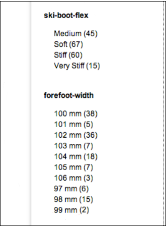
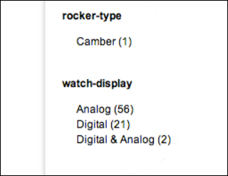
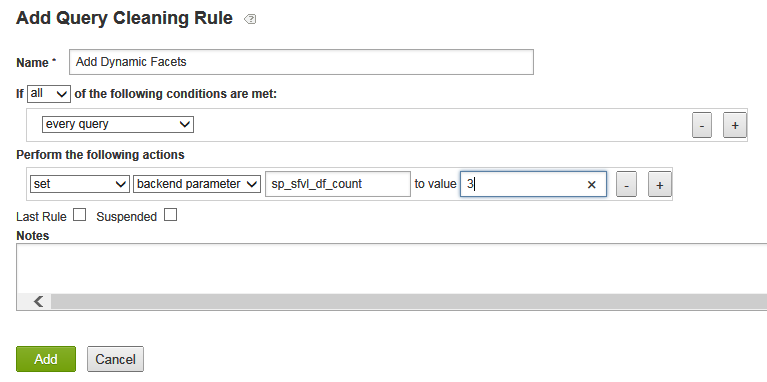
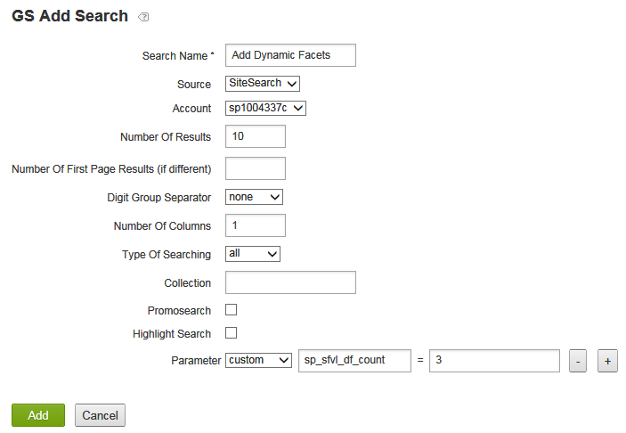
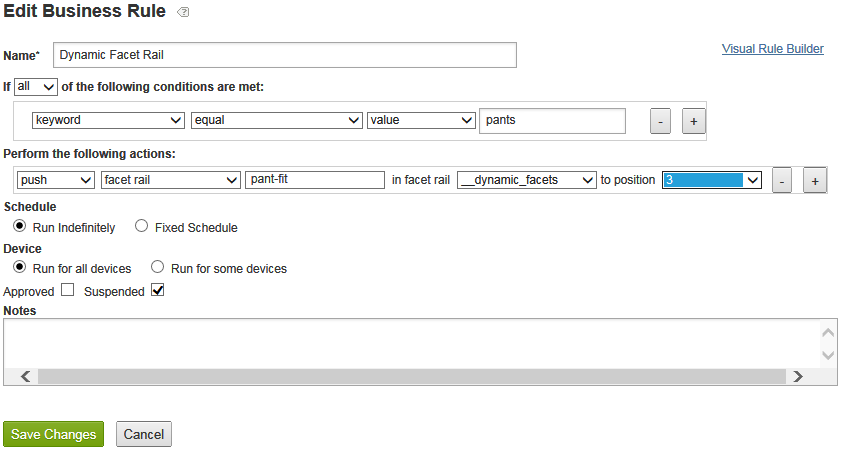

# Acerca de las facetas dinámicas{#about-dynamic-facets}

Utilice Facetas dinámicas para crear automáticamente nuevas selecciones de rango en el momento de la búsqueda. Si lo desea, puede asociar cada campo de faceta dinámica con hasta un nombre de tabla en su cuenta de Adobe Search&amp;Promote. Las relaciones de tabla se aplican en tiempo de búsqueda para cualquier campo de faceta dinámica que participe en la búsqueda.

## Uso de facetas dinámicas {#concept_E65A70C9C2E04804BF24FBE1B3CAD899}

>[!NOTE]
>
>Esta función no está habilitada de forma predeterminada en [!DNL Adobe Search&Promote]. Póngase en contacto con la asistencia técnica para activar la función para su uso.

Sin el uso de facetas dinámicas, tenía que combinar los atributos relacionados en &quot;ranuras&quot; y sólo mostrar las ranuras homogéneas para una búsqueda determinada. Es decir, sólo podían contener valores de un atributo lógico, como &quot;tamaño de zapato&quot; o &quot;tamaño de anillo&quot;. Este método proporcionó un rendimiento adecuado en tiempo de búsqueda con un gran conjunto de atributos únicos.

Sin embargo, cuando se utiliza Facetas dinámicas, no se limita el número de facetas que la búsqueda principal puede rastrear de manera eficiente. Puede definir cientos de facetas dinámicas, desde las cuales la búsqueda principal puede devolver las &quot;facetas más `N` dinámicas&quot; para una búsqueda determinada, donde `N` es generalmente un valor más modesto de 10-20 o menos. Este método elimina la necesidad de asignar atributos, ya que ahora puede crear una faceta dinámica única para los atributos en el sitio web.

## ¿Qué facetas deberías hacer dinámicas? {#section_254EE034BCAD4250A5D09FBF6158C4A5}

Las facetas que están escasamente pobladas en el sitio web y que solo aparecen en un subconjunto de búsquedas son buenas candidatas para ser dinámicas. Por ejemplo, una faceta llamada &quot;ancho de avance&quot; solo se puede rellenar cuando se buscan zapatos o botas. Mientras que otra faceta llamada &quot;Estilo numérico facial&quot;, con los valores posibles &quot;romano&quot; y &quot;árabe&quot;, solo puede aparecer al buscar relojes o relojes.

Si su cuenta tiene un gran número de facetas de este tipo, mejora el rendimiento de búsqueda para utilizar facetas dinámicas en lugar de seleccionar siempre el conjunto completo de facetas posibles para cada búsqueda. Las facetas genéricas como &quot;SKU&quot; o &quot;marca&quot;, que normalmente son apropiadas para mostrarse con los resultados de cada búsqueda, generalmente no son apropiadas como facetas dinámicas.

## Relación entre facetas y campos de etiquetas meta {#section_2869E5FCDA8B431A87BC6E5573F2B0A0}

Las facetas se crean sobre los campos de etiquetas meta. Un campo de etiqueta meta es una función de capa de búsqueda básica de bajo nivel de [!DNL Adobe Search&Promote]. Por otro lado, las facetas forman parte de GS (Búsqueda guiada): la capa de presentación de alto nivel de Adobe Search&amp;Promote. Sin embargo, las facetas tienen campos de etiquetas meta propios, los campos de etiquetas meta no saben nada acerca de las facetas. Al configurar facetas dinámicas, primero se agregan facetas y luego se agregan campos de etiquetas meta con la opción Faceta dinámica seleccionada para establecer que la faceta identificada sea dinámica.

>[!NOTE]
>
>No hay ningún ajuste de &quot;faceta dinámica&quot; en **[!UICONTROL Design > Navigation > Facets]**. Lo que hace que una faceta sea &quot;dinámica&quot; es que su &quot;campo de etiqueta meta&quot; subyacente es dinámico como se define en **[!UICONTROL Settings > Metadata > Definitions]**.

## Ejemplos de facetas dinámicas en acción {#section_BC699A05E2E742EF94D41679163ACE84}

Ejemplo de facetas dinámicas que se muestran después de una búsqueda de &quot;inicios&quot;:



Otro ejemplo de facetas dinámicas que se muestran después de buscar &quot;relojes&quot;:



Consulte también

* [Parámetros CGI de búsqueda back-end](../c-appendices/c-cgiparameters.md#reference_582E85C3886740C98FE88CA9DF7918E8)
* [Etiquetas de plantilla de presentación](../c-appendices/c-templates.md#reference_F1BBF616BCEC4AD7B2548ECD3CA74C64)
* [Etiquetas de plantilla de transporte](../c-appendices/c-templates.md#reference_227D199F5A7248049BE1D405C0584751)

## Configuración de facetas dinámicas {#task_D17F484130E448258100BAC1EEC53F39}

Configuración de facetas dinámicas en Search&amp;Promotoe.

<!-- 

t_configuring_dynamic_facets.xml

 -->

>[!NOTE]
>
>Esta función no está habilitada de forma predeterminada en Adobe Search&amp;Promote. Póngase en contacto con la asistencia técnica para activar la función para su uso.

Antes de que los efectos de las facetas dinámicas sean visibles para los clientes, debe volver a generar el índice del sitio.

Consulte también

* [Parámetros CGI de búsqueda back-end](../c-appendices/c-cgiparameters.md#reference_582E85C3886740C98FE88CA9DF7918E8)
* [Etiquetas de plantilla de presentación](../c-appendices/c-templates.md#reference_F1BBF616BCEC4AD7B2548ECD3CA74C64)
* [Etiquetas de plantilla de transporte](../c-appendices/c-templates.md#reference_227D199F5A7248049BE1D405C0584751)

**Para configurar facetas dinámicas**

1. Asegúrese de que ya ha agregado facetas.

   Consulte [Añadir una nueva faceta](../c-about-design-menu/c-about-facets.md#task_FC07BFFA62CA4B718D6CBF4F2855C89B).
1. Una vez agregadas las facetas, asegúrese de que ha agregado las facetas a nuevos campos de etiquetas meta definidos por el usuario.

   Consulte [Añadir un nuevo campo](../c-about-settings-menu/c-about-metadata-menu.md#task_6DF188C0FC7F4831A4444CA9AFA615E5)de etiqueta meta.
1. En el menú de producto, haga clic en **[!UICONTROL Settings]** > **[!UICONTROL Metadata]** > **[!UICONTROL Definitions.]**
1. En la [!DNL Definitions] página, en la [!DNL User-defined fields] tabla, en la [!DNL Actions] columna, haga clic en el icono de lápiz (Editar) en la fila del nombre del campo de etiqueta meta asociado a la faceta que desea convertir en dinámica.
1. En la [!DNL Edit Field] página, marque **[!UICONTROL Dynamic Facet]**.

   Consulte la tabla de opciones para [Añadir un nuevo campo](../c-about-settings-menu/c-about-metadata-menu.md#task_6DF188C0FC7F4831A4444CA9AFA615E5)de etiqueta meta.
1. Haga clic **[!UICONTROL Save Changes]**.
1. Haga clic en **volver a generar el índice** del sitio escalonado en el cuadro azul para volver a generar rápidamente el índice del sitio Web escalonado.

   Consulte también [Regeneración del índice de un sitio web](../c-about-index-menu/c-about-regenerate-index.md#task_B28DE40C0E9A475ABCBCBC4FF993AACD)activo o de etapas.
1. Determinar el número de facetas dinámicas que se seleccionarán para una búsqueda determinada. Puede realizar esta tarea realizando una de las acciones siguientes:

   * Cree una regla de limpieza de consultas con las condiciones que desee, que realice la acción `set`, `backend parameter`, `sp_sfvl_df_count` para valorar `X`, donde `X` es el número deseado de facetas dinámicas que se van a solicitar en el momento de la búsqueda y, a continuación, haga clic en **[!UICONTROL Add]**.
   

   Consulte [Añadir una regla](../c-about-rules-menu/c-about-query-cleaning-rules.md#task_47F43988D3D9485F8AE1DFDA7E00BF54)de limpieza de consultas.

   Consulte también Parámetros [CGI de búsqueda](../c-appendices/c-cgiparameters.md#reference_582E85C3886740C98FE88CA9DF7918E8)back-end, fila 40 en la tabla para obtener más información sobre `sp_sfvl_df_count`.

   * Añada una búsqueda y establezca el parámetro &quot;custom&quot; `sp_sfvl_df_count` en el valor deseado y haga clic en **[!UICONTROL Add]**.
   

   Consulte [Añadir una nueva definición](../c-about-settings-menu/c-about-searching-menu.md#task_98D3A168AB5D4F30A1ADB6E0D48AB648)de búsqueda.

   Consulte también Parámetros [CGI de búsqueda](../c-appendices/c-cgiparameters.md#reference_582E85C3886740C98FE88CA9DF7918E8)back-end, fila 40 en la tabla para obtener más información sobre `sp_sfvl_df_count`.

1. Edite la plantilla de transporte adecuada para generar las facetas dinámicas que devuelve la búsqueda principal.

   Consulte [Edición de una presentación o una plantilla](../c-about-design-menu/c-about-templates.md#task_800E0E2265C34C028C92FEB5A1243EC3)de transporte.

   Por ejemplo, supongamos que se nombra la plantilla de transporte `guided.tpl`. En ese caso, en el menú del producto, haga clic en **[!UICONTROL Design > Templates]**. En la [!DNL Templates] página, ubique `guided.tpl` en la tabla. y luego haga clic en **[!UICONTROL Edit]** en el extremo derecho del nombre. En la página Edición, agregue el siguiente bloque de código al final de `</facets>`: Salida JSON:

   ```
   ... 
   }<search-dynamic-facet-fields>, 
           { 
               "name" : "<search-dynamic-facet-field-name>", 
               "dynamic-facet" : 1, 
               "values" : [<search-field-value-list quotes="yes" commas="yes" data="values" sortby="values" encoding="json" />], 
               "counts" : [<search-field-value-list quotes="yes" commas="yes" data="results" sortby="values" />] 
   
           }</search-dynamic-facet-fields> 
   ...
   ```

1. Edite las plantillas de presentación o plantillas adecuadas para generar las facetas dinámicas.

   Consulte [Edición de una presentación o una plantilla](../c-about-design-menu/c-about-templates.md#task_800E0E2265C34C028C92FEB5A1243EC3)de transporte.

   Por ejemplo, supongamos que tiene una plantilla con el nombre `sim.tmpl` que se utiliza para generar contenido en el simulador. Para editar esa plantilla, en el menú del producto, haga clic en **[!UICONTROL Design > Templates]**. En la [!DNL Templates] página, ubique `sim.tmpl` en la tabla. y luego haga clic en **[!UICONTROL Edit]** en el extremo derecho del nombre. En la página Edición, agregue lo siguiente dentro del área de visualización de facetas de la plantilla:

   ```
   <h6>DF RAIL</h6> 
   <guided-facet-rail gsname="__dynamic_facets"> 
               <guided-facet ><!-- behavior=Normal --> 
               <div class="facet-block" id="facet"> 
               <p><b><guided-facet-display-name /></b></p> 
               <ul> 
                   <guided-facet-values> 
                       <guided-if-facet-value-equals-length-threshold> 
               </ul> 
               <ul id="brand" style="display:none"> 
                       </guided-if-facet-value-equals-length-threshold> 
                       <guided-if-facet-value-selected> 
                           <li><guided-facet-value> [<guided-lt>a href="<guided-facet-value-undo-path />"<guided-gt>X</a>]</li> 
                       <guided-else-facet-value-selected> 
                           <li><guided-facet-link><guided-facet-value></guided-facet-link> (<guided-facet-count>) </li> 
                       </guided-if-facet-value-selected> 
                   </guided-facet-values> 
               </ul> 
               <guided-if-facet-long> 
                 <br /><guided-lt />a href="#" onclick="moreless(this,'brand');return false;" <guided-gt /><button style="font-size:10px;">VIEW MORE</button></a> 
               </guided-if-facet-long> 
               </div> 
               </guided-facet> 
   </guided-facet-rail> 
   <h6>/DF RAIL</h6>
   ```

   También puede realizar una modificación similar a otras plantillas de presentación, según sea necesario, como `json.tmpl`.

   Asegúrese de especificar `__dynamic_facets` para la `gsname` etiqueta en la `guided-facet-rail` etiqueta . Esta etiqueta es un carril de facetas predefinido reservado para generar cualquier faceta dinámica que se devuelva para una búsqueda determinada.

   También puede editar de forma opcional este carril de faceta especial mediante **[!UICONTROL Rules > Business Rules]** y utilizando el **[!UICONTROL Advanced Rule Builder]** como se muestra a continuación.

   

   Consulte también [Añadir una nueva regla comercial](../c-about-rules-menu/c-about-business-rules.md#task_BD3B31ED48BB4B1B8F1DCD3BFA2528E7)
