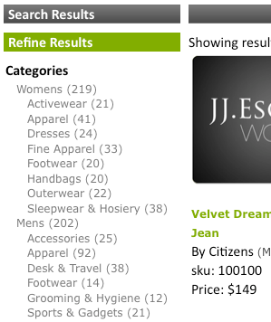

# Acerca de las facetas{#about-facets}

Puede utilizar Facetas para personalizar la capa de presentación y proporcionar a los usuarios una búsqueda guiada que les permita explorar en profundidad los resultados de la búsqueda.

## Uso de facetas {#concept_FA912B3B41EE493DB2F492D188457FF5}

Por ejemplo, supongamos que un visitante a un sitio web que vende herramientas realiza una búsqueda de llaves. La compañía podría utilizar dos facetas: una para especificar todas las marcas de llaves que se encontraron y la segunda para especificar todos los tamaños de llave inglesa. El cliente puede hacer clic en cualquier marca o tamaño dentro de la faceta adecuada para reducir los resultados y encontrar rápidamente la llave que necesita.

Puede basar una faceta en cualquier definición de metadatos existente. Si una faceta se define como un tipo de fecha en los metadatos, se muestra como una faceta de intervalo de fechas.

La tabla de la página [!DNL Staged Facets] muestra una visión general de la configuración que conforma cada faceta agregada. Puede agregar nuevas facetas y editar o eliminar facetas existentes. Puede revertir cualquier cambio que realice en facetas mediante **[!UICONTROL History]** cerca de la esquina superior derecha de la página.

La configuración de faceta se configura de forma predeterminada para que pueda probar los cambios antes de insertarlos en directo.

Consulte [Acerca de Ensayo](../c-about-staging.md#concept_08B8F3CA1F4241108F14BA7FC7806CA7).

Puede utilizar **[!UICONTROL View Live Settings]** para comparar la configuración de ensayo con la configuración de lanzamiento actual. Utilice **[!UICONTROL View Staged Settings]** para volver al área de ensayo. Para un elemento que se ha escalonado, la versión activa de la configuración es de solo lectura. Por lo tanto, puede manipularla para activar la configuración de ensayo. Una vez que esté satisfecho con los cambios realizados en la faceta de ensayo, haga clic en **[!UICONTROL Push Live]** para activarlos.

## Facetas de intervalo de fechas {#section_FEFFF6B5B6534456913189FEF559BA58}

Las facetas que se definen como tipo Fecha en los metadatos se tratan de forma diferente a otras facetas. En lugar de tratarse como un conjunto de valores, se tratan como un intervalo de fechas, con una fecha de inicio, una fecha de finalización o ambos.

Una faceta de intervalo de fechas tiene un valor de la fecha de inicio, seguido de &quot;BTW&quot; (para &quot;entre&quot;), seguido de la fecha de finalización. Las fechas están en los dos formatos siguientes:

mm-dd-aaaa

mm/dd/aaaa

Se requieren años de cuatro dígitos. Debe haber al menos una de las fechas de inicio o de finalización, pero ambas no son obligatorias. Por ejemplo, &quot;12/1/2007BTW1/4/2009&quot; significa todas las fechas entre el 1 de diciembre de 2007 y el 4 de enero de 2009. Sin embargo, &quot;1-1-2005BTW&quot; significa todas las fechas desde el 1 de enero de 2005.

Puede utilizar la etiqueta de plantilla de presentación `<guided-facet-value/>` para obtener un valor de faceta de intervalo de fechas, como una faceta normal. Actualmente, JavaScript es necesario para permitir que los usuarios introduzcan intervalos de fechas en los que buscar. Por ejemplo, puede tomar la entrada de dos campos de entrada para las fechas de inicio y de finalización. A continuación, puede validar la entrada y anexar el valor de la nueva faceta (generado a partir de los dos campos de entrada) y el nombre de faceta a la dirección URL existente.

Consulte [Etiquetas de plantillas de presentación](../c-appendices/c-templates.md#reference_F1BBF616BCEC4AD7B2548ECD3CA74C64).

El siguiente ejemplo de código es un ejemplo de cómo presentar un intervalo de fechas en una página. Muestra el intervalo de fechas existente si está seleccionado; de lo contrario, presenta un formulario de entrada sencillo. Cuando se envía el formulario, éste realiza una validación sencilla. Luego envía el explorador a una nueva dirección URL que incluye dos parámetros nuevos:

* `q#` - Representa el intervalo de fechas seleccionado ensamblado a partir de los dos campos de entrada.
* `x#` - Nombra la faceta. En este ejemplo, la faceta del intervalo de fechas se denomina &quot;modificado&quot;.

Las partes `replace(/%2F/ig, '~2F')` del código son necesarias porque Apache no permite `%2F` en las rutas de URL por motivos de seguridad, y cuando se utilizan direcciones URL SEO la consulta está en la ruta de URL. Por lo tanto, `/` se codifica como `~2F` en lugar de `%2F`, como normalmente se codifica en una dirección URL.

```
<div class="date_range"> 
 <p>Date Range</p> 
 <guided-if-facet-selected gsname="modified"> 
  <guided-facet-values gsname="modified"> 
   <script> 
   var modified_daterange= '<guided-facet-value />'.split(/BTW/) ; 
   if (modified_daterange[0]=='') modified_daterange[0]= '--/--/----' ; 
   if (modified_daterange[1]=='') modified_daterange[1]= '--/--/----' ; 
   document.write('From: ' + modified_daterange[0]) ; 
   document.write('<br>To: ' + modified_daterange[1]) ; 
   </script> 
  </guided-facet-values> 
 
 <guided-else-facet-selected> 
  <form action="#"> 
   From: <input name="dateFrom" size=10> 
   <br>To: <input name="dateTo" size=10> 
   <br><input type="button" value="Go" onclick="goClick(this.form)"> 
  </form> 
  <script> 
  function goClick(f) { 
   if (f.dateFrom.value=='' && f.dateTo.value=='') { 
    alert('You must enter either a From: date or a To: date.') ; 
    return ; 
   } 
   if ( f.dateFrom.value!='' && !f.dateFrom.value.match(/^\d+[\/\-]\d+[\/\-]\d\d\d\d$/) ) { 
    alert('From: date must be in "mm/dd/yyyy" or "mm-dd-yyyy" format.') ; 
    return ; 
   } 
   if ( f.dateTo.value!='' && !f.dateTo.value.match(/^\d+[\/\-]\d+[\/\-]\d\d\d\d$/) ) { 
    alert('To: date must be in "mm/dd/yyyy" or "mm-dd-yyyy" format.') ; 
    return ; 
   } 
   // Note that "/" is encoded as "~2F" instead of "%2F" to avoid Apache 404 error. 
   var new_url= '<guided-current-path />&<guided-query-param-name gsname="q#" offset="0" />=' 
    + encodeURIComponent(f.dateFrom.value).replace(/%2F/ig, '~2F') + 'BTW' 
    + encodeURIComponent(f.dateTo  .value).replace(/%2F/ig, '~2F') 
    + '&<guided-query-param-name gsname="x#" offset="0" />=modified' ; 
   location.href= new_url ; 
  } 
  </script> 
 </guided-if-facet-selected> 
</div>
```

## Acerca de las facetas anidadas {#section_6BC77F38DE9F43D5B6911F8CECB15DFC}

Las facetas anidadas son facetas que muestran varios niveles de categorías como en el siguiente ejemplo:



Las categorías de mujeres y hombres están en la faceta superior o superior. Las subcategorías, como Accesorios y Calzado, están en la faceta inferior o infantil.

La profundidad de faceta anidada actual es de dos, pero puede estar en cualquier parte a lo largo de la lista de exploración en profundidad.

A continuación se indican los comportamientos de los distintos tipos de facetas anidadas:

<table> 
 <thead> 
  <tr> 
   <th colname="col1" class="entry"> <p>Comportamiento del tipo de faceta anidada </p> </th> 
   <th colname="col2" class="entry"> <p>Comportamiento </p> </th> 
  </tr> 
 </thead>
 <tbody> 
  <tr> 
   <td colname="col1"> <p>Normal </p> </td> 
   <td colname="col2"> <p>El comportamiento de una faceta anidada normal es que se reduce si otras facetas limitan la búsqueda. </p> <p>Si se selecciona la faceta anidada, se reduce hacia abajo hasta su selección. Si se selecciona una faceta principal, solo esa faceta principal aparece con todas las facetas secundarias restantes. Si se selecciona una faceta secundaria, la faceta solo muestra la faceta principal seleccionada y la faceta secundaria seleccionada. </p> </td> 
  </tr> 
  <tr> 
   <td colname="col1"> <p>Fijo </p> </td> 
   <td colname="col2"> <p>El comportamiento de una faceta anidada adhesiva es que intenta mantener la faceta abierta tanto como sea posible en base al estado de otras facetas o criterios de búsqueda. Si se selecciona la faceta secundaria, se cuenta hacia la profundidad fija. </p> </td> 
  </tr> 
  <tr> 
   <td colname="col1"> <p>Selección múltiple </p> </td> 
   <td colname="col2"> <p>El comportamiento de una faceta de selección múltiple es que mantiene la faceta abierta. Cualquier nueva selección intenta eliminar todas las demás selecciones de facetas, a menos que la faceta sea "principal" de la faceta anidada de categoría. En este caso, "principal" se refiere a las facetas de categoría, no a las categorías de nivel superior de una faceta anidada. </p> </td> 
  </tr> 
  <tr> 
   <td colname="col1"> <p>Selección múltiple de categoría </p> </td> 
   <td colname="col2"> <p>Al igual que el tipo de faceta anidada de selección múltiple con las siguientes excepciones: </p> 
    <ul id="ul_D5AB6AF3169A483E8F3FC6D2A2EA3A28"> 
     <li id="li_9308156EF2FF43CE9DFB933F13786C58">Cualquier otra faceta elegida anteriormente no se selecciona si esta faceta se selecciona por primera vez. </li> 
     <li id="li_DD96D6802A9C479283212A0FD68C6F85">Otras facetas elegidas anteriormente también no se seleccionan si el cliente profundiza directamente en la faceta secundaria sin hacer clic en la faceta principal o si se elige un hermano de una faceta principal diferente. </li> 
     <li id="li_8BF58F10969B4743986D5D0E0086AD6C">Pueden tener padres en el sentido de que las facetas de la categoría tienen padres. No confunda este comportamiento con las relaciones padre-hijo que se encuentran con todas las facetas anidadas. </li> 
    </ul> </td> 
  </tr> 
 </tbody> 
</table>

Consulte también [Acerca del carril de facetas](../c-about-design-menu/c-about-facet-rails.md#concept_1FDC8BCDFFC84A0889DA670F63D5F6DB).

## Añadir una nueva faceta {#task_FC07BFFA62CA4B718D6CBF4F2855C89B}

Puede agregar facetas para personalizar la capa de presentación y proporcionar a sus clientes una Búsqueda guiada que les permita explorar en profundidad los resultados de búsqueda.

<!-- 

t_adding_a_new_facet.xml

 -->

La tabla facetas de la página [!DNL Facets] muestra un extracto de la configuración que conforma una sola faceta. Puede agregar nuevas facetas y editar o eliminar facetas existentes. Los cambios que realice en las facetas se pueden revertir con la función Historial.

>[!NOTE]
>
>Asegúrese de hacer referencia a la faceta en la plantilla de presentación para que esté visible en el sitio web.

Consulte también [Acerca del carril de facetas](../c-about-design-menu/c-about-facet-rails.md#concept_1FDC8BCDFFC84A0889DA670F63D5F6DB).

**Para agregar una nueva faceta**

1. Antes de agregar una nueva faceta, asegúrese de que ya ha hecho lo siguiente antes de continuar con el paso siguiente:

   * Algunos campos de etiqueta meta ya están definidos.

      Consulte [Añadir un nuevo campo de etiqueta meta](../c-about-settings-menu/c-about-metadata-menu.md#task_6DF188C0FC7F4831A4444CA9AFA615E5).
   * Inyecte los metadatos en el índice.
Consulte [Añadir definiciones de inyección de campo](../c-about-settings-menu/c-about-metadata-menu.md#task_E86566FA1FF74CF68115C0ADA05172AE).

1. En el menú del producto, haga clic en **[!UICONTROL Design]** > **[!UICONTROL Navigation]** > **[!UICONTROL Facets.]**
1. En la página [!DNL Facets], haga clic en **[!UICONTROL Add New Facet]**.
1. En la página [!DNL Add Facet], establezca las opciones que desee.

   Esta configuración afecta tanto al comportamiento como a la presentación predeterminada de una faceta. Puede anular algunos de estos ajustes mediante la configuración de la plantilla de presentación.

   Si una faceta se define como un tipo de fecha en los metadatos, se muestra como un intervalo de fechas.

   Consulte [Facetas de intervalo de fechas](../c-about-design-menu/c-about-facets.md#section_FEFFF6B5B6534456913189FEF559BA58).

   Según las opciones de faceta que seleccione, no todas las opciones están disponibles.

   <!-- 
   r_add_facet_options.xml
   -->

   <table> 
    <thead> 
      <tr> 
      <th colname="col1" class="entry"> <p>Opción </p> </th> 
      <th colname="col2" class="entry"> <p>Descripción </p> </th> 
      </tr> 
    </thead>
    <tbody> 
      <tr> 
      <td colname="col1"> <p>Nombre de faceta </p> </td> 
      <td colname="col2"> <p>Identifica el nombre de una faceta determinada. </p> <p> <p>Nota:  Solo puede tener una faceta basada en metadatos existentes definidos por el usuario. Si no hay facetas disponibles en la lista desplegable, primero debe definir algunos metadatos. </p> </p> <p>Consulte <a href="../c-about-settings-menu/c-about-metadata-menu.md#task_6DF188C0FC7F4831A4444CA9AFA615E5" type="task" format="dita" scope="local"> Añadir un nuevo campo de etiqueta meta </a>. </p> <p>Para generar una faceta basada en una tabla de campo, utilice el nombre de faceta personalizada y especifique el nombre de la tabla de campo. </p> </td> 
      </tr> 
      <tr> 
      <td colname="col1"> <p>Mostrar etiqueta </p> </td> 
      <td colname="col2"> <p>Establece la etiqueta de una faceta que se puede utilizar en una ruta de exploración, en lugar de un nombre de campo de metadatos (con la etiqueta <span class="codeph"> &lt;guided-breadcrumb-label&gt; </span>) o un valor independiente (con la etiqueta <span class="codeph"> &lt;guided-facet-display-name&gt; </span>). </p> </td> 
      </tr> 
      <tr> 
      <td colname="col1"> <p>Comportamiento </p> </td> 
      <td colname="col2"> <p>Establece uno de los tres comportamientos facetas. </p> <p> 
      <ul id="ul_67C19E1C16224B9990F04A0D05BD3D05"> 
      <li id="li_6B232C11A61840B68CA59E1F593405A0"> <span class="uicontrol"> Normal </span> <p>Cuando un cliente hace clic en una faceta cuyo comportamiento está establecido en <span class="uicontrol"> Normal </span>, explora los resultados de búsqueda de ese elemento. A partir de ahí, el cliente puede restringir y restringir aún más el número de resultados de búsqueda. </p> </li> 
      <li id="li_7D7C43A7F7AB4B84A9B0FEF34627605A"> <span class="uicontrol"> Categoría </span> <p>Las facetas de categoría actúan como elementos de navegación. Estas facetas son facetas de nivel superior que los clientes suelen explorar antes de revelar facetas con opciones de atributos. Las facetas de categoría no se estrechan cuando se seleccionan otras facetas y permanecen abiertas. Al hacer clic en un valor diferente dentro de una faceta de categoría, se anula la selección de todas las demás facetas de la página, excepto para los padres de esa faceta de categoría. </p> </li> 
      <li id="li_01255993D71F40DBA8870AA3FEA7D304"> <span class="uicontrol"> Selección múltiple de categoría  </span> <p>las facetas son facetas de categoría que admiten la selección de varios elementos de la faceta donde los elementos están "Oed" juntos. </p> </li> 
      </ul> 
      <ul id="ul_683F6D3FC8524E65AF303453ADDB6001"> 
        <li id="li_81F504D1D1294666BBBC5EA43B34B712"> <span class="uicontrol"> Fijo </span> <p>Cuando un cliente hace clic en una faceta cuyo comportamiento está establecido en <span class="uicontrol"> Fijo </span>, la faceta con la opción seleccionada permanece abierta durante el desglose. Esta opción es útil cuando desea permitir que un cliente cambie una opción anterior. </p> </li> 
      </ul> 
      <ul id="ul_8E871D63B09445268C600C8ABC20F6A4"> 
        <li id="li_F88AC5528B0C4751BC4CFE7FA9525857"> <span class="uicontrol"> Selección múltiple  </span> <p>Permite la selección de varios elementos de una faceta, donde los elementos dentro de la faceta son "Oed" juntos. Esta opción es útil para una faceta que puede mostrar un atributo menor como colores y desea permitir que el cliente tenga la capacidad de crear una consulta que le permita "mostrar zapatos de mi tamaño que sean rojos o negros". </p> </li> 
      </ul> </p> </td> 
      </tr> 
      <tr> 
      <td colname="col1"> <p>Mostrar siempre </p> </td> 
      <td colname="col2"> <p>Para una faceta normal o adhesiva, establece la faceta para que permanezca visible para el cliente en todo momento. </p> <p>Esta opción solo está disponible si seleccionó <span class="uicontrol"> Categoría normal </span>, <span class="uicontrol"> </span> o <span class="uicontrol"> adhesiva </span> en la lista desplegable <span class="uicontrol"> Comportamiento </span>. </p> </td> 
      </tr> 
      <tr> 
      <td colname="col1"> <p>Los padres de Facet </p> </td> 
      <td colname="col2"> <p>Esta opción solo está disponible si seleccionó <span class="uicontrol"> Categoría </span> o <span class="uicontrol"> Categoría de selección múltiple </span> en la lista desplegable <span class="uicontrol"> Comportamiento </span>. </p> <p>Indica cuáles son los padres de la faceta de categoría. Los elementos seleccionados en las facetas principales de categorías se utilizan para reducir las opciones disponibles dentro de la faceta de categoría actual. Las facetas principales no están desseleccionadas cuando un cliente interactúa con la faceta de categoría. Puede especificar varios elementos principales delimitados por comas. </p> </td> 
      </tr> 
      <tr> 
      <td colname="col1"> <p>Profundidad fija </p> </td> 
      <td colname="col2"> <p>Esta opción solo está disponible si seleccionó <span class="uicontrol"> Fijo </span> en la lista desplegable <span class="uicontrol"> Comportamiento </span>. </p> <p>Define el número de opciones que se deben mantener abiertas durante el desglose. </p> </td> 
      </tr> 
      <tr> 
      <td colname="col1"> <p>Umbral de longitud </p> </td> 
      <td colname="col2"> <p>Define la longitud vertical (1-9999) de la faceta definida en el número de elementos. </p> <p>Si la plantilla de presentación está correctamente configurada, puede utilizar esta configuración para proporcionar un "Mostrar más...". o determine cuándo lanzar la faceta a un div desplazable, etc. </p> </td> 
      </tr> 
      <tr> 
      <td colname="col1"> <p>Umbral de longitud de truncamiento </p> </td> 
      <td colname="col2"> <p>Trunca el número de elementos de una faceta después de un umbral determinado. </p> <p>Algunas implementaciones tienen facetas con miles de elementos. Puede ser caro enviar todos los datos por cable. Puede utilizar esta configuración para recortar la faceta a un nivel manejable. La faceta se truncará después de ordenarla. </p> </td> 
      </tr> 
      <tr> 
      <td colname="col1"> <p>Ancho máximo del valor </p> </td> 
      <td colname="col2"> <p>Especifica un límite para la longitud de la cadena de valor de faceta (1-999). </p> <p>Esta opción resulta útil cuando se desea colocar una faceta en un diseño de anchura fija y evitar que las cadenas se ajusten. De forma predeterminada, la cadena se establece en 3 caracteres más cortos que el umbral para poder agregar puntos suspensivos. </p> </td> 
      </tr> 
      <tr> 
      <td colname="col1"> <p>Extensión de valor </p> </td> 
      <td colname="col2"> <p>Especifica la cadena que desea utilizar para indicar que el valor de una faceta está truncado. De forma predeterminada, la cadena "..." se utiliza. </p> </td> 
      </tr> 
      <tr> 
      <td colname="col1"> <p>Delimitador </p> </td> 
      <td colname="col2"> <p>Especifica el delimitador que se va a utilizar para cualquier lista de valor separado delimitado que se aplique a la faceta. </p> <p>El delimitador que se utiliza es el mismo que se define en los metadatos en los que se basa la faceta. El delimitador predeterminado es una coma. Sin embargo, puede utilizar cualquier valor compatible con XML. </p> </td> 
      </tr> 
      <tr> 
      <td colname="col1"> <p>Ordenar </p> </td> 
      <td colname="col2"> <p>Especifica cómo desea que las facetas se ordenen en el sitio web. Las facetas se pueden ordenar según lo siguiente. Si lo desea, puede combinar hasta cinco tipos. </p> 
      <ul id="ul_12987F4DC7B34C63ABC906B59688A174"> 
      <li id="li_3206C96013DF431D90119F594D93D85D"> <span class="uicontrol"> alpha  </span> <p>Ordena los valores alfabéticamente (0-9, A-Z), incluidos los caracteres de puntuación. </p> </li> 
      <li id="li_304E4A518FBE48D18D9E9EA7339A3481"> <span class="uicontrol"> alpha (solo alfanumérica)  </span> <p>Ordena los valores alfabéticamente (0-9, A-Z), omitiendo los caracteres de puntuación. </p> </li> 
      <li id="li_CADB888CC514455F9CA379C8EEE490AA"> <span class="uicontrol"> alpha (no distingue entre mayúsculas y minúsculas)  </span> <p>Ordena los valores alfabéticamente (0-9, A-Z), omitiendo las mayúsculas y minúsculas de los caracteres alfabéticos e incluyendo los caracteres de puntuación. </p> </li> 
      <li id="li_F61122E79AB5413792DA31F8AB1414BD"> <span class="uicontrol"> alpha (sin distinción de mayúsculas y minúsculas, solo alfanumérica)  </span> <p>Ordena los valores alfabéticamente (0-9, A-Z), omitiendo las mayúsculas y minúsculas de los caracteres alfabéticos y omitiendo los caracteres de puntuación. </p> </li> 
      <li id="li_F50CC298ABF046D0A39D5AE5B1261823"> <span class="uicontrol"> count  </span> <p>Ordena por número de resultados que coinciden con cada valor de faceta de bueno a mínimo. </p> </li> 
      <li id="li_32B6AF39E9534762B39B15181DC5AD01"> <span class="uicontrol"> numérico  </span> <p>Ordena los valores numéricamente. Al ordenar los números, esta opción es superior a una clasificación Alfa porque si se utiliza una clasificación Alfa, 10 se muestra antes de 2. </p> </li> 
      <li id="li_CF8E76A7B1184E0C8DCC11B53E31A1DC"> <span class="uicontrol"> split </span> <p>Divide la lista en dos listas independientes según el umbral de recuento. Los valores de faceta por encima del umbral se mueven al principio. Los valores de faceta con recuentos por debajo del umbral se mueven al final. Se requiere un umbral dividido cuando se desea forzar que los valores de un determinado rango estén siempre en la parte superior. </p> </li> 
      <li id="li_4AB8276577384B1099CBA895898205AD"> <span class="uicontrol"> break  </span> <p>Obliga determinados valores a la parte superior o inferior de la lista. Por ejemplo, es posible que siempre desee que el término "Otro" aparezca en la parte inferior de la lista. Los valores superiores o los valores inferiores son obligatorios cuando se utiliza una clasificación de salto para identificar los valores explícitos que deben estar en la parte superior o inferior de la clasificación. </p> </li> 
      <li id="li_227E96CFED2044FCA2F10B6913B03CFB"> <span class="uicontrol"> pedido  </span> <p>Los valores de faceta siempre deben estar en un orden fijo (una lista de valores separados por delimitadores definida en la opción <span class="uicontrol"> Ordenar </span> que se describe a continuación). </p> </li> 
      </ul> </td> 
      </tr> 
      <tr> 
      <td colname="col1"> <p>Alias de faceta </p> </td> 
      <td colname="col2"> <p>Para admitir las direcciones URL de búsqueda existentes que se pueden tener fuera en estado silvestre, puede utilizar un alias de faceta para asignar un nombre de parámetro heredado a la modificación o simplemente crear una faceta con un nombre diferente. El alias se aplica solo a solicitudes entrantes y no se utiliza para crear vínculos de facetas. </p> </td> 
      </tr> 
      <tr> 
      <td colname="col1"> <p>Nombre de carril de faceta </p> </td> 
      <td colname="col2"> <p>Nombre del carril de facetas si decide ordenar las facetas alfabéticamente, por recuento o por un método personalizado. </p> <p>Consulte <a href="../c-about-design-menu/c-about-facet-rails.md#concept_1FDC8BCDFFC84A0889DA670F63D5F6DB" format="dita" scope="local">Acerca de Barra de faceta </a>. </p> </td> 
      </tr> 
      <tr> 
      <td colname="col1"> <p>Pedido </p> </td> 
      <td colname="col2"> <p>Esta opción solo está disponible si seleccionó <span class="uicontrol"> Pedido </span> en la lista desplegable <span class="uicontrol"> Ordenar </span>. </p> <p>Permite definir una lista delimitada de valores que especifica el orden que se va a utilizar. </p> </td> 
      </tr> 
      <tr> 
      <td colname="col1"> <p>Anexar extras </p> </td> 
      <td colname="col2"> <p>Esta opción solo está disponible si seleccionó <span class="uicontrol"> Pedido </span> en la lista desplegable <span class="uicontrol"> Ordenar </span>. </p> <p>Si los valores no están presentes en la lista ordenada, se anexan al final. </p> </td> 
      </tr> 
      <tr> 
      <td colname="col1"> <p>Mostrar fantasmas </p> </td> 
      <td colname="col2"> <p>Esta opción solo está disponible si seleccionó <span class="uicontrol"> Pedido </span> en la lista desplegable <span class="uicontrol"> Ordenar </span>. </p> <p>Si faltan los valores especificados por la lista ordenada, esta opción marca cada elemento que falta en la faceta como "fantasma" para que los elementos se muestren de forma diferente. </p> </td> 
      </tr> 
      <tr> 
      <td colname="col1"> <p>Faceta anidada </p> </td> 
      <td colname="col2"> <p>Una faceta anidada muestra sus categorías y sus categorías secundarias. Sólo puede mostrar una profundidad de dos categorías, pero puede estar en cualquier parte a lo largo del desglose. </p> <p>Los datos de esta faceta deben seguir una convención para describir los dos niveles de categorías. Por ejemplo, un valor de faceta puede ser 'zapatos:botas' donde la categoría principal es 'zapatos' y la categoría secundaria es 'botas'. Se utiliza ':' como delimitador para separarlos. </p> <p>Consulte Delimitador anidado a continuación para obtener más información sobre cómo cambiar el delimitador. </p> <p>Para generar los datos en este formato, puede utilizar una secuencia de comandos de filtro para combinar dos categorías existentes. Puede combinar los comportamientos Normal, Categoría y Fijo con facetas anidadas. </p> </td> 
      </tr> 
      <tr> 
      <td colname="col1"> <p>Nombre principal anidado </p> </td> 
      <td colname="col2"> <p>Esta lista desplegable sólo está disponible si seleccionó <span class="uicontrol"> Faceta anidada </span>. </p> <p>Permite elegir qué campo representa la categoría principal. Este campo se utiliza durante el tiempo de búsqueda en categorías principales coincidentes. </p> </td> 
      </tr> 
      <tr> 
      <td colname="col1"> <p>Nombre secundario anidado </p> </td> 
      <td colname="col2"> <p>Esta lista desplegable sólo está disponible si seleccionó <span class="uicontrol"> Faceta anidada </span>. </p> <p>Permite elegir qué campo representa la categoría secundaria. Este campo se utiliza durante el tiempo de búsqueda para hacer coincidir categorías secundarias. </p> </td> 
      </tr> 
      <tr> 
      <td colname="col1"> <p>Delimitador de faceta anidada </p> </td> 
      <td colname="col2"> <p>Esta opción solo está disponible si seleccionó <span class="uicontrol"> Faceta anidada </span>. </p> <p>El carácter introducido aquí se utiliza para analizar las categorías principales y las categorías secundarias de sus datos. </p> <p>Por ejemplo, si se utiliza ':' como delimitador y el elemento principal es 'zapatos' y el secundario es 'botas', espera que los datos tengan el formato 'zapatos:botas'. </p> </td> 
      </tr> 
      <tr> 
      <td colname="col1"> <p>Umbral dividido </p> </td> 
      <td colname="col2"> <p>Esta opción solo está disponible si seleccionó <span class="uicontrol"> Dividir </span> en la lista desplegable <span class="uicontrol"> Ordenar </span>. </p> <p>Al utilizar una ordenación dividida, el umbral dividido define el recuento en el que se dividirá la faceta en dos listas independientes. Los valores con recuentos buenos o iguales al umbral se mantienen en la parte superior, mientras que los valores por debajo del umbral se mueven al final. </p> </td> 
      </tr> 
      <tr> 
      <td colname="col1"> <p>Valores máximos </p> </td> 
      <td colname="col2"> <p>Esta opción solo está disponible si seleccionó <span class="uicontrol"> Salto </span> en la lista desplegable <span class="uicontrol"> Ordenar </span>. </p> <p>Cuando se utiliza una ordenación Break, esta lista delimitada de valores siempre se coloca en la parte superior de la lista. Se permite el uso de expresiones regulares, pero deben estar entre llaves o entre llaves, por ejemplo: {^Nuevo.*?},{^Muy nuevo.*} </p> </td> 
      </tr> 
      <tr> 
      <td colname="col1"> <p>Valores mínimos </p> </td> 
      <td colname="col2"> <p>Esta opción solo está disponible si seleccionó <span class="uicontrol"> Salto </span> en la lista desplegable <span class="uicontrol"> Ordenar </span>. </p> <p>Cuando se utiliza una ordenación Break, esta lista delimitada de valores siempre se coloca en la parte inferior de la lista. Se permite el uso de expresiones regulares, pero deben estar entre llaves o entre llaves, como en el siguiente ejemplo: {^Anterior.*?},{^Muy antiguo.*} </p> </td> 
      </tr> 
    </tbody> 
    </table>

1. Haga clic **[!UICONTROL Add]**.
1. (Opcional) En la página [!DNL Facets], realice una de las siguientes acciones:

   * Haga clic **[!UICONTROL History]** para revertir cualquier cambio que haya realizado.

      Consulte [Uso de la opción Historial](../t-using-the-history-option.md#task_70DD3F87A67242BBBD2CB27156F43002).

   * Haga clic **[!UICONTROL Live]**.

      Consulte [Visualización de la configuración dinámica](../c-about-staging.md#task_401A0EBDB5DB4D4CA933CBA7BECDC10F).

   * Haga clic **[!UICONTROL Push Live]**.

      Consulte [Inserción de la configuración del escenario en directo](../c-about-staging.md#task_44306783B4C0408AAA58B471DAF2D9A4).

## Añadir una faceta anidada {#task_A132FA7EB7494A6B88E443F2C3FABBBA}

Puede agregar una faceta anidada para mostrar varios niveles de categorías.

<!-- 

t_adding_a_nested_facet.xml

 -->

Tenga en cuenta lo siguiente cuando cree una faceta anidada:

* Cada faceta anidada requiere un campo de etiqueta meta definido por el usuario.
* Las facetas anidadas están compuestas por otras dos facetas: la faceta principal y la faceta secundaria. Pueden ser facetas de un solo valor o facetas de varios valores. No se permite la mezcla de facetas de un solo valor y facetas de varios valores.
* Debe determinar si esta faceta se utilizará en la tabla del campo de búsqueda. La tabla de campo requiere la faceta anidada y sus facetas de composición.
* Considere utilizar JSON para implementar facetas anidadas; es más fácil.

* [Tarea 1: Añadir una etiqueta meta](../c-about-design-menu/c-about-facets.md#task_6944558325204E749C725DCFEF17EF3D)
* [Tarea 2: Añada una secuencia de comandos de filtrado para generar datos con formato previo](../c-about-design-menu/c-about-facets.md#task_2DFED8BCB87B4067A6CE280945D7CAF4)
* [Tarea 3 - Añadir una nueva faceta](../c-about-design-menu/c-about-facets.md#task_3C11A4159FC44B9494D48594941AF8CF)
* [Tarea 4 - Editar búsqueda guiada](../c-about-design-menu/c-about-facets.md#task_E50EFD7BBD0F45729C15759EA4F548D8)
* [Tarea 5 - Crear la plantilla de transporte](../c-about-design-menu/c-about-facets.md#task_C1FEDEF11D2549DEB1A9C09BFBA64381)
* [Tarea 6 - Crear la plantilla de presentación](../c-about-design-menu/c-about-facets.md#task_4B2ABB37B9CD4F3F8AF8E6874227A995)
* [Tarea 7 - Editar la ruta de exploración](../c-about-design-menu/c-about-facets.md#task_5E22409528EC4DA284821F82FDCE3438)

>[!NOTE]
>
>Este tema se refiere a la faceta anidada como faceta n1.

## Tarea 1: Añadir una etiqueta meta {#task_6944558325204E749C725DCFEF17EF3D}

Añada un nuevo campo de etiqueta meta dedicado a la fecha de retención para la faceta anidada. Puede ser un campo de varios valores o un campo de un solo valor.

1. En el menú del producto, haga clic en **[!UICONTROL Settings]** > **[!UICONTROL Metadata]** > **[!UICONTROL Definitions]**.
1. En la página [!DNL Definitions], haga clic en **[!UICONTROL Add New Field]**.
1. En la página [!DNL Add Field], establezca las opciones que desee.

   Consulte [Añadir un nuevo campo de etiqueta meta](../c-about-settings-menu/c-about-metadata-menu.md#task_6DF188C0FC7F4831A4444CA9AFA615E5).
1. Haga clic **[!UICONTROL Add]**.
1. (Opcional) Vuelva a generar el índice del sitio escalonado si desea realizar una previsualización de los resultados.

   Consulte [Configuración de un índice incremental de un sitio Web escalonado](../c-about-index-menu/c-about-incremental-index.md#task_46A367B0786C4C90BFFA5D3F95FD86C0).

   Las tareas restantes hacen referencia a este campo de etiqueta meta como **n1**.

## Tarea 2: Añada una secuencia de comandos de filtrado para generar datos con formato previo {#task_2DFED8BCB87B4067A6CE280945D7CAF4}

1. Añada una secuencia de comandos de filtrado para combinar las facetas originales en el siguiente formato: `<parent_value><nested_delimiter><child_value>`.

   Consulte [Añadir una secuencia de comandos de filtrado](../c-about-settings-menu/c-about-filtering-menu.md#task_0AB84FD1133F47F9AA069A79BEA13A22).

   Los siguientes son ejemplos de valores para el campo de etiqueta meta n1, con el formato anterior

   `Womens:Handbags`

   `Womens:Dresses`

   `Mens:Accessories`

   `Mens:Footwear`
1. Después de crear o editar el script de filtrado, pruebe el script. Si la apariencia es correcta, vuelva a indexar la cuenta, si corresponde. Puede comprobar el índice mediante [!DNL Index Overview].

   En los siguientes ejemplos se da por supuesto que se incluyen algunas bibliotecas de consultoría estándar con la inicialización de secuencias de comandos de filtrado. Recuerde que cada cuenta es diferente, por lo que el script de filtrado debe reflejar los requisitos necesarios para su propia cuenta.

   **Ejemplo de secuencia de comandos de filtrado de varios valores**

   ```
   my $doc; 
   { 
   # Slurp all the data into $doc 
   local $/; 
   undef $/; 
   $doc = <>; 
   } 
    # Create n1 field 
    if ( $doc =~ m{<meta\s+name="t1"\s+content="([^\"]*)"}is ) 
    { 
     my @t1arr = split(/\|/, $1); 
     if (scalar @t1arr > 0) 
     { 
      if ( $doc =~ m{<meta\s+name="t2"\s+content="([^\"]*)"}is ) 
      { 
       my @t2arr = split(/\|/, $1); 
   
       if ( scalar @t2arr > 0 ) 
       { 
        my $max = ((scalar @t1arr) < (scalar @t2arr)) ? (scalar @t1arr) : (scalar @t2arr); 
        for (my $i = 0; $i < $max; $i++) 
        { 
         $t1arr[$i] .= ":" . $t2arr[$i]; 
        } 
       } 
      } 
      my $output = join( '|', @t1arr ); 
      $doc =~ s{</head>}{<meta name="n1" content="$output" />\b</head>}is; 
     } 
    } 
    # END: n1 field
   ```

   **Ejemplo de una secuencia de comandos de filtrado de un solo valor**

   ```
   # This is a complete example. 
   # This script is designed for index connector where each record 
   # in the XML file is converted into a fake HTML page filled with 
   # meta data tags.  
   my $doc; 
   { 
   # Slurp all the data 
   local $/; 
   undef $/; 
   $doc = <>; 
   } 
   # All legitimate index connector data has key in its URL. 
   # Process the page if and only if it is coming from index connector and 
   # it is not the first entry point page.  Entry point pages don't have key 
   # in the URL. 
   if ($main::search_url =~ /\?key=/) { 
    my $meta = {}; 
    # Mine and scrape the meta fields from the page 
    my @lines = split(/\n/,$doc); 
    foreach my $line (@lines) 
    { 
     if ($line =~ m{<meta name="(.*?)" content="(.*?)" />}) 
     { 
      $meta->{lc($1)} = $2; 
     } 
    } 
    # Combined t1,t2 and t2,t3, and t3,t4 together. 
    # Assign them respectively to n1, n2, and n3. 
    my ($t1, $t2, $t3, $t4); 
    my %meta2; 
    $t1 = $meta->{'t1'}; 
    $t2 = $meta->{'t2'}; 
    $t3 = $meta->{'t3'}; 
    $t4 = $meta->{'t4'}; 
    if (defined $t1 && $t1) { 
     $meta2{'n1'} = $t1; 
     if (defined $t2 && $t2) { 
      $meta2{'n1'} .= ":" . $t2; 
      $meta2{'n2'} = $t2; 
      if (defined $t3 && $t3) { 
      $meta2{'n2'} .= ":" . $t3; 
       $meta2{'n3'} = $t3; 
       if (defined $t4 && $t4) { 
        $meta2{'n3'} .= ":" . $t4; 
       } 
      } 
     } 
    } 
    foreach my $stuff ( keys %meta2 ) 
    { 
     my $v = $meta2{$stuff}; 
     $doc =~ s{</head>}{<meta name="$stuff" content="$v" />\n</head>}; 
    } 
   } 
   
   # Do some ranking stuff here 
   ws_insert_static_rank_meta_tag(\$doc, "RANK"); 
   
   # Prints the entire page back out. 
   print $doc;
   ```

## Tarea 3 - Añadir una nueva faceta {#task_3C11A4159FC44B9494D48594941AF8CF}

1. En el menú del producto, haga clic en **[!UICONTROL Design]** > **[!UICONTROL Navigation]** > **[!UICONTROL Facets]**.
1. En la página [!DNL Facets], haga clic en **[!UICONTROL Add New Facet]**.
1. En la página [!DNL Add Facet], establezca las siguientes opciones:

   * En la lista desplegable [!DNL Facet Name], seleccione el campo meta tag que definió en la Tarea 1. Si está utilizando tablas de campos de búsqueda, seleccione **[!UICONTROL custom]** en la lista desplegable y, a continuación, escriba el nombre personalizado de la faceta.

   * Marque **[!UICONTROL Nested Facet]** para &quot;activar&quot; facetas anidadas.
   * En las listas desplegables [!DNL Nested Parent Name] y [!DNL Nested Child Name], elija los campos de etiqueta meta que puede utilizar. Si utiliza tablas de campos de búsqueda, seleccione **[!UICONTROL custom]** e introduzca el nombre personalizado de la faceta.

   * En el campo [!DNL Nested Facet Delimiter], especifique el delimitador que desea utilizar, como &quot;:&quot; (dos puntos). No confunda esto con el delimitador de varios valores. Ambos delimitadores deben ser diferentes entre sí.
   * Si establece el comportamiento de la faceta **[!UICONTROL Category]**, puede especificar los elementos principales de la faceta (no confunda el elemento principal con los elementos principales anidados). En general, nunca utilice el nombre de otra faceta anidada como elemento principal de Categoría. En su lugar, utilice las facetas individuales que componen esa faceta anidada.
   * Configure las demás opciones de faceta que desee.

   Consulte [Añadir una nueva faceta](../c-about-design-menu/c-about-facets.md#task_FC07BFFA62CA4B718D6CBF4F2855C89B).
1. Haga clic **[!UICONTROL Add]**.

## Tarea 4 - Editar búsqueda guiada {#task_E50EFD7BBD0F45729C15759EA4F548D8}

1. En el menú del producto, haga clic en **[!UICONTROL Settings]** > **[!UICONTROL Searching]** > **[!UICONTROL Searches]**.
1. En las páginas [!DNL Searches], haga clic en **[!UICONTROL Edit]** en el nombre del tipo de búsqueda que desee actualizar.
1. El `sp_field_table` necesita los campos n1, t1 y t2.

   Si se utilizan tablas de campo, debe editar el parámetro `sp_field_table`. O bien, puede hacerlo en cualquier otro lugar mediante reglas de limpieza de consultas o reglas de búsqueda previa.

   Consulte [Añadir una regla de limpieza de consultas](../c-about-rules-menu/c-about-query-cleaning-rules.md#task_47F43988D3D9485F8AE1DFDA7E00BF54).

   Consulte [Añadir una nueva regla de búsqueda previa](../c-about-rules-menu/c-about-pre-search-rules.md#task_182B95918462490D8BDA7F16A81CAC11).
1. Haga clic **[!UICONTROL Save Changes]**.

## Tarea 5 - Crear la plantilla de transporte {#task_C1FEDEF11D2549DEB1A9C09BFBA64381}

1. En el menú del producto, haga clic en **[!UICONTROL Design]** > **[!UICONTROL Templates]**.
1. En las páginas [!DNL Templates], haga clic en **[!UICONTROL Add New Template]**.
1. En el cuadro de diálogo [!DNL Add Template], especifique el nombre del archivo de plantilla de transporte.
1. En la lista desplegable [!DNL New Template Type], seleccione **[!UICONTROL Transport]**.
1. Haga clic **[!UICONTROL Add]**.
1. En la página [!DNL Templates], haga clic en el nombre del archivo de plantilla de transporte que acaba de agregar.
1. En la página [!DNL Template Editor] de la plantilla de transporte, incluya los datos procedentes del campo n1. Consulte los siguientes ejemplos.

   **Ejemplo XML de devolución de** datos de facetas anidadasEl ejemplo XML debe especificar qué carácter se utiliza como delimitador entre los valores de facetas. En este caso, es una barra vertical (|).

   ```
   <facet name="n1"> 
     <values delimiter="|"><search-field-value-list name="n1" quotes="no" separator="|" sortby="values" data="values" /></values> 
     <counts><search-field-value-list name="n1" quotes="no" sortby="values" data="results" /></counts> 
   </facet>
   ```

   **Ejemplo JSON de devolución de datos de faceta anidados**

   ```
   { 
      "name" : "n1", 
      "values" : [ <search-field-value-list name="n1" quotes="yes" sortby="values" data="values" encoding="json"/>], 
      "counts" : [<search-field-value-list name="n1" quotes="no" sortby="values" data="results" />] 
   },
   ```

## Tarea 6 - Crear la plantilla de presentación {#task_4B2ABB37B9CD4F3F8AF8E6874227A995}

1. En el menú del producto, haga clic en **[!UICONTROL Design]** > **[!UICONTROL Templates]**.
1. En las páginas [!DNL Templates], haga clic en **[!UICONTROL Add New Template]**.
1. En el cuadro de diálogo [!DNL Add Template], especifique el nombre del archivo de plantilla de presentación.
1. En la lista desplegable [!DNL New Template Type], seleccione **[!UICONTROL Presentation]**.
1. Haga clic **[!UICONTROL Add]**.
1. En la página [!DNL Templates], haga clic en el nombre del archivo de plantilla de presentación que acaba de agregar.
1. En la página [!DNL Template Editor] de la plantilla de presentación, agregue un marcado HTML que se integre con el resultado esperado.

   Puede utilizar las etiquetas siguientes para mostrar las etiquetas secundarias:

* **Si las etiquetas secundarias existen** `<guided-if-facet-value-has-children><guided-else-facet-value-selected></guided-if-facet-value-has-children>`

* **Etiquetas de valor secundario** `<guided-facet-value-children></guided-facet-value-children>`

   Las etiquetas Valor secundario no se comportan como etiquetas normales de valor de faceta guiada. Son etiquetas envolventes que obligan a todas las etiquetas `<guided-facet-value>` abarcadoras a iterar por los valores de facetas secundarios en lugar de los valores de facetas principales. Del mismo modo, otras etiquetas de faceta guiada, como las etiquetas de deshacer, siguen el mismo procedimiento. Se utilizan mejor dentro de etiquetas `<guided-if-facet-value-has-children>`.

   A continuación se muestra un ejemplo de una plantilla de presentación con marcado HTML.

   ```
   <guided-facet gsname="n1"> 
   <guided-if-facet-selected> 
    <guided-facet-values> 
    <guided-if-facet-value-selected> 
     <li><span class="selected"><guided-facet-value /></span><guided-facet-value-undo-link gsname="n1">X</guided-facet-value-undo-link></li> 
     <guided-if-facet-value-has-children> 
      <ul> 
      <guided-facet-value-children> 
      <guided-if-facet-value-selected> 
       <li><span class="selected"><guided-facet-value /></span><guided-facet-value-undo-link gsname="n1">X</guided-facet-value-undo-link></li> 
      <guided-else-facet-value-selected> 
       <li><guided-facet-link title='<guided-facet-value />'><guided-facet-value /> (<guided-facet-count />)</guided-facet-link> </li> 
      </guided-if-facet-value-selected> 
      </guided-facet-value-children> 
      </ul> 
     </guided-if-facet-value-has-children> 
    <guided-else-facet-value-selected> 
     <li><guided-facet-link title='<guided-facet-value />'><guided-facet-value /> (<guided-facet-count />)</guided-facet-link> </li> 
     <guided-if-facet-value-has-children> 
      <ul> 
      <guided-facet-value-children> 
       <li><guided-facet-link title='<guided-facet-value />'><guided-facet-value /> (<guided-facet-count />)</guided-facet-link> </li> 
      </guided-facet-value-children> 
      </ul> 
     </guided-if-facet-value-has-children> 
    </guided-if-facet-value-selected> 
    </guided-facet-values> 
   <guided-else-facet-selected>  
    <guided-facet-values> 
    <guided-if-facet-value-selected> 
     <li><span class="selected"><guided-facet-value /></span><guided-facet-value-undo-link gsname="n1">X</guided-facet-value-undo-link></li> 
     <guided-if-facet-value-has-children> 
      <ul> 
      <guided-facet-value-children> 
       <li><guided-facet-link title='<guided-facet-value />'><guided-facet-value /> (<guided-facet-count />)</guided-facet-link> </li> 
      </guided-facet-value-children> 
      </ul> 
     </guided-if-facet-value-has-children> 
    <guided-else-facet-value-selected> 
     <li><guided-facet-link title='<guided-facet-value />'><guided-facet-value /> (<guided-facet-count />)</guided-facet-link> </li> 
     <guided-if-facet-value-has-children> 
      <ul> 
      <guided-facet-value-children> 
       <li><guided-facet-link title='<guided-facet-value />'><guided-facet-value /> (<guided-facet-count />)</guided-facet-link> </li> 
      </guided-facet-value-children> 
      </ul> 
     </guided-if-facet-value-has-children> 
    </guided-if-facet-value-selected> 
    </guided-facet-values> 
   </guided-if-facet-selected> 
   </guided-facet>
   ```

## Tarea 7 - Editar la ruta de exploración {#task_5E22409528EC4DA284821F82FDCE3438}

Si utiliza rutas de exploración en la búsqueda, debe establecer el comportamiento en **Ir a**.

1. En el menú del producto, haga clic en **[!UICONTROL Design]** > **[!UICONTROL Navigation]** > **[!UICONTROL Breadcrumbs]**.
1. En las páginas [!DNL Breadcrumbs], haga clic en **[!UICONTROL Edit]** en el nombre de la ruta de exploración cuyo comportamiento desee actualizar.
1. En la página [!DNL Edit Breadcrumb], en la lista desplegable [!DNL Behavior], seleccione **Ir a**.
1. Haga clic **[!UICONTROL Save Changes]**.

## Edición de una faceta {#task_457EDC49983F4F7781873703AF574DA5}

Puede editar la configuración de cualquier faceta que haya agregado.

<!-- 

t_editing_a_facet.xml

 -->

>[!NOTE]
>
>Asegúrese de hacer referencia a la faceta en la plantilla de presentación para que esté visible en el sitio web.

**Para editar una faceta**

1. En el menú del producto, haga clic en **[!UICONTROL Design]** > **[!UICONTROL Navigation]** > **[!UICONTROL Facets.]**
1. En la página [!DNL Facets], haga clic en **[!UICONTROL Edit]** a la derecha del nombre de una faceta.
1. En la página [!DNL Edit Facet], establezca las opciones que desee.

   Consulte la tabla de opciones en [Añadir una nueva faceta](../c-about-design-menu/c-about-facets.md#task_FC07BFFA62CA4B718D6CBF4F2855C89B).
1. Haga clic **[!UICONTROL Save Changes]**.
1. (Opcional) En la página [!DNL Facets],

   * Haga clic **[!UICONTROL History]** para revertir cualquier cambio que haya realizado.

      Consulte [Uso de la opción Historial](../t-using-the-history-option.md#task_70DD3F87A67242BBBD2CB27156F43002).

   * Haga clic **[!UICONTROL Live]**.

      Consulte [Visualización de la configuración dinámica](../c-about-staging.md#task_401A0EBDB5DB4D4CA933CBA7BECDC10F).

   * Haga clic **[!UICONTROL Push Live]**.

      Consulte [Inserción de la configuración del escenario en directo](../c-about-staging.md#task_44306783B4C0408AAA58B471DAF2D9A4).

## Eliminación de una faceta {#task_17756FD66BCC49629325B2217F821BDD}

Puede eliminar cualquier faceta que haya agregado.

<!-- 

t_deleting_a_facet.xml

 -->

**Eliminar una faceta**

1. En el menú del producto, haga clic en **[!UICONTROL Design]** > **[!UICONTROL Navigation]** > **[!UICONTROL Facets]**.
1. En la página [!DNL Facets], haga clic en **[!UICONTROL Delete]** a la derecha del nombre de una faceta.
1. En el cuadro de diálogo [!DNL Confirmation], haga clic en **[!UICONTROL OK]**.
1. Realice uno de los siguientes pasos:

   * Haga clic **[!UICONTROL History]** para revertir cualquier cambio que haya realizado.

      Consulte [Uso de la opción Historial](../t-using-the-history-option.md#task_70DD3F87A67242BBBD2CB27156F43002).

   * Haga clic **[!UICONTROL Live]**.

      Consulte [Visualización de la configuración dinámica](../c-about-staging.md#task_401A0EBDB5DB4D4CA933CBA7BECDC10F).

   * Haga clic **[!UICONTROL Push Live]**.

      Consulte [Inserción de la configuración del escenario en directo](../c-about-staging.md#task_44306783B4C0408AAA58B471DAF2D9A4).

