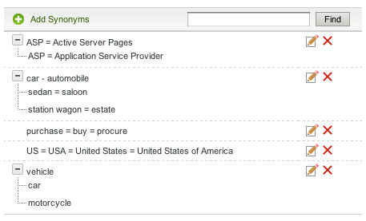

# Acerca de los diccionarios{#about-dictionaries}

Puede utilizar Diccionarios para administrar una colección de diccionarios y sus sinónimos e hiponyms asociados.

## Uso de diccionarios {#concept_B8028B71EC8144669614C64578EDB034}

Los sinónimos son palabras que tienen el mismo significado o similar, como pantalones, vaqueros, pantalones y pantalones, o comprar, comprar, adquirir y ordenar.

Los Hyponyms son sinónimos unidireccionales y ofrecen una solución cuando los sinónimos serían inapropiados. Por ejemplo: el término de búsqueda principal de un sitio de venta minorista de ropa es &quot;pantalones&quot;. Sin embargo, los vaqueros no aparecen en los resultados de búsqueda. En tal caso, se puede usar un himno para asociar jeans con pantalones, pero para permitir que una búsqueda de jeans devuelva solamente jeans. Utilice los hiponyms para proporcionar también una coincidencia para productos interrumpidos o términos competitivos. Esta estrategia garantiza un impacto mínimo en otros resultados de búsqueda. Por ejemplo, si el producto &quot;S2000&quot; se interrumpe y el producto &quot;S3000&quot; es su sucesor, utilice un hiponym en lugar de un sinónimo para asegurarse de que los resultados de la búsqueda para &quot;S3000&quot; no incluyan ningún resultado &quot;S2000&quot;.

Los sinónimos y los hiponyms ayudan a los clientes a encontrar resultados de búsqueda relevantes cuando especifican términos coincidentes no exactos que no existen en las páginas web. Por ejemplo, si la palabra &quot;pantalones&quot; se utiliza en todo el sitio web, puede crear un sinónimo que vincule &quot;pantalones&quot; y &quot;pantalones&quot;. A su vez, cuando los clientes buscan &quot;pantalones&quot;, se devuelven resultados de búsqueda relacionados con pantalones.

Los sinónimos y los hiponyms se agrupan como Diccionarios de dominio. Son diccionarios especiales que se crean para un tema o propósito específico.

La página Menú del diccionario enumera todos los diccionarios de dominio que la cuenta ha definido actualmente. Desde esta página principal, puede cambiar el nombre de los diccionarios de dominio, editarlos, eliminarlos o activarlos y desactivarlos.

## Comprensión de la notación de sinónimos e hiponym {#section_B459CCB850974F4FB16A14E489BBBEC0}

La siguiente imagen es un ejemplo de un grupo de términos con relaciones sinónimas e hípicas.

Se definen explícitamente seis relaciones sinónimas principales. Cada término está separado por signos iguales (=).

* &quot;Coche&quot; es un sinónimo de automóvil.
* &quot;Sedan&quot; es sinónimo de salón.
* &quot;El vagón de la estación&quot; es un sinónimo de propiedad.
* &quot;ASP&quot; es un sinónimo de Active Server Pages y Application Service Provider.
* &quot;Compras&quot;, &quot;compras&quot; y &quot;compras&quot; son sinónimos entre sí.
* &quot;EE.UU.&quot;, &quot;EE.UU.&quot; y &quot;Estados Unidos de América&quot; son sinónimos.

Las filas que contienen una sola palabra son sinónimos simples. Las filas con árboles ampliables forman relaciones de hiponismo. En el ejemplo, el segundo árbol define sedan, saloon, vagón de estación y propiedad como hípimos de auto y automóvil. Por el contrario, los automóviles y los automóviles son hipertipos del resto de los términos del árbol.

El tercer árbol define el automóvil y la motocicleta como los hípimos del vehículo.

Puede incluir más de un acrónimo y/o expansión de varias palabras en cada sinónimo, como se ha visto en el ejemplo de sinónimo &quot;EE. UU.&quot; anterior. Cuando una palabra o acrónimo tenga varios significados, cree un sinónimo para cada significado, como en el ejemplo &quot;ASP&quot; anterior. Al agregar varios sinónimos, se asegura de que la búsqueda de &quot;Proveedor de servicio de aplicaciones&quot;, por ejemplo, no devuelve resultados de búsqueda de &quot;Páginas de Active Server&quot;.

Los hipopótamos no se expanden con otros hiponyms. Los hipopótamos se expanden, como mucho, un nivel con sus sinónimos. Por ejemplo, una búsqueda de &quot;vehículo&quot; devuelve los resultados de &quot;coche&quot; y &quot;automóvil&quot;, pero no devuelve los resultados de &quot;sedan&quot; y &quot;vagón de estación&quot;.

## Acerca de la búsqueda de términos entre diccionarios {#section_28E7F80CE68D4481BBF4F51EED237C67}

Puede buscar los hiponyms y sinónimos en todos los diccionarios que agregue. Esta función es útil porque desea editar o eliminar un término específico que pueda existir en varios diccionarios. Cada diccionario con resultados coincidentes aparece con sus conjuntos de palabras coincidentes. Si la consulta devuelve más de 1000 conjuntos o árboles, solo se presentan los 1000 primeros.

Consulte [Búsqueda entre diccionarios](../c-about-linguistics-menu/c-about-dictionaries.md#task_8D2BACC6F9B4487FA82367CBEDEE306F).

Consulte [Edición de un diccionario](../c-about-linguistics-menu/c-about-dictionaries.md#task_7B349B2D385048D7A06E754FAB75316A).

## Acerca de la configuración de un diccionario como diccionario derivativo {#section_B859E2E957674F558AC6F8D05A0ED190}

La lematización, que es la capacidad de buscar en la raíz de una palabra que puede tener varios extremos, puede funcionar en uno de los tres modos siguientes: Diccionarios de dominio, Forms predeterminado de palabra alternativa y Ninguno.

Consulte [Acerca de las palabras y el idioma](../c-about-linguistics-menu/c-about-words-and-language.md#concept_CEB4B9576F3C4E2EB87B352EEC738D79).

La siguiente información supone que su cuenta tiene **[!UICONTROL Alternative Word Forms]** establecido en **[!UICONTROL Domain Dictionaries]**, de modo que pueda configurar diccionarios de dominio específicos como su fuente de sistemas.

Puede convertir cualquier diccionario de dominio en un &quot;diccionario de derivación&quot;. Sus sinónimos e hiponimos siguen expandiéndose según lo esperado, pero con efectos secundarios adicionales. Con cualquier término en común que se encuentre en otro diccionario, o incluso en sí mismo, combina su grupo de palabras con esos sinónimos o hyponyms. Se puede pensar en esto como otro nivel de expansión de palabras.

Sin derivación, los sinónimos y los hiponyms deben ser detallados y completos, y deben enumerar cada palabra relevante como miembro.

A continuación se muestra un ejemplo de sinónimos y sin derivación:

* Sinónimos: jog = en ejecución
* Una consulta para &quot;jog&quot; produce documentos con las palabras &quot;running&quot; y &quot;jog&quot;.
* Una consulta para &quot;ejecutar&quot; produce los mismos documentos que &quot;jog&quot;.
* Las páginas web sin &quot;jog&quot; y &quot;Running&quot;, pero con otros formularios de palabras como &quot;run&quot; y &quot;run&quot;, no aparecen en el resultado de la consulta.

En este ejemplo, una palabra de consulta no se expande a menos que sea miembro de un sinónimo o un hiponym específicos.

A continuación se muestra un ejemplo de sinónimos y derivación:

* Sinónimos: jog = en ejecución
* Entrada de sinónimo de un diccionario derivador: run = run = run
* Una consulta para &quot;jog&quot; o &quot;running&quot; devuelve todas las páginas web con las palabras &quot;run&quot;, &quot;running&quot;, &quot;run&quot; y &quot;jog&quot;.
* Una consulta para &quot;ejecuta&quot; y &quot;ejecuta&quot; devuelve los mismos resultados o resultados similares.

En este ejemplo, un sinónimo de un diccionario derivador tiene la capacidad de combinar su grupo de palabras equivalentes con cualquier otro sinónimo o hiponym en cualquier otro diccionario que tenga al menos un término en común.

Designar demasiados diccionarios con demasiadas palabras puede tener ramificaciones de rendimiento. Debe designar los diccionarios de dominio como diccionarios de derivación con moderación. La depuración también puede crear expansiones de palabras no previstas durante la búsqueda y complicar el proceso de depuración y seguimiento de expansiones de palabras.

Consulte [Configuración de un diccionario como diccionario de derivación](../c-about-linguistics-menu/c-about-dictionaries.md#task_541E8453A12F4A8E89CF6F595469F074).

## Adición de un nuevo diccionario {#task_F31AC6723E894C4F91D12AB2A4CEE9FB}

Puede agregar un nuevo diccionario de sinónimos e hípimos para ayudar a sus clientes a encontrar resultados de búsqueda relevantes. Esta función es especialmente útil cuando los clientes especifican términos coincidentes no exactos que podrían no existir en las páginas web.

Consulte también [Adición de una nueva regla comercial](../c-about-rules-menu/c-about-business-rules.md#task_BD3B31ED48BB4B1B8F1DCD3BFA2528E7).

**Para agregar un diccionario nuevo**

1. En el menú del producto, haga clic en **[!UICONTROL Linguistics]** > **[!UICONTROL Dictionaries]**.
1. En la página **[!UICONTROL Dictionary Menu]**, haga clic en **[!UICONTROL Add New Dictionary]**.
1. En la página **[!UICONTROL Dictionary]**, en el campo **[!UICONTROL Name]**, introduzca el nombre del nuevo diccionario.
1. Haga clic **[!UICONTROL Add Synonyms]**.
1. En el cuadro de diálogo **[!UICONTROL Add Terms]**, realice una de las siguientes acciones:

   * Para agregar sinónimos, escriba dos o más términos en el campo de texto principal, separando cada palabra o frase con un signo igual (=). Por ejemplo, pantalones = pantalones = barras.
   * Para agregar himnos, escriba un término de hiperenumeración en el campo de texto principal. Haga clic en **[!UICONTROL Add Hyponym]** y, a continuación, introduzca un hiponym relacionado con el hipernombre introducido. Por ejemplo, &quot;sedan&quot;, &quot;saloon&quot;, &quot;station wagon&quot; y &quot;property&quot; podrían ser hípimos de &quot;coche&quot; y &quot;automóvil&quot; (ambos hipernimos) como se ve a continuación.

      

      Las entradas de Hyponym también pueden formar sinónimos como &quot;sedan&quot; y &quot;saloon&quot;.

1. Haga clic **[!UICONTROL Save]**.
1. Realice uno de los siguientes pasos:

   * Repita los pasos 4-6 para agregar más sinónimos e hiponimos.
   * Continúe con el paso siguiente.

1. Para obtener una vista previa de los resultados de los cambios, haga clic en **[!UICONTROL regenerate your staged site index]** para reconstruir el índice del sitio web provisional.

   Consulte [Ejecución de un índice completo de un sitio web activo o organizado...](../c-about-index-menu/c-about-full-index.md#task_F7FE04D8A1654A7787FCCA31B45EB42D).

   Consulte [Ejecución de un índice incremental de un sitio web activo o por etapas...](../c-about-index-menu/c-about-incremental-index.md#task_9BFB6157F3884B2FAECB7E0E9CA318CB).
1. (Opcional) En el menú del producto, haga clic en **[!UICONTROL Linguistics]** > **[!UICONTROL Dictionaries]** y, a continuación, realice una de las siguientes acciones:

   * Haga clic en **[!UICONTROL History]** para revertir cualquier cambio que haya realizado.

      Consulte [Uso de la opción Historial](../t-using-the-history-option.md#task_70DD3F87A67242BBBD2CB27156F43002).

   * Haga clic **[!UICONTROL Live]**.

      Consulte [Visualización de la configuración de lanzamiento](../c-about-staging.md#task_401A0EBDB5DB4D4CA933CBA7BECDC10F).

   * Haga clic **[!UICONTROL Push Live]**.

      Consulte [Inserción de la configuración del escenario en directo](../c-about-staging.md#task_44306783B4C0408AAA58B471DAF2D9A4).

## Activación o desactivación de un diccionario {#task_EC282EA0846942F6913918EA8218220B}

Las relaciones de cada palabra se generan en el momento de indexar el sitio web. Antes de la siguiente operación de indexación, puede activar o desactivar cualquier diccionario que haya agregado.

**Para habilitar o deshabilitar un diccionario**

1. En el menú del producto, haga clic en **[!UICONTROL Linguistics]** > **[!UICONTROL Dictionaries]**.
1. En la página **[!UICONTROL Dictionary Menu]**, en la columna **[!UICONTROL Enabled]** de la tabla, realice una de las siguientes acciones:

   * Marque la casilla de un diccionario que desee activar y haya indexado.
   * Desmarque la casilla de un diccionario que desee desactivar y que no tenga indexado.

1. Haga clic **[!UICONTROL Save Changes]**.
1. Para obtener una vista previa de los resultados de los cambios, haga clic en **[!UICONTROL regenerate your staged site index]** para reconstruir el índice del sitio web provisional.

   Consulte [Ejecución de un índice completo de un sitio web activo o organizado...](../c-about-index-menu/c-about-full-index.md#task_F7FE04D8A1654A7787FCCA31B45EB42D).

   Consulte [Ejecución de un índice incremental de un sitio web activo o por etapas...](../c-about-index-menu/c-about-incremental-index.md#task_9BFB6157F3884B2FAECB7E0E9CA318CB).
1. (Opcional) En el menú del producto, haga clic en **[!UICONTROL Linguistics]** > **[!UICONTROL Dictionaries]** y, a continuación, realice una de las siguientes acciones:

   * Haga clic en **[!UICONTROL History]** para revertir cualquier cambio que haya realizado.

      Consulte [Uso de la opción Historial](../t-using-the-history-option.md#task_70DD3F87A67242BBBD2CB27156F43002).

   * Haga clic **[!UICONTROL Live]**.

      Consulte [Visualización de la configuración de lanzamiento](../c-about-staging.md#task_401A0EBDB5DB4D4CA933CBA7BECDC10F).

   * Haga clic **[!UICONTROL Push Live]**.

      Consulte [Inserción de la configuración del escenario en directo](../c-about-staging.md#task_44306783B4C0408AAA58B471DAF2D9A4).

## Edición de un diccionario {#task_7B349B2D385048D7A06E754FAB75316A}

Puede editar o eliminar grupos de sinónimos e hípicos que conformen un diccionario específico.

<!-- 

t_editing_a_dictionary.xml

 -->

También puede utilizar **[!UICONTROL Find]** para localizar sinónimos e hiponimos específicos que desee editar o eliminar en todos sus diccionarios.

**Para editar un diccionario**

1. En el menú del producto, haga clic en **[!UICONTROL Linguistics]** > **[!UICONTROL Dictionaries]**.
1. Realice uno de los siguientes pasos:

   * En la página [!DNL Dictionary Menu], en la tabla, haga clic en el nombre de un solo diccionario cuyos términos desee editar o eliminar.
   * En la página [!DNL Dictionary Menu], en el campo de texto **[!UICONTROL Find]**, escriba un término que desee localizar en todos los diccionarios y, a continuación, haga clic en **[!UICONTROL Find]**.

      En la página [!DNL Find in Dictionaries], utilice las listas desplegables que acompañan para establecer las opciones de refinamiento que desee.

      <table> 
      <thead> 
        <tr> 
        <th colname="col1" class="entry"> 
Opción 
 </th> 
        <th colname="col2" class="entry"> 
Descripción 
 </th> 
        </tr> 
      </thead>
      <tbody> 
        <tr> 
        <td colname="col1"> 
Buscar 
 </td> 
        <td colname="col2"> 
Permite introducir el término que desea buscar en todos los diccionarios. 
 </td> 
        </tr> 
        <tr> 
        <td colname="col1"> 
Coincidir lista desplegable 
 </td> 
        <td colname="col2"> 
Permite seleccionar entre los cuatro tipos de coincidencias siguientes: 
        <ul id="ul_D656F159677946938050115F610EEF4B"> 
        <li id="li_2D6B302E021A4CE7A47F028812633EDC">  Coincidencia exacta   
La consulta debe tener una coincidencia exacta con un himno o sinónimo. 
 </li> 
        <li id="li_30AD5976E43041E98190F4757E821092">  Contiene texto   
La consulta solo necesita una coincidencia de subcadena; una coincidencia dentro de un himno o sinónimo. 
 </li> 
        <li id="li_9BF911EFB54345BB82679BDE51DDF8AF">  Comienza con  
La consulta solo se compara con el principio de cada hiponym y sinónimo. 
 </li> 
        <li id="li_CB791C7F5B5A4496B329ED505E7D97BC">  Coincidencia de palabras   
La consulta se compara con cada palabra de un sinónimo o un hiponym, pero la palabra debe coincidir exactamente. 
 </li> 
        </ul> 
 </td> 
        </tr> 
        <tr> 
        <td colname="col1"> 
Lista desplegable Diccionario habilitado/deshabilitado 
 </td> 
        <td colname="col2"> 
Permite seleccionar entre las siguientes opciones: 
        <ul id="ul_EBBD3F3A2D854952A35CBDDBECB40958"> 
        <li id="li_7F5654C284BE485EAC9B000A663C6C60">  Diccionarios habilitados y deshabilitados   
Busque el término especificado en los diccionarios habilitado y deshabilitado. 
 </li> 
        <li id="li_4A83EECF38044287A923EC0AAF639079">  Solo diccionarios habilitados   
La búsqueda de diccionarios habilitados solo es útil para depurar el índice actual. 
 </li> 
        </ul> 
 
Consulte <a href="../c-about-linguistics-menu/c-about-dictionaries.md#task_EC282EA0846942F6913918EA8218220B" type="task" format="dita" scope="local"> Activación o desactivación de un diccionario </a>. 
 </td> 
        </tr> 
        <tr> 
        <td colname="col1"> 
Lista desplegable Ensayo/Activo 
 </td> 
        <td colname="col2"> 
Permite seleccionar entre las siguientes opciones: 
        <ul id="ul_BD0733A30E6B470E942B21F499A4373B"> 
        <li id="li_F9A8C39C22EA4FBF86536F5924ED973C">  Diccionarios en escena/activos   
Busca el término especificado en los diccionarios en vivo y en etapas. Sin embargo, solo busca la versión configurada del diccionario si existe. Si la versión configurada no existe, busca la versión activa del diccionario. 
 </li> 
        <li id="li_DB0944DB18564269AA10676BDFDB0460">  Diccionarios en directo   
Busque el término especificado solo en los diccionarios activos. 
 </li> 
        </ul> 
 </td> 
        </tr> 
      </tbody> 
      </table>

1. En la tabla, realice una de las acciones siguientes:

   * Haga clic en  que está asociado con el término que desea actualizar. En el cuadro de diálogo **[!UICONTROL Edit Terms]**, cambie los términos que desee. Cuando termine, haga clic en **[!UICONTROL Save]**.

   * Haga clic en  que está asociado con el término que desea eliminar. En el cuadro de diálogo **[!UICONTROL Delete Terms]**, haga clic en **[!UICONTROL Delete]**. Asegúrese de eliminar el término correcto; no hay ningún cuadro de diálogo de confirmación de eliminación.

1. Para obtener una vista previa de los resultados de los cambios, haga clic en **[!UICONTROL regenerate your staged site index]** para reconstruir el índice del sitio web provisional.

   Consulte [Ejecución de un índice completo de un sitio web activo o organizado...](../c-about-index-menu/c-about-full-index.md#task_F7FE04D8A1654A7787FCCA31B45EB42D).

   Consulte [Ejecución de un índice incremental de un sitio web activo o por etapas...](../c-about-index-menu/c-about-incremental-index.md#task_9BFB6157F3884B2FAECB7E0E9CA318CB).
1. (Opcional) En el menú del producto, haga clic en **[!UICONTROL Linguistics]** > **[!UICONTROL Dictionaries]** y, a continuación, realice una de las siguientes acciones:

   * Haga clic en **[!UICONTROL History]** para revertir cualquier cambio que haya realizado.

      Consulte [Uso de la opción Historial](../t-using-the-history-option.md#task_70DD3F87A67242BBBD2CB27156F43002).

   * Haga clic **[!UICONTROL Live]**.

      Consulte [Visualización de la configuración de lanzamiento](../c-about-staging.md#task_401A0EBDB5DB4D4CA933CBA7BECDC10F).

   * Haga clic **[!UICONTROL Push Live]**.

      Consulte [Inserción de la configuración del escenario en directo](../c-about-staging.md#task_44306783B4C0408AAA58B471DAF2D9A4).

## Cambio del nombre de un diccionario {#task_7F1F372B337B4853BFA2A60AD267B092}

Puede cambiar el nombre de un diccionario que haya agregado.

<!-- 

t_renaming_a_dictionary.xml

 -->

Si establece la opción **[!UICONTROL Alternate Word Forms]** en **[!UICONTROL Domain Dictionaries]** en **[!UICONTROL Words & Language]**, se utiliza la opción **[!UICONTROL Configure]** en lugar de **[!UICONTROL Rename]**.

Consulte [Acerca de las palabras y el idioma](../c-about-linguistics-menu/c-about-words-and-language.md#concept_CEB4B9576F3C4E2EB87B352EEC738D79).

**Cambio del nombre de un diccionario**

1. En el menú del producto, haga clic en **[!UICONTROL Linguistics]** > **[!UICONTROL Dictionaries]**.
1. En la página **[!UICONTROL Dictionary Menu]**, en la columna **[!UICONTROL Actions]** de la tabla, realice una de las siguientes acciones:

   * Haga clic **[!UICONTROL Rename]** para el diccionario asociado cuyo nombre desee cambiar.

      En el cuadro de diálogo **[!UICONTROL Rename Dictionary]**. en el campo **[!UICONTROL Name]**, introduzca el nuevo nombre del diccionario.

      Haga clic **[!UICONTROL Rename File]**.

   * Haga clic **[!UICONTROL Configure]** para el diccionario asociado cuyo nombre desee cambiar.

      En el cuadro de diálogo **[!UICONTROL Configure Dictionary]**. en el campo **[!UICONTROL Name]**, introduzca el nuevo nombre del diccionario.

      Haga clic **[!UICONTROL Save Configuration]**.

1. (Opcional) Realice una de las siguientes acciones:

   * Haga clic en **[!UICONTROL History]** para revertir cualquier cambio que haya realizado.

      Consulte [Uso de la opción Historial](../t-using-the-history-option.md#task_70DD3F87A67242BBBD2CB27156F43002).

   * Haga clic **[!UICONTROL Live]**.

      Consulte [Visualización de la configuración de lanzamiento](../c-about-staging.md#task_401A0EBDB5DB4D4CA933CBA7BECDC10F).

   * Haga clic **[!UICONTROL Push Live]**.

      Consulte [Inserción de la configuración del escenario en directo](../c-about-staging.md#task_44306783B4C0408AAA58B471DAF2D9A4).

## Configuración de un diccionario como diccionario de derivación {#task_541E8453A12F4A8E89CF6F595469F074}

Puede establecer un diccionario en modo de derivación avanzado para aprovechar la derivación de palabras en las búsquedas.

<!-- 

t_configuring_a_dictionary_as_a_stemming_dictionary.xml

 -->

Este modo devuelve páginas web que coinciden con las variantes de lo que buscan los clientes.

Consulte [Acerca de los diccionarios](../c-about-linguistics-menu/c-about-dictionaries.md#concept_B8028B71EC8144669614C64578EDB034).

Consulte [Acerca de las palabras y el idioma](../c-about-linguistics-menu/c-about-words-and-language.md#concept_CEB4B9576F3C4E2EB87B352EEC738D79).

**Configuración de un diccionario como diccionario de derivación**

1. En el menú del producto, haga clic en **[!UICONTROL Linguistics]** > **[!UICONTROL Words & Language]**.
1. En la página [!DNL Words & Languages], en la lista desplegable **[!UICONTROL Alternate Words Forms]**, seleccione **[!UICONTROL Domain Dictionaries]**.

   Cualquier diccionario de dominio configurado como diccionario de derivación (consulte el paso 7 a continuación) se utiliza como fuente de formularios de palabras alternativos.

1. Haga clic **[!UICONTROL Save Changes]**.
1. En el menú del producto, haga clic en **[!UICONTROL Linguistics]** > **[!UICONTROL Dictionaries]**.
1. En la página [!DNL Dictionaries Menu], en la columna **[!UICONTROL Actions]** de la tabla, haga clic en **[!UICONTROL Configure]** para obtener un diccionario asociado que desee configurar como diccionario raíz.
1. En el cuadro de diálogo **[!UICONTROL Configure Dictionary]**, en la lista desplegable **[!UICONTROL Advanced Stemming Mode]**, seleccione **[!UICONTROL Yes]**.
1. Haga clic **[!UICONTROL Save Configuration]**.
1. Haga clic en **[!UICONTROL regenerate your staged site index]** para reconstruir el índice de sitio web provisional.

   Consulte [Ejecución de un índice completo de un sitio web activo o organizado...](../c-about-index-menu/c-about-full-index.md#task_F7FE04D8A1654A7787FCCA31B45EB42D).

   Consulte [Ejecución de un índice incremental de un sitio web activo o por etapas...](../c-about-index-menu/c-about-incremental-index.md#task_9BFB6157F3884B2FAECB7E0E9CA318CB).
1. (Opcional) En el menú del producto, haga clic en **[!UICONTROL Linguistics]** > **[!UICONTROL Dictionaries]** y, a continuación, realice una de las siguientes acciones:

   * Haga clic en **[!UICONTROL History]** para revertir cualquier cambio que haya realizado.

      Consulte [Uso de la opción Historial](../t-using-the-history-option.md#task_70DD3F87A67242BBBD2CB27156F43002).

   * Haga clic **[!UICONTROL Live]**.

      Consulte [Visualización de la configuración de lanzamiento](../c-about-staging.md#task_401A0EBDB5DB4D4CA933CBA7BECDC10F).

   * Haga clic **[!UICONTROL Push Live]**.

      Consulte [Inserción de la configuración del escenario en directo](../c-about-staging.md#task_44306783B4C0408AAA58B471DAF2D9A4).

## Búsqueda entre diccionarios {#task_8D2BACC6F9B4487FA82367CBEDEE306F}

Puede buscar los hiponyms y sinónimos en todos los diccionarios que se agregan a la búsqueda o comercialización del sitio.

<!-- 

t_searching_across_dictionaries.xml

 -->

Esta función es útil porque desea editar o eliminar un término específico que pueda existir en varios diccionarios. Cada diccionario con resultados coincidentes aparece con sus conjuntos de palabras coincidentes. Si la consulta devuelve más de 1000 conjuntos o árboles, solo se presentan los 1000 primeros.

Consulte [Edición de un diccionario](../c-about-linguistics-menu/c-about-dictionaries.md#task_7B349B2D385048D7A06E754FAB75316A).

**Para buscar entre diccionarios**

1. En el menú del producto, haga clic en **[!UICONTROL Linguistics]** > **[!UICONTROL Dictionaries]**.
1. En la página [!DNL Dictionary Menu], en el campo de texto **[!UICONTROL Find]**, escriba un término que desee localizar en todos los diccionarios y, a continuación, haga clic en **[!UICONTROL Find]**.
1. En la página [!DNL Find in Dictionaries], utilice las listas desplegables que acompañan para establecer las opciones de refinamiento que desee.

   Consulte [Edición de un diccionario](../c-about-linguistics-menu/c-about-dictionaries.md#task_7B349B2D385048D7A06E754FAB75316A).
1. (Opcional) Use la lista desplegable **[!UICONTROL Show]** para especificar el número máximo de resultados que desea mostrar por página.

## Eliminación de un diccionario {#task_DBAAEE624BC14D2590444B0B7869ECCA}

Puede eliminar diccionarios que ya no necesite o use.

<!-- 

t_deleting_a_dictionary.xml

 -->

Si elimina un diccionario que está activo, se configura para su eliminación. Si elimina un diccionario que está en etapa, se elimina inmediatamente.

Asegúrese de que está eliminando un diccionario que ya sabe que necesita; no hay ninguna función de historial disponible para revertir la eliminación.

**Eliminar un diccionario**

1. En el menú del producto, haga clic en **[!UICONTROL Linguistics]** > **[!UICONTROL Dictionaries]**.
1. En la página [!DNL Dictionary Menu], en la columna **[!UICONTROL Actions]** de la tabla, haga clic en **[!UICONTROL Delete]** para el diccionario asociado que desea eliminar.
1. En el cuadro de diálogo **[!UICONTROL Delete Dictionary]**. haga clic en **[!UICONTROL Yes]** para confirmar la eliminación.
1. (Opcional) Si ha eliminado un diccionario activo, realice una de las siguientes acciones:

   * Haga clic **[!UICONTROL Live]**.

      Consulte [Visualización de la configuración de lanzamiento](../c-about-staging.md#task_401A0EBDB5DB4D4CA933CBA7BECDC10F).

   * Haga clic **[!UICONTROL Push Live]**.

      Consulte [Inserción de la configuración del escenario en directo](../c-about-staging.md#task_44306783B4C0408AAA58B471DAF2D9A4).

