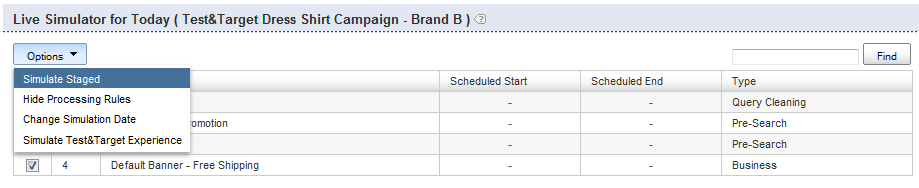

# Acerca de las reglas comerciales{#about-business-rules}

Puede utilizar las reglas comerciales para comercializar la búsqueda.

## Uso de reglas comerciales {#concept_2A93D76216754D3D8412CDEA00BD26BD}

Por ejemplo, puede configurar cuándo aparecen los letreros o qué resultados aparecen y en qué orden. También puede configurar la posición de un elemento en la faceta y qué plantilla se utiliza para una búsqueda determinada. Las reglas se ejecutan en el orden en que se definieron; cuanto mayor sea el número de orden de una regla, más tarde se ejecutará en el proceso, superando las reglas anteriores. Puede arrastrar y soltar las reglas para cambiar su orden, o puede reordenarlas introduciendo un nuevo número en el cuadro de texto Orden de reglas.

Cada regla comercial está formada por activadores y acciones.

El activador define cuándo se ejecuta la regla. Por ejemplo, cuando el término de consulta es &quot;hombre&quot; o cuando los resultados son mayormente sombreros. El activador consiste en varias condiciones que deben ser todas o cualquiera de ellas debe ser verdadera para que el activador global sea verdadero. Puede especificar la prioridad cambiando el operador de activación.

La acción define qué sucede cuando se cumple la condición desencadenadora. Por ejemplo, si se configura la pancarta para que muestre o mueva un resultado determinado a la posición 1. La tabla de reglas muestra información resumida sobre la regla. Puede hacer clic en el nombre de una regla para abrirla y ver información adicional.

La tabla de reglas muestra una lista de todas las reglas comerciales. De forma predeterminada, la tabla muestra las diez últimas reglas agregadas, en orden descendente. Puede hacer clic en los encabezados de columna de la tabla para ordenar las reglas en orden ascendente o descendente.

Las reglas comerciales pueden tener uno de los tres estados siguientes: Aprobado, Suspendido o Trabajo en curso

<table> 
 <thead> 
  <tr> 
   <th colname="col1" class="entry"> 
Estado de la regla comercial 
 </th> 
   <th colname="col2" class="entry"> 
Descripción 
 </th> 
  </tr> 
 </thead>
 <tbody> 
  <tr> 
   <td colname="col1"> 
Aprobado 
 </td> 
   <td colname="col2"> 
Las reglas comerciales aprobadas se ejecutan en su entorno activo y en su entorno de ensayo. Puede aprobar una regla comercial en el Generador de reglas avanzado. 
 </td> 
  </tr> 
  <tr> 
   <td colname="col1"> 
Suspendido 
 </td> 
   <td colname="col2"> 
Las reglas comerciales suspendidas nunca se ejecutan en su entorno de ensayo o en su entorno de lanzamiento. 
 </td> 
  </tr> 
  <tr> 
   <td colname="col1"> 
WIP 
 </td> 
   <td colname="col2"> 
WIP (Trabajo en curso) son reglas comerciales que no están aprobadas ni suspendidas. Es decir, es posible que aún esté trabajando en ellos o que desee probarlos antes de aprobarlos. Las reglas comerciales en estado de trabajo en curso se ejecutan únicamente en el entorno de ensayo. 
 </td> 
  </tr> 
 </tbody> 
</table>

Las reglas comerciales se aprueban y se insertan en directo para que se ejecuten en el entorno de lanzamiento. Actualmente, solo puede insertar *todas* las reglas en directo. Sin embargo, puede cambiar el estado de una regla para tener control sobre qué reglas se ejecutan y no se ejecutan en el entorno de lanzamiento.

De forma predeterminada, las reglas se ejecutan cada vez que se cumplen los activadores asociados. Sin embargo, si lo desea, puede programar una regla para que se ejecute en un intervalo de fecha y hora específico.

Además, de forma predeterminada, las reglas se ejecutan cada vez que se cumplen sus activadores asociados para todas las tiendas. Si desea que la regla solo se aplique a determinadas tiendas, puede utilizar el panel Tiendas para seleccionar una o varias tiendas a las que se aplique la regla.

## Adición de una nueva regla comercial {#task_BD3B31ED48BB4B1B8F1DCD3BFA2528E7}

Puede usar [!DNL Visual Rule Builder] o [!DNL Advanced Rule Builder] agregar reglas comerciales que adapten la experiencia de búsqueda de su cliente.

**Para agregar una nueva regla comercial**

En los pasos siguientes se asume que está utilizando el Generador de reglas visuales.

1. Realice uno de los siguientes pasos:

   * En el menú de producto, haga clic en **[!UICONTROL Rules]** > **[!UICONTROL Business Rules]**. En la [!DNL Business Rules] página, haga clic en **[!UICONTROL Add New Rule]**.

   * En el menú del producto, haga clic en **[!UICONTROL Simulator]**. En la **[!UICONTROL Simulator for Today]** página, haga clic **[!UICONTROL Add New Rule]** a la derecha del menú **[!UICONTROL Options]** desplegable.

      Si la **[!UICONTROL Add New Rule]** opción no está visible en la página, en el menú **[!UICONTROL Options]** desplegable, haga clic en **[!UICONTROL Simulate Staged]**.

      

1. En el campo de **[!UICONTROL Name]** texto, escriba el nuevo nombre de la regla comercial.

   No haga clic **[!UICONTROL Save Rule]** aún.
1. (Opcional) Si administra un gran número de reglas comerciales, puede etiquetar las reglas comerciales con etiquetas específicas. En el **[!UICONTROL Tags]** campo, introduzca una o varias etiquetas de etiquetas, Use una coma, Tab o Intro como delimitador.

   En la [!DNL Business Rules] página, utilice la **[!UICONTROL Filter by tag]** característica para filtrar las reglas que coinciden con una etiqueta determinada. 1. En la [!DNL Business Rule Builder] página, configure los activadores y las acciones que desee utilizar.

       **Opciones de activador**
 Los     
     activadores son las condiciones que deben cumplirse para que se ejecute una regla comercial. Cuando una regla comercial tiene varios activadores, puede configurar la forma en que los activadores responden con uno de los tres métodos siguientes:
   
   * Una respuesta en la que todos los activadores deben ser verdaderos (la configuración predeterminada) como en el siguiente ejemplo:

      `if a AND b AND c then ...`

   * Una respuesta en la que cualquiera de los activadores debe ser verdadero como en el siguiente ejemplo:

      `if a OR b OR c then ...`

   * Una respuesta en la que se especifica una combinación personalizada de activadores. Es decir, combina activadores individuales o &quot;condiciones&quot; con `AND` operadores y `OR` operadores.

      También puede modificar la prioridad de evaluación agregando combinaciones de paréntesis de apertura y de cierre como en el ejemplo siguiente:

      `if (a OR b) AND c then ...`

      >[!NOTE]
      >
      >Si combina `AND` operadores con `OR` operadores en un conjunto de reglas comerciales personalizadas, asegúrese de especificar los paréntesis correctamente para asegurarse de que los activadores se evalúan en el orden correcto.

      Esta característica particular de poder personalizar una combinación de activadores no está habilitada de forma predeterminada. Póngase en contacto con la asistencia técnica para activar esta función para su uso.
   <table> 
      <thead> 
      <tr> 
      <th colname="col1" class="entry"> 
Opción Desencadenadores 
 </th> 
      <th colname="col2" class="entry"> 
Descripción 
 </th> 
      </tr> 
    </thead>
    <tbody> 
      <tr> 
      <td colname="col1"> 
Coincidencias de palabras clave 
 </td> 
      <td colname="col2"> 
El activador es verdadero cuando el término de búsqueda coincide con la palabra clave que distingue entre mayúsculas y minúsculas dada. El activador es verdadero tanto para la palabra clave como para todos sus sinónimos, tal como se define en el diccionario lingüístico. 
 </td> 
      </tr> 
      <tr> 
      <td colname="col1"> 
 Coincidencias de consultas 
 </td> 
      <td colname="col2"> 
 El activador es true cuando coinciden todos los parámetros de búsqueda. 
 </td> 
      </tr> 
      <tr> 
      <td colname="col1"> 
 El grupo de resultados es dominante 
 </td> 
      <td colname="col2"> 
 El activador es verdadero cuando el grupo de resultados definido por la búsqueda dada domina el conjunto de resultados. 
 
De forma predeterminada, el dominio se establece en 50%. Esta configuración es una preferencia de comercialización que puede establecer. 
 
 
        <!--See <xref href="t_Configuring_Merchandising_preferences.xml#task_7AC7B9F5D9F44E10AB5BC0B8CB31C37A" type="task" format="dita" scope="local">Configuring Merchandising preferences</xref>. --> 
 
El grupo completo debe estar presente en el conjunto de resultados para que este activador sea verdadero. El grupo de resultados es dinámico. Pueden cambiar después de las operaciones de índice, dependiendo de los resultados que coincidan con los criterios de búsqueda originales. 
 </td> 
      </tr> 
      <tr> 
      <td colname="col1"> 
El grupo de resultados está presente 
 </td> 
      <td colname="col2"> 
 El activador es verdadero cuando el grupo de resultados definido por la búsqueda dada está presente en el conjunto de resultados. El grupo completo debe estar presente en el conjunto de resultados para que se cumpla este activador (los resultados pueden estar presentes en cualquier página). El grupo de resultados es dinámico y puede cambiar después de las operaciones de índice en función de los resultados que coincidan con los criterios de búsqueda originales. 
 </td> 
      </tr> 
      <tr> 
      <td colname="col1"> 
 Resultado presente 
 </td> 
      <td colname="col2"> 
 El activador es verdadero cuando el resultado individual se encuentra dentro del conjunto de resultados. El resultado puede estar en cualquier parte del conjunto de resultados, no tiene por qué estar en la página que el usuario está viendo actualmente. 
 </td> 
      </tr> 
    </tbody> 
    </table>

   **Opciones de acción**

   Cuando se alcanzan los activadores de una regla comercial, se realizan las acciones asociadas con la regla. Aunque el Generador de reglas visuales permite crear las siguientes acciones, puede utilizar el Generador de reglas avanzado para crear tipos adicionales de acciones.

   Las acciones Eliminar elemento de faceta, Revelar elemento de faceta, Revelar faceta, Quitar faceta y Insertar elemento de faceta en la siguiente tabla requieren una faceta. La interfaz para elegir una faceta depende de cómo se configure la cuenta. Por ejemplo, una cuenta normal utiliza una lista desplegable para elegir facetas. Sin embargo, si la cuenta tiene facetas asignadas, aparece un cuadro de texto de relleno automático en el que puede introducir el nombre de cualquier faceta. El llenado automático sugiere facetas en una lista desplegable a medida que escribe el nombre de la faceta. Las sugerencias incluyen facetas definidas actualmente. Si su cuenta tiene un mapa de ranuras, también sugiere facetas con asignación de fechas.

   <table> 
    <thead> 
      <tr> 
      <th colname="col1" class="entry"> 
Opción Acciones 
 </th> 
      <th colname="col2" class="entry"> 
Descripción 
 </th> 
      </tr> 
    </thead>
    <tbody> 
      <tr> 
      <td colname="col1"> 
Grupo push 
 </td> 
      <td colname="col2"> 
 Coloca el grupo de resultados de búsqueda definido por los criterios de búsqueda especificados en una posición específica. 
 
Al insertar un grupo de resultados de búsqueda no se agrega implícitamente el grupo. 
 </td> 
      </tr> 
      <tr> 
      <td colname="col1"> 
Agregar grupo 
 </td> 
      <td colname="col2"> 
 Agregue el grupo de resultados de búsqueda según los criterios de búsqueda especificados. 
 </td> 
      </tr> 
      <tr> 
      <td colname="col1"> 
Quitar grupo 
 </td> 
      <td colname="col2"> 
 Elimine el grupo de resultados de búsqueda definido por los criterios de búsqueda especificados. 
 </td> 
      </tr> 
      <tr> 
      <td colname="col1"> 
Push Single 
 </td> 
      <td colname="col2"> 
 Coloca el resultado de búsqueda individual en la posición seleccionada. 
 </td> 
      </tr> 
      <tr> 
      <td colname="col1"> 
Agregar una sola 
 </td> 
      <td colname="col2"> 
 Agrega un resultado de búsqueda individual a la posición seleccionada. 
 </td> 
      </tr> 
      <tr> 
      <td colname="col1"> 
Eliminar una sola 
 </td> 
      <td colname="col2"> 
 Elimina un resultado de búsqueda individual del conjunto de resultados de búsqueda. 
 </td> 
      </tr> 
      <tr> 
      <td colname="col1"> 
Eliminar todos los resultados 
 </td> 
      <td colname="col2"> 
Quita todos los resultados del conjunto de resultados de búsqueda. 
 
 
        <!-- Bug #3331637 The option is meant to be used in conjunction with other rule actions in order to create "canned landing pages" where we want to create a page's content solely by rule actions, and need to completely discard the "natural" results of the search. Given that the other options don't have any kind of "here's how/why you might use this", I don't see much point in breaking that precedent here.--> 
 </td> 
      </tr> 
      <tr> 
      <td colname="col1"> 
Seleccionar letrero diferente 
 </td> 
      <td colname="col2"> 
 Cambia la pancarta en el área de la pancarta seleccionada. 
 
Esta opción está disponible cuando se hace clic con el botón derecho en un letrero del área de visualización de la página web. 
 </td> 
      </tr> 
      <tr> 
      <td colname="col1"> 
Agregar comandos de pancarta 
 </td> 
      <td colname="col2"> 
Solo se aplica a plantillas de Adobe Dynamic Media Classic. 
 
Permite cambiar los parámetros predeterminados que se utilizan en la plantilla de pancarta. 
 
Consulte la tabla de opciones en <a scope="local" href="../c-about-design-menu/c-about-banners.md#task_AD1E0C00A9E04B1FA819EB93288786B3" type="reference" format="dita"> Adición de letreros con Adobe Dynamic Media Classic </a>. 
 
Consulte también <a href="../c-about-design-menu/c-about-banners.md#task_C3E782477FBF428ABEA220751781ACA9" type="task" format="dita" scope="local"> Edición de letreros con Adobe Dynamic Media Classic </a>. 
 </td> 
      </tr> 
      <tr> 
      <td colname="col1"> 
Eliminar pancarta 
 </td> 
      <td colname="col2"> 
 Quita la pancarta del área de la pancarta seleccionada; no se muestra ningún letrero a menos que otra regla que establezca un letrero anule esta regla. 
 
Esta opción está disponible cuando se hace clic con el botón derecho en un letrero del área de visualización de la página web. 
 </td> 
      </tr> 
      <tr> 
      <td colname="col1"> 
Elemento de faceta push 
 </td> 
      <td colname="col2"> 
 Coloca un elemento dentro de una faceta en la posición seleccionada. 
 </td> 
      </tr> 
      <tr> 
      <td colname="col1"> 
Eliminar zona 
 </td> 
      <td colname="col2"> 
 Quita una zona de la página de resultados de la búsqueda. 
 
Consulte también la acción Eliminar faceta a continuación. 
 </td> 
      </tr> 
      <tr> 
      <td colname="col1"> 
Mostrar zona 
 </td> 
      <td colname="col2"> 
 Muestra una zona en la página de resultados de la búsqueda. 
 
Consulte también la acción Mostrar faceta a continuación. 
 </td> 
      </tr> 
      <tr> 
      <td colname="col1"> 
Eliminar elemento de faceta 
 </td> 
      <td colname="col2"> 
 Quita un elemento de faceta de una faceta. 
 </td> 
      </tr> 
      <tr> 
      <td colname="col1"> 
Mostrar elemento de faceta 
 </td> 
      <td colname="col2"> 
 Muestra un elemento de faceta específico. 
 </td> 
      </tr> 
      <tr> 
      <td colname="col1"> 
Mostrar faceta 
 </td> 
      <td colname="col2"> 
 Muestra una faceta específica. Esta acción es preferible a la acción Mostrar zona. 
 </td> 
      </tr> 
      <tr> 
      <td colname="col1"> 
Eliminar faceta 
 </td> 
      <td colname="col2"> 
 Elimina una faceta específica. Esta acción es preferible a la acción Eliminar zona. 
 </td> 
      </tr> 
    </tbody> 
    </table>

   Según el panel del generador de reglas que esté activo (desplegado), también puede hacer lo siguiente para definir activadores y acciones.

   * Cuando se despliega el **[!UICONTROL Triggers]** panel: en el área de la plantilla de presentación de la página Generador de reglas comerciales, haga clic con el botón secundario en cualquier resultado de búsqueda o faceta de búsqueda y, a continuación, haga clic en **[!UICONTROL Add "result present" trigger]**.

      En el panel Desencadenadores, haga clic en la &quot;X&quot; a la izquierda de un activador para quitarla de la lista de activadores.

   * Cuando se despliega el **[!UICONTROL Actions]** panel: en el área de la plantilla de presentación de la página Generador de reglas comerciales, haga clic con el botón derecho en un resultado de búsqueda. Haga clic **[!UICONTROL Add Result]**, **[!UICONTROL Remove Result]**, **[!UICONTROL Push to bottom]** o **[!UICONTROL Push to #`<n>`]** (donde `<n>` es un número).

1. (Opcional) En cualquier panel Generador de reglas comerciales ( [!DNL Triggers], [!DNL Actions]o [!DNL Schedule]), realice una de las siguientes acciones:

   * En el área de la plantilla de presentación del área de la página Generador de reglas comerciales, haga clic con el botón secundario en un letrero y, a continuación, haga clic en **[!UICONTROL Select different banner]**. En la **[!UICONTROL Pick Banner]** página, haga clic **[!UICONTROL Pick this banner]** debajo de la miniatura de la pancarta para agregarla a la plantilla de presentación. Solo los letreros que coincidan con el tamaño y el área del letrero original en la plantilla de presentación están disponibles para que pueda seleccionarlos.

      La acción Agregar letrero se agrega al [!DNL Actions] panel.

   * En el área de plantilla de presentación de la [!DNL Business Rule Builder] página, haga clic con el botón secundario en un letrero de plantilla de Adobe Dynamic Media Classic cuyos parámetros desee cambiar y, a continuación, haga clic en **[!UICONTROL Add banner commands]**. En el cuadro [!DNL Change Parameters] de diálogo, establezca las opciones de parámetro que desee.

      Consulte la tabla de opciones en [Adición de letreros con Adobe Dynamic Media Classic](../c-about-design-menu/c-about-banners.md#task_AD1E0C00A9E04B1FA819EB93288786B3).

      Haga clic **[!UICONTROL Save]**.

      Los cambios en los parámetros se agregan al [!DNL Actions] panel.

      Consulte también [Edición de letreros con Adobe Dynamic Media Classic](../c-about-design-menu/c-about-banners.md#task_C3E782477FBF428ABEA220751781ACA9).

   * En el área de la plantilla de presentación de la página Generador de reglas comerciales, haga clic con el botón secundario en un letrero que desee eliminar de la página y, a continuación, haga clic en **[!UICONTROL Remove banner]**. La acción de quitar pancarta se agrega al panel Acciones.

1. (Opcional) En el **[!UICONTROL Schedule]** panel, realice una de las acciones siguientes:

   * Haga clic en **[!UICONTROL Run Indefinitely]** para que la regla se ejecute cada vez que se alcancen los activadores asociados. Esta opción es la predeterminada.
   * Haga clic en **[!UICONTROL Fixed Schedule]** y, a continuación, especifique la fecha y hora de inicio, así como la fecha y hora de finalización para que la regla se ejecute siempre que se cumpla el activador asociado.

1. Haga clic **[!UICONTROL Save Rule]**.
1. (Opcional) En la [!DNL Business Rules] página, realice una de las siguientes acciones:

   * Haga clic en **[!UICONTROL History]** para revertir cualquier cambio que haya realizado.

      Consulte [Uso de la opción](../t-using-the-history-option.md#task_70DD3F87A67242BBBD2CB27156F43002)Historial.

   * Haga clic **[!UICONTROL Live]**.

      Consulte [Visualización de la configuración](../c-about-staging.md#task_401A0EBDB5DB4D4CA933CBA7BECDC10F)de lanzamiento.

   * Haga clic **[!UICONTROL Push Live]**.

      Consulte [Inserción de la configuración del escenario en directo](../c-about-staging.md#task_44306783B4C0408AAA58B471DAF2D9A4).

## Edición de una regla comercial {#task_375CFA75D1D94D9E92A35DE1228E5087}

Puede utilizar el Generador de reglas visuales o el Generador de reglas avanzado para editar las reglas comerciales que haya agregado.

**Para editar una nueva regla comercial**

1. En el menú de producto, haga clic en **[!UICONTROL Rules]** > **[!UICONTROL Business Rules]**.
1. En la [!DNL Business Rules] página, realice una de las acciones siguientes:

   * En la [!DNL Name] columna, haga clic en el nombre de una regla comercial que desee cambiar.

      La regla comercial se abre en la interfaz predeterminada especificada en **[!UICONTROL Settings]** > **[!UICONTROL My Profile]** > **[!UICONTROL My Preferences]**.

   * En la lista desplegable, junto al nombre de una regla comercial que desee editar, haga clic en **[!UICONTROL Edit in advanced mode]** o **[!UICONTROL Edit in visual mode]**.

1. En el campo de [!DNL Name] texto, escriba el nuevo nombre de la regla comercial.

   No haga clic **[!UICONTROL Save Rule]** aún. 1. En la [!DNL Business Rule Builder] página, configure los activadores y las acciones que desee utilizar.

   Consulte la tabla de opciones en [Adición de una nueva regla](../c-about-rules-menu/c-about-business-rules.md#task_BD3B31ED48BB4B1B8F1DCD3BFA2528E7)comercial.
1. (Opcional) En cualquier **[!UICONTROL Business Rule Builder]** panel ( [!DNL Triggers], [!DNL Actions]o [!DNL Schedule], realice una de las siguientes acciones:

   * En el área de la plantilla de presentación de la [!DNL Business Rule Builder] página, haga clic con el botón secundario en un letrero y, a continuación, haga clic en **[!UICONTROL Select different banner]**. En la [!DNL Pick Banner page], haga clic **[!UICONTROL Pick this banner]** debajo de la miniatura de la pancarta para agregarla a la plantilla de presentación. Solo los letreros que coincidan con el tamaño y el área del letrero original en la plantilla de presentación están disponibles para que pueda seleccionarlos.

      La acción Agregar letrero se agrega al [!DNL Actions] panel.

   * En el área de plantilla de presentación de la [!DNL Business Rule Builder] página, haga clic con el botón secundario en un letrero de plantilla de Adobe Dynamic Media Classic cuyos parámetros desee cambiar y, a continuación, haga clic en **[!UICONTROL Add banner commands]**. En el cuadro [!DNL Change Parameters] de diálogo, establezca las opciones de parámetro que desee.

      Consulte la tabla de opciones en [Adición de letreros con Adobe Dynamic Media Classic](../c-about-design-menu/c-about-banners.md#task_AD1E0C00A9E04B1FA819EB93288786B3).

      Haga clic **[!UICONTROL Save]**.

      Los cambios en los parámetros se agregan al [!DNL Actions] panel.

      Consulte también [Edición de letreros con Adobe Dynamic Media Classic](../c-about-design-menu/c-about-banners.md#task_C3E782477FBF428ABEA220751781ACA9).

   * En el área de la plantilla de presentación de la [!DNL Business Rule Builder] página, haga clic con el botón secundario en un letrero que desee eliminar de la página y, a continuación, haga clic en **[!UICONTROL Remove banner]**. La acción de quitar pancarta se agrega al [!DNL Actions] panel.

1. (Opcional) En el [!DNL Schedule] panel, realice una de las acciones siguientes:

   * Haga clic en **[!UICONTROL Run Indefinitely]** para que la regla se ejecute cada vez que se alcancen los activadores asociados. Esta opción es la predeterminada.
   * Haga clic en **[!UICONTROL Fixed Schedule]** y, a continuación, especifique la fecha y hora de inicio, así como la fecha y hora de finalización para que la regla se ejecute siempre que se cumpla el activador asociado.

1. Haga clic **[!UICONTROL Save Rule]**.

   La [!DNL Business Rule Builder] página se cierra y vuelve a la **[!UICONTROL Business Rule]** página. Las reglas aparecen en la tabla. Haga clic en el encabezado de la **[!UICONTROL Modified]** columna para ordenar las reglas por fecha de edición. 1. (Opcional) Realice una de las siguientes acciones:

   * Haga clic en **[!UICONTROL History]** para revertir cualquier cambio que haya realizado.

      Consulte [Uso de la opción](../t-using-the-history-option.md#task_70DD3F87A67242BBBD2CB27156F43002)Historial.

   * Haga clic **[!UICONTROL Live]**.

      Consulte [Visualización de la configuración](../c-about-staging.md#task_401A0EBDB5DB4D4CA933CBA7BECDC10F)de lanzamiento.

   * Haga clic **[!UICONTROL Push Live]**.

      Consulte [Inserción de la configuración del escenario en directo](../c-about-staging.md#task_44306783B4C0408AAA58B471DAF2D9A4).

## Copia de una regla comercial {#task_89F1879C71A54EE9B7454439302C03EC}

Puede copiar una regla comercial existente para utilizarla como base para una nueva regla comercial que desee crear.

**Para copiar una regla comercial**

1. En el menú de producto, haga clic en **[!UICONTROL Rules]** > **[!UICONTROL Business Rules]**.
1. En la **[!UICONTROL Business Rules]** página, en la lista desplegable situada junto al nombre de una regla comercial que desee copiar, haga clic en **[!UICONTROL Copy rule]**.
1. Edite la regla comercial copiada como de costumbre.

   See [Editing a business rule](../c-about-rules-menu/c-about-business-rules.md#task_375CFA75D1D94D9E92A35DE1228E5087).

## Aprobación de reglas comerciales {#task_BD569D18BF664272B8692294C162E2C1}

Puede activar reglas comerciales que tengan un estado de WIP (Trabajo en curso) o suspendido.

**Para aprobar reglas comerciales**

1. En el menú de producto, haga clic en **[!UICONTROL Rule]** > **[!UICONTROL Business Rules]**.
1. En la [!DNL Business Rules] página, mediante el encabezado de la columna de estado en la [!DNL Status] columna de la tabla de reglas comerciales, ordene las reglas que tengan un estado de **[!UICONTROL WIP]** o **[!UICONTROL suspended]**.

   Utilice el encabezado de la columna de la casilla de verificación que hay en la parte izquierda de la tabla para comprobar todas las reglas que se muestran actualmente en la página o sólo las que tienen un estado de **[!UICONTROL WIP]** o **[!UICONTROL suspended]**. 1. En la barra de menús situada cerca de la parte superior de la página, haga clic en **[!UICONTROL Approve]**.
1. En el cuadro de diálogo **[!UICONTROL Confirm Action]** , haga clic en **[!UICONTROL OK]**.
1. (Opcional) Realice una de las siguientes acciones:

   * Haga clic en **[!UICONTROL History]** para revertir cualquier cambio que haya realizado.

      Consulte [Uso de la opción](../t-using-the-history-option.md#task_70DD3F87A67242BBBD2CB27156F43002)Historial.

   * Haga clic **[!UICONTROL Live]**.

      Consulte [Visualización de la configuración](../c-about-staging.md#task_401A0EBDB5DB4D4CA933CBA7BECDC10F)de lanzamiento.

   * Haga clic **[!UICONTROL Push Live]**.

      Consulte [Inserción de la configuración del escenario en directo](../c-about-staging.md#task_44306783B4C0408AAA58B471DAF2D9A4).

## Suspensión de reglas comerciales {#task_364E1FFB905141C08E306C8F1794A20E}

Puede suspender las reglas comerciales que tengan un estado de WIP (Trabajo en curso) o aprobado.

Cuando se suspende una regla, se indica en la interfaz de usuario que la ha vuelto inactiva temporalmente y que está aplazando cualquier trabajo en ella por otro tiempo. Sin embargo, puede seguir editando una regla suspendida.

**Para suspender reglas comerciales**

1. En el menú de producto, haga clic en **[!UICONTROL Rule]** > **[!UICONTROL Business Rules]**.
1. En la [!DNL Business Rules] página, utilizando el estado en la columna Estado de la tabla de reglas comerciales, en la columna de la izquierda de la tabla, compruebe las reglas que tienen un estado de **[!UICONTROL WIP]** o **[!UICONTROL approved]**.
1. En la barra de menús situada cerca de la parte superior de la página, haga clic en **[!UICONTROL Suspend]**.
1. En el cuadro de diálogo **[!UICONTROL Confirm Action]** , haga clic en **[!UICONTROL OK]**.
1. (Opcional) Realice una de las siguientes acciones:

   * Haga clic en **[!UICONTROL History]** para revertir cualquier cambio que haya realizado.

      Consulte [Uso de la opción](../t-using-the-history-option.md#task_70DD3F87A67242BBBD2CB27156F43002)Historial.

   * Haga clic **[!UICONTROL Live]**.

      Consulte [Visualización de la configuración](../c-about-staging.md#task_401A0EBDB5DB4D4CA933CBA7BECDC10F)de lanzamiento.

   * Haga clic **[!UICONTROL Push Live]**.

      Consulte [Inserción de la configuración del escenario en directo](../c-about-staging.md#task_44306783B4C0408AAA58B471DAF2D9A4).

## Reanudar reglas comerciales {#task_E67D678C765B436EA2A3D6ADD7A49ABA}

Puede reanudar las reglas comerciales para reactivar una regla suspendida. Después de reanudar la regla comercial, su estado se establece en WIP (Trabajo en curso).

**Para reanudar las reglas comerciales**

1. En el menú de producto, haga clic en **[!UICONTROL Rule]** > **[!UICONTROL Business Rules]**.
1. En la [!DNL Business Rules] página, utilizando el estado en la columna Estado de la tabla de reglas comerciales, en la columna de la izquierda de la tabla, compruebe las reglas que tienen un estado de **[!UICONTROL suspended]**.
1. En la barra de menús situada cerca de la parte superior de la página, haga clic en **[!UICONTROL Resume]**.
1. En el cuadro de diálogo [!DNL Confirm Action] , haga clic en **[!UICONTROL OK]**.
1. (Opcional) Realice una de las siguientes acciones:

   * Haga clic en **[!UICONTROL History]** para revertir cualquier cambio que haya realizado.

      Consulte [Uso de la opción](../t-using-the-history-option.md#task_70DD3F87A67242BBBD2CB27156F43002)Historial.

   * Haga clic **[!UICONTROL Live]**.

      Consulte [Visualización de la configuración](../c-about-staging.md#task_401A0EBDB5DB4D4CA933CBA7BECDC10F)de lanzamiento.

   * Haga clic **[!UICONTROL Push Live]**.

      Consulte [Inserción de la configuración del escenario en directo](../c-about-staging.md#task_44306783B4C0408AAA58B471DAF2D9A4).

## Cambio del orden de ejecución de las reglas comerciales {#task_FE3B1C17307F49B49050C2EC5A063991}

Puede reordenar las reglas comerciales para cambiar el orden en que se ejecutan en las plantillas de presentación.

Las reglas comerciales se ejecutan en el orden en que se definieron; cuanto mayor sea el número de orden de una regla, más tarde se ejecutará en el proceso, superando las reglas anteriores. Las reglas se reordenan introduciendo un nuevo número en la columna Orden de la tabla de la [!DNL Business Rules] página. También puede utilizar la función de arrastrar y soltar en las reglas para cambiar el orden de ejecución.

**Para cambiar el orden en que se ejecutan las reglas comerciales**

1. En el menú de producto, haga clic en **[!UICONTROL Rule]** > **[!UICONTROL Business Rules]**.
1. En la tabla de la [!DNL Business Rules] página, realice una de las siguientes acciones:

   * Haga clic en el encabezado de la **[!UICONTROL Order]** columna para ordenar las reglas en orden ascendente o descendente.
   * En la **[!UICONTROL Order]** columna, en el campo de texto a la izquierda del nombre de una regla comercial, escriba el número de pedido que desea que se ejecute la regla.
   * Arrastre y suelte una fila de tabla en la posición en la que desee que se ejecute la regla. Todos los números de pedido se actualizan para reflejar el nuevo orden en que se ejecutan las reglas.

1. Haga clic **[!UICONTROL Save Changes]**.

   Las reglas comerciales ahora se ejecutarán en el orden especificado. La excepción es si se ha especificado una regla comercial de redirección. Si la regla comercial de redireccionamiento se activa o se activa, el procesamiento de reglas comerciales se detiene para permitir la redirección.
1. (Opcional) Realice una de las siguientes acciones:

   * Haga clic en **[!UICONTROL History]** para revertir cualquier cambio que haya realizado.

      Consulte [Uso de la opción](../t-using-the-history-option.md#task_70DD3F87A67242BBBD2CB27156F43002)Historial.

   * Haga clic **[!UICONTROL Live]**.

      Consulte [Visualización de la configuración](../c-about-staging.md#task_401A0EBDB5DB4D4CA933CBA7BECDC10F)de lanzamiento.

   * Haga clic **[!UICONTROL Push Live]**.

      Consulte [Inserción de la configuración del escenario en directo](../c-about-staging.md#task_44306783B4C0408AAA58B471DAF2D9A4).

## Eliminación de reglas comerciales {#task_AE37B42412044541BCC6D46CF8793DFF}

Puede eliminar reglas comerciales cuyo estado sea WIP, suspendido o aprobado mediante el menú desplegable Acciones masivas.

**Para eliminar reglas comerciales**

1. En el menú de producto, haga clic en **[!UICONTROL Rules]** > **[!UICONTROL Business Rules]**.
1. En la [!DNL Business Rules] página, realice una de las acciones siguientes:

   * Utilice el encabezado de columna de casilla de verificación para comprobar todas las reglas que se muestran actualmente en la página.
   * Marque sólo las reglas comerciales que desee eliminar en función del estado de la columna Estado de la tabla.

1. En la lista [!DNL Bulk Actions] desplegable, haga clic en **[!UICONTROL Delete]**.
1. En el cuadro de diálogo [!DNL Confirm Action] , haga clic en **[!UICONTROL OK]**.
1. (Opcional) Realice una de las siguientes acciones:

   * Haga clic en **[!UICONTROL History]** para revertir cualquier cambio que haya realizado.

      Consulte [Uso de la opción](../t-using-the-history-option.md#task_70DD3F87A67242BBBD2CB27156F43002)Historial.

   * Haga clic **[!UICONTROL Live]**.

      Consulte [Visualización de la configuración](../c-about-staging.md#task_401A0EBDB5DB4D4CA933CBA7BECDC10F)de lanzamiento.

   * Haga clic **[!UICONTROL Push Live]**.

      Consulte [Inserción de la configuración del escenario en directo](../c-about-staging.md#task_44306783B4C0408AAA58B471DAF2D9A4).
