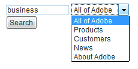
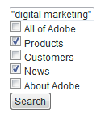
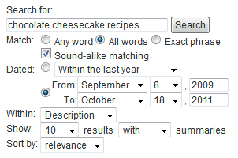

# Buscar formularios{#search-forms}

## Uso de colecciones en formularios de búsqueda {#reference_5A079AEEEFB84457892EF0870D0605C3}

Las colecciones permiten a los clientes buscar áreas específicas del sitio web. Según si implementa una lista desplegable o una lista de casillas de verificación, puede permitir que los clientes busquen una o varias colecciones.

Consulte también [Acerca de las colecciones](../c-about-settings-menu/c-about-searching-menu.md#concept_62E42ACE53D54EEE9273433B86259127).

El siguiente ejemplo muestra cuatro nombres de colección diferentes y las áreas asociadas del sitio web que cubren:

<table> 
 <thead> 
  <tr> 
   <th colname="col1" class="entry"> <p>Nombre de la colección </p> </th> 
   <th colname="col2" class="entry"> <p> </p> </th> 
  </tr> 
 </thead>
 <tbody> 
  <tr> 
   <td colname="col1"> <p>products </p> </td> 
   <td colname="col2"> <p> 
     <ul id="ul_7AE70789C0914EBFBCCC7695C6F53B9E"> 
      <li id="li_72525BAA34E2442D86152F2FD8CA83D5"> https://www.mycompany.com/products.htm </li> 
      <li id="li_5CA4152239124BDBB251E6C94B15D45B"> https://www.mycompany.com/publish/ </li> 
      <li id="li_6E266736B3494696A3AFD841C4AFEC57"> https://www.mycompany.com/search/ </li> 
     </ul> </p> </td> 
  </tr> 
  <tr> 
   <td colname="col1"> <p>Clientes </p> </td> 
   <td colname="col2"> <p>https://www.mycompany.com/customers/ </p> </td> 
  </tr> 
  <tr> 
   <td colname="col1"> <p>Noticias </p> </td> 
   <td colname="col2"> <p>https://www.mycompany.com/news/ </p> </td> 
  </tr> 
  <tr> 
   <td colname="col1"> <p>Acerca de Adobe </p> </td> 
   <td colname="col2"> <p>https://www.mycompany.com/company/ </p> </td> 
  </tr> 
 </tbody> 
</table>

La interfaz de formulario de búsqueda desplegable permite a los usuarios seleccionar una colección y tiene el siguiente aspecto:



El formulario de búsqueda desplegable se genera con el siguiente código HTML:

```
<select name="sp_k"> 
<option value="">All of Adobe</option> 
<option value="Products">Products</option> 
<option value="Customers">Customers</option> 
<option value="News">News</option> 
<option value="About Adobe">About Adobe</option> 
</select>
```

También puede utilizar un grupo de casillas de verificación en el formulario de búsqueda para que los visitantes puedan seleccionar varias colecciones:



El formulario de búsqueda de casillas de verificación se genera con el siguiente código HTML:

```
<input type="checkbox" name="sp_k" value="">All of Adobe<br> 
<input type="checkbox" name="sp_k" value="Products">Products<br> 
<input type="checkbox" name="sp_k" value="Customers">Customers<br> 
<input type="checkbox" name="sp_k" value="News">News<br> 
<input type="checkbox" name="sp_k" value="About Adobe">About Adobe<br>
```

## Search results {#section_BBDD5B44E2B349BC88D937F44583D350}

La etiqueta de plantilla de búsqueda `<search-input-collections>` genera el cuadro de lista de la colección HTML en los resultados de búsqueda y selecciona automáticamente la colección especificada en la búsqueda. Si desea generar casillas de verificación en su lugar, utilice la `<search-input>` etiqueta en lugar de la `<input>` etiqueta de la siguiente manera:

```
<search-input type="checkbox" name="sp_k" value="">All of Adobe<br> 
<search-input type="checkbox" name="sp_k" value="Products">Products<br> 
<search-input type="checkbox" name="sp_k" value="Customers">Customers<br> 
<search-input type="checkbox" name="sp_k" value="News">News<br> 
<search-input type="checkbox" name="sp_k" value="About Adobe">About Adobe<br>
```

La `<search-input>` etiqueta genera una `<input>` etiqueta e incluye el `checked` atributo si la colección se especificó en la búsqueda.

## Uso de marcos con formularios {#reference_82CDDDA1E37042E4849EBF7EA05407C5}

Puede configurar los conjuntos de marcos para que funcionen con la búsqueda o comercialización del sitio.

Para obtener más información sobre los marcos HTML y el elemento de conjunto de marcos HTML, consulte la siguiente URL:

[https://www.w3schools.com/html/html_frames.asp](https://www.w3schools.com/html/html_frames.asp)

Si su sitio utiliza marcos, puede especificar un marco de destinatario para los vínculos de resultados de búsqueda. El destinatario predeterminado es _self, que abre los vínculos en el marco actual o en la ventana del explorador. En su lugar, puede especificar destinatarios específicos del sitio o reservados para el explorador:

* Los resultados _top (reservados por el navegador) se abren en la ventana actual del navegador y reemplazan todos los marcos actuales.
* _blank (reservado para el explorador) se abre en una nueva ventana del explorador.
* Los resultados _parent (reservados para el navegador) se abren en el marco principal del marco actual.
* frame2 (específico del sitio) resultados abiertos en un marco llamado &quot;frame2&quot;. Puede especificar el nombre de cualquier marco como valor (por ejemplo, principal o contenido).

Si su sitio no utiliza marcos, lo más probable es que no desee cambiar el nombre de destinatario predeterminado.

Si crea una plantilla de resultados de búsqueda personalizada para su sitio web, puede anular la configuración especificada utilizando el `target` atributo de la `<search-link>` etiqueta .

El proceso de configuración de conjuntos de marcos es el siguiente:

<table> 
 <thead> 
  <tr> 
   <th colname="col1" class="entry"> <p>Paso de proceso </p> </th> 
   <th colname="col02" class="entry"> <p>Descripción del proceso </p> </th> 
   <th colname="col2" class="entry"> <p>Vínculo </p> </th> 
  </tr> 
 </thead>
 <tbody> 
  <tr> 
   <td colname="col1"> <p>1 </p> </td> 
   <td colname="col02"> <p>Añada el formulario al marco deseado en la página web. </p> </td> 
   <td colname="col2"> <p> <a href="#section_BAA8A502BB2243F8B5FF9783CDF2BFFD" type="section" format="dita" scope="local"> Añadiendo el código del formulario de búsqueda en un marco de su ... </a> </p> </td> 
  </tr> 
  <tr> 
   <td colname="col1"> <p>2 </p> </td> 
   <td colname="col02"> <p>Configure el marco de destinatario para la página de resultados de búsqueda. </p> </td> 
   <td colname="col2"> <p> <a scope="local" href="#section_532CACB90888467093D95EACB64FDFA1" type="section" format="dita"> Configuración del marco de destinatario para la página de resultados de búsqueda </a> </p> </td> 
  </tr> 
  <tr> 
   <td colname="col1"> <p>3 </p> </td> 
   <td colname="col02"> <p>Establezca el destinatario de los vínculos realizados desde la página de resultados de la búsqueda. </p> </td> 
   <td colname="col2"> <p> <a scope="local" href="#section_523248C5AC424D878321C21A23A5CD66" type="section" format="dita"> Estableciendo el destinatario para los vínculos realizados a partir de los resultados de búsqueda... </a> </p> </td> 
  </tr> 
  <tr> 
   <td colname="col1"> <p>4 </p> </td> 
   <td colname="col02"> <p>Edite las páginas de marcos de navegación para evitar que se indiquen. </p> </td> 
   <td colname="col2"> <p> <a scope="local" href="#section_C62E5F0EE1294D5EBD97E123E54433FC" type="section" format="dita"> Editando las páginas de marcos de navegación para evitar que se encuentren... </a> </p> </td> 
  </tr> 
  <tr> 
   <td colname="col1"> <p>5 </p> </td> 
   <td colname="col02"> <p>Pruebe el formulario de búsqueda. </p> </td> 
   <td colname="col2"> <p> <a scope="local" href="../c-appendices/c-searchforms.md#section_43D8D4A7BF524DC480DFE5442F6A2E3C" type="section" format="dita"> Prueba del formulario de búsqueda </a> </p> </td> 
  </tr> 
 </tbody> 
</table>

## Añadir el código del formulario de búsqueda en un marco de la página web {#section_BAA8A502BB2243F8B5FF9783CDF2BFFD}

1. En el menú de producto, haga clic en **[!UICONTROL Design]** > **[!UICONTROL Auto-Complete]** > **[!UICONTROL Form Source]**.

   El código del formulario de búsqueda HTML tiene un aspecto similar al siguiente:

   ```
   <!-- Adobe Target HTML for [your customer name] --> 
   <form method="get" action="https://search.atomz.com/search/"> 
   <input size=15 name="sp_q"><br> 
   <input type=submit value="Search"> 
   <input type=hidden name="sp_a" value="[your account number]"> 
   </form>
   ```

1. En la [!DNL Standard Form Source] página, seleccione y copie el código de formulario de búsqueda HTML que aparece en el campo de texto.
1. Pegue el código del formulario de búsqueda en el marco que desee en el conjunto de marcos.

   En el ejemplo siguiente, el código del formulario de búsqueda se pega en el marco de navegación (el marco vertical estrecho del lado izquierdo de la pantalla).

   

## Configuración del marco de destinatario para la página de resultados de búsqueda {#section_532CACB90888467093D95EACB64FDFA1}

Si coloca el código del formulario de búsqueda en el marco de navegación vertical como se muestra arriba, puede mostrar los resultados de búsqueda en el marco principal más grande. En este ejemplo, se llama al fotograma principal &quot;body&quot; y se establece como el fotograma de destinatario.


1. Para especificar el marco de destinatario de la página de resultados, agregue un destinatario y un valor al formulario cambiando la línea siguiente en el código del formulario de búsqueda de la siguiente manera:

   `<form method="get" action="https://search.atomz.com/search/">`

   a lo siguiente:

   `<form target="body" method="get" action="https://search.atomz.com/search/">`

   Asegúrese de colocar comillas alrededor del valor del destinatario del formulario.

Cuando un cliente realiza una búsqueda en su sitio web, los resultados de la búsqueda aparecen en el marco &quot;body&quot; de la página web.

## Configuración del destinatario para los vínculos realizados desde la página de resultados de búsqueda {#section_523248C5AC424D878321C21A23A5CD66}

Puede definir el marco de destino editando directamente la plantilla.

Si los resultados de la búsqueda aparecen en el marco &quot;body&quot;, es probable que también desee que los vínculos se abran en el marco &quot;body&quot;. Dado que este es el mismo marco, el valor de destinatario `"_self"` que es la configuración predeterminada, no es necesario realizar ningún cambio.

También puede establecer el marco de destino para los vínculos de resultados. A continuación se muestran varios ejemplos de lo que puede hacer:

* Especifique marcos diferentes para los resultados de búsqueda y sus vínculos de modo que los resultados de búsqueda permanezcan activos en su propio marco mientras cada resultado de clic se abre en un marco independiente.
* Especifique que los resultados de la búsqueda se abran en una nueva ventana en blanco, de modo que la ventana antigua permanezca activa con su contenido original, lo que también preserva los resultados de la búsqueda.

El nombre del destinatario puede ser el nombre de un marco especificado en el HTML o puede ser uno de los siguientes valores predeterminados de HTML:

* `target="_blank"` Abra los vínculos en una ventana nueva, en blanco y sin nombre.

* `target="_self"` Valor predeterminado. Abra los vínculos en la misma ventana en la que residen los resultados de la búsqueda. En este caso, la ventana de resultados de búsqueda original. Utilice esta opción para anular un destinatario base asignado globalmente.

* `target="_parent"` Abra los vínculos en el conjunto de marcos principal de la página de vínculos. Si el documento no tiene un elemento principal, funciona como `"_self"` de forma predeterminada.

* `target="_top"` Abra los vínculos en la ventana completa. Si el documento ya está en la parte superior, funciona como `"_self"` de forma predeterminada. Utilice esta opción para salir de un anidado de fotogramas profundos arbitrariamente.

Por ejemplo, para establecer el marco de destino de `_blank` destinatario, puede editar la plantilla de la siguiente manera:

1. En el menú de producto, haga clic en **[!UICONTROL Design]** > **[!UICONTROL Templates]**.

1. En la tabla de la [!DNL Staged Templates] página, haga clic en el nombre de la plantilla con el marco de destino de destino.
1. Busque la `<search-link>` etiqueta . Your default `<search-link>` tag should look similar to the following:

   `<search-link><search-title length=100></search-link>`

1. Añada el destinatario de marco a la `<search-link>` etiqueta . En el ejemplo anterior, introduzca `target="_blank"`. Asegúrese de incluir el subrayado y las comillas alrededor del valor de destinatario.

   Ahora la `<search-link>` etiqueta aparece como se indica a continuación:

   `<search-link target="_blank"><search-title length=100></search-link>`

Cuando un visitante del sitio elige un vínculo de resultados de búsqueda, la página vinculada ahora se abre en una nueva ventana en blanco.

## Edición de las páginas de marcos de navegación para evitar que se indiquen {#section_C62E5F0EE1294D5EBD97E123E54433FC}

Normalmente, desea excluir los marcos de navegación para que no se indiquen con los resultados de búsqueda. Para lograr esta funcionalidad, puede agregar `noindex` meta tag a esas páginas.

1. Abra el origen de la página HTML para el marco de navegación.
1. Añada la siguiente etiqueta meta dentro de la `<head>` sección de su HTML:

   `<meta name="robots" content="noindex">`

   Por ejemplo:

   ```
   <html> 
   <head> 
   <title>This page is a frameset that I do not want indexed</title> 
   <meta http-equiv="Content-Type" content="text/html; charset=iso-8859-1"> 
   <meta name="robots" content="noindex"> 
   </head>
   ```

## Prueba del formulario de búsqueda {#section_43D8D4A7BF524DC480DFE5442F6A2E3C}

1. Vaya al sitio web y vaya a un formulario.
1. En el campo de búsqueda, introduzca algunos términos de búsqueda y haga clic en **[!UICONTROL Search]**.

   Lo siguiente es true:

   * La página de resultados de búsqueda aparece en el marco de destinatario especificado.
   * Los vínculos de los resultados de búsqueda se encuentran en el marco de destinatario especificado.
   * Los resultados del marco de navegación no aparecen.
   Si tiene problemas con los marcos después de probar el formulario de búsqueda, póngase en contacto con el servicio de asistencia al cliente.

## Ejemplo de formulario de búsqueda avanzada {#reference_82E1051918744EBA88A01E9E6AE42C4A}

Puede editar el código de formulario avanzado para adaptarlo a sus necesidades de diseño y contenido, o bien agregar o eliminar parámetros de búsqueda adicionales.

Su página de inicio es un buen lugar para insertar un formulario de búsqueda avanzada porque muchos clientes esperan encontrar la capacidad de búsqueda allí. También puede crear una página HTML que incluya el formulario de búsqueda y otra información útil, y luego vincular a esa página en todo el sitio web.

Si está indexando contenido seguro, puede que los resultados de búsqueda se proporcionen desde los servidores Web de búsqueda seguros. Cambie la dirección URL en el atributo de acción del formulario de búsqueda a: action=&quot;https://search.atomz.com/search/&quot; para realizar esto.

>[!NOTE]
>
>Algunos editores HTML tienen problemas al pegar código HTML desde otras aplicaciones. Si el código HTML aparece en la página web como texto, copie y pegue el código de búsqueda en un editor de texto sencillo, como Bloc de notas en Windows o Texto simple en Mac, y después copie y pegue de nuevo desde el editor de texto simple al editor de HTML.

Los parámetros de búsqueda se utilizan en el código de formulario de búsqueda avanzada para crear botones de opción, casillas de verificación y cuadros de lista que los clientes pueden utilizar para personalizar búsquedas individuales. Los clientes pueden especificar el número de resultados de búsqueda mostrados, por ejemplo, o un intervalo de fechas, o si los resúmenes se muestran con los resultados de búsqueda, mediante las opciones que aparecen en los formularios de búsqueda avanzada.

Con el siguiente formulario de búsqueda avanzada de ejemplo, el resto de este tema muestra cómo se crea cada opción del formulario utilizando parámetros de búsqueda.



Puede realizar la vista de todo el código HTML de formulario de búsqueda avanzada del ejemplo anterior.

Consulte Código [HTML de formulario de búsqueda](../c-appendices/c-searchforms.md#reference_9AAD4A46B68D4D48865508982CB86DB9)avanzada.

Consulte [Configuración de CSS](../c-about-auto-complete.md#task_EECE35DEB6C94F4A8A5B42B4DED76D96)de finalización automática.

Consulte [Copia del código HTML del formulario de búsqueda en el...](../c-about-auto-complete.md#task_A3A01EA800F24C0AA33902387E0362C7).

<table> 
 <thead> 
  <tr> 
   <th colname="col2" class="entry"> <p>Ubicación en el formulario </p> </th> 
   <th colname="col1" class="entry"> <p>Parámetro </p> </th> 
   <th colname="col3" class="entry"> <p>Código HTML </p> </th> 
   <th colname="col4" class="entry"> <p>Descripción </p> </th> 
  </tr> 
 </thead>
 <tbody> 
  <tr> 
   <td colname="col2"> <p>Habilitar las opciones avanzadas de formulario de búsqueda (campo oculto) </p> </td> 
   <td colname="col1"> <p> <span class="codeph"> sp_advanced </span> </p> </td> 
   <td colname="col3"> <p> <span class="syntax html codeph"> &lt;input type=hidden name="sp_advanced" value=1&gt; </span> </p> </td> 
   <td colname="col4"> <p>Habilite o deshabilite las opciones de búsqueda avanzada. Por ejemplo, puede colocar un formulario de búsqueda estándar en la página de inicio con un vínculo a una segunda página que contenga un formulario avanzado. En este caso, colocaría una copia del formulario estándar dentro de <span class="codeph"> &lt;search-if-not-advanced&gt;...etiquetas de plantilla &lt;/search-if-not-advanced&gt; </span> . </p> <p>Un cliente que realiza una búsqueda desde el formulario estándar ve un formulario de búsqueda estándar cuando se muestran los resultados de la búsqueda. En la pantalla de formulario de búsqueda avanzada, se incluye la etiqueta <span class="codeph"> &lt;input type=hidden name="sp_advanced" value=1&gt; </span> con las demás opciones de formulario avanzadas. </p> <p>También se incluye una copia del formulario de búsqueda avanzada dentro del &lt;search-if-advanced&gt;... &lt;/search-if-advanced&gt; etiquetas de plantilla. Un cliente que realiza una búsqueda desde el formulario de búsqueda avanzada ve un formulario de búsqueda avanzada cuando se muestran los resultados de la búsqueda. </p> </td> 
  </tr> 
  <tr> 
   <td colname="col2"> <p> Coincidir con cualquier, todo o frase </p> </td> 
   <td colname="col1"> <p> <span class="codeph"> sp_p </span> </p> <p> </p> </td> 
   <td colname="col3"> <p> <code class="syntax html"> &lt;!--&nbsp;Allow&nbsp;"any,"&nbsp;"all,"&nbsp;or&nbsp;"phrase"&nbsp;--&gt; 
      &lt;input&nbsp;type=radio&nbsp;name="sp_p"&nbsp;value="any"&gt;Any&nbsp;word 
      &lt;input&nbsp;type=radio&nbsp;name="sp_p"&nbsp;value="all"&nbsp;checked&gt;All&nbsp;words 
      &lt;input&nbsp;type=radio&nbsp;name="sp_p"&nbsp;value="phrase"&gt;Exact&nbsp;phrase </code> </p> </td> 
   <td colname="col4"> <p>Permita que el cliente especifique que "cualquier palabra", "todas las palabras" o "la frase exacta" deben estar presentes para que un documento coincida. Cuando se especifica el <span class="codeph"> parámetro sp_p </span> , los clientes no necesitan utilizar "+", "-" o ambos en la consulta de búsqueda. </p> <p> Si se omite el <span class="codeph"> parámetro sp_p </span> , o si se define como "" o "any", los clientes podrán seguir utilizando los especificadores "+" y "-". Si el parámetro <span class="codeph"> sp_p </span> se establece en "all" o "phrase", se omiten los parámetros "+" y "-" especificados. </p> <p>Puede obtener más información sobre el uso de "+" y "-" en una búsqueda. </p> <p>Consulte <a href="../c-about-settings-menu/c-about-searching-menu.md#concept_207105CF26B1448F8A3D223787C56AB8" type="concept" format="dita" scope="local">Acerca de las búsquedas </a>. </p> </td> 
  </tr> 
  <tr> 
   <td colname="col2"> <p> Coincidencia de sonido similar </p> </td> 
   <td colname="col1"> <p> <span class="codeph"> sp_w </span> </p> <p>y </p> <p> <span class="codeph"> sp_w_control </span> </p> <p> </p> </td> 
   <td colname="col3"> <p> <code class="syntax html"> &lt;!--&nbsp;Checkbox&nbsp;enables&nbsp;sound-alike&nbsp;matching&nbsp;--&gt; 
      &lt;input&nbsp;type=hidden&nbsp;name="sp_w_control"&nbsp;value=1&gt; 
      &lt;input&nbsp;type=checkbox&nbsp;name="sp_w"&nbsp;value="alike"&gt;&nbsp;Sound-alike&nbsp;matching </code> </p> </td> 
   <td colname="col4"> <p>Permite a los clientes habilitar o deshabilitar la coincidencia de sonido similar. La coincidencia de sonidos similares permite que las consultas de búsqueda mal escritas coincidan con las palabras que "suenan igual" en los documentos. </p> <p>Cuando el parámetro <span class="codeph"> sp_w_control </span> se establece en 1 y el parámetro <span class="codeph"> sp_w </span> se establece en "similar", se activa la casilla de verificación generada, lo que permite la coincidencia de sonido similar de forma predeterminada. </p> <p>Si el parámetro <span class="codeph"> sp_w </span> está establecido en "", la casilla de verificación no está seleccionada. </p> <p>Si no habilitó la coincidencia de sonido similar durante la operación de indexación más reciente, no será posible la coincidencia de sonido similar y se omitirá el parámetro <span class="codeph"> sp_w </span> . Para habilitar la coincidencia de sonido similar, en el menú del producto, haga clic en <span class="uicontrol"> Lingüística </span> &gt; <span class="uicontrol"> Palabras y lenguaje </span> &gt; <span class="uicontrol"> Coincidencia de sonido similar </span>. </p> <p>También puede asignar los parámetros <span class="codeph"> sp_w </span> y <span class="codeph"> sp_w_control </span> de la siguiente manera: </p> <p> <code class="syntax html"> &lt;!--&nbsp;Checkbox&nbsp;disables&nbsp;sound-alike&nbsp;matching&nbsp;--&gt; 
      &lt;input&nbsp;type=hidden&nbsp;name="sp_w_control"&nbsp;value=0&gt; 
      &lt;input&nbsp;type=checkbox&nbsp;name="sp_w"&nbsp;value="exact"&gt; 
      No&nbsp;sound-alike&nbsp;matching </code> </p> <p>En este caso, cuando el parámetro <span class="codeph"> sp_w_control </span> se establece en 0 y el parámetro <span class="codeph"> sp_w </span> se establece en "exacto", la coincidencia de sonido se desactiva de forma predeterminada. Si el parámetro <span class="codeph"> sp_w </span> está establecido en "", se habilita la coincidencia de sonido similar. </p> </td> 
  </tr> 
  <tr> 
   <td colname="col2"> <p>Coincidencia de intervalo de fechas </p> </td> 
   <td colname="col1"> <p> <span class="codeph"> sp_d </span> </p> <p> </p> </td> 
   <td colname="col3"> <p> <code class="syntax html"> &lt;!--Specifies&nbsp;type&nbsp;of&nbsp;date&nbsp;range&nbsp;searching&nbsp;to&nbsp;perform.--&gt; 
      &lt;input&nbsp;type=radio&nbsp;name="sp_d"&nbsp;value="custom"&nbsp;checked&gt; 
      &lt;input&nbsp;type=radio&nbsp;name="sp_d"&nbsp;value="specific"&gt; </code> </p> </td> 
   <td colname="col4"> <p>El parámetro <span class="codeph"> sp_d </span> especifica una coincidencia de intervalo de datos personalizada que se va a realizar o una coincidencia de intervalo de fechas específica que se va a realizar. </p> <p>En el formulario de búsqueda avanzada predeterminado, esta opción se presenta como un grupo de botones de radio con una lista desplegable de intervalos de fechas "personalizados", tal como se genera con un parámetro <span class="codeph"> sp_date_range </span> . También incluye y un grupo de fechas de inicio y finalización "específicas" que se generan con los parámetros <span class="codeph"> sp_inicio_day </span>, <span class="codeph"> sp_inicio_month </span>, <span class="codeph"> sp_inicio_year </span>, <span class="codeph"> sp_end_day </span>, <span class="codeph"> sp_end_month </span><span class="codeph"> </span> y sp_end_year_year. </p> <p>Un intervalo de fechas "personalizado" es un intervalo de fechas con nombre para buscar. Por ejemplo, "En cualquier momento", "Hoy", "En el último año", etc. </p> <p>Un intervalo de fechas "específico" consiste en una fecha de inicio y una fecha de finalización. Por ejemplo, desde "8 de septiembre de 2009 hasta el 18 de octubre de 2011". </p> </td> 
  </tr> 
  <tr> 
   <td colname="col2"> <p>Coincidencia de intervalo de fechas: intervalo de fechas personalizado </p> </td> 
   <td colname="col1"> <p> <span class="codeph"> sp_date_range </span> </p> <p> </p> </td> 
   <td colname="col3"> <p> <code class="syntax html"> &lt;!--Selection&nbsp;list&nbsp;for&nbsp;custom&nbsp;date&nbsp;range.--&gt; 
      &lt;select&nbsp;name="sp_date_range"&nbsp;size=1&gt; 
      &lt;option&nbsp;value=-1&nbsp;selected&gt;Anytime&lt;/option&gt; 
      &lt;option&nbsp;value=7&gt;Within&nbsp;the&nbsp;last&nbsp;week&lt;/option&gt; 
      &lt;option&nbsp;value=14&gt;Within&nbsp;the&nbsp;last&nbsp;2&nbsp;weeks&lt;/option&gt; 
      &lt;option&nbsp;value=30&gt;Within&nbsp;the&nbsp;last&nbsp;30&nbsp;days&lt;/option&gt; 
      &lt;option&nbsp;value=60&gt;Within&nbsp;the&nbsp;last&nbsp;60&nbsp;days&lt;/option&gt; 
      &lt;option&nbsp;value=90&gt;Within&nbsp;the&nbsp;last&nbsp;90&nbsp;days&lt;/option&gt; 
      &lt;option&nbsp;value=180&gt;Within&nbsp;the&nbsp;last&nbsp;180&nbsp;days&lt;/option&gt; 
      &lt;option&nbsp;value=365&gt;Within&nbsp;the&nbsp;last&nbsp;year&lt;/option&gt; 
      &lt;option&nbsp;value=730&gt;Within&nbsp;the&nbsp;last&nbsp;two&nbsp;years&lt;/option&gt; 
      &lt;/select&gt; </code> </p> </td> 
   <td colname="col4"> <p>El parámetro <span class="codeph"> sp_date_range </span> se utiliza para crear un intervalo de fechas "personalizado". Por ejemplo: "En cualquier momento", "Hoy", "En el último año" y así sucesivamente. </p> <p>Los valores buenos que son iguales o iguales a cero especifican el número de días de búsqueda antes de hoy. Por ejemplo, un valor de 0 especifica "Hoy", un valor de "1" especifica "Hoy y Ayer", un valor de "30" especifica "En los últimos 30 días", etc. Los valores inferiores a cero especifican un rango personalizado de la siguiente manera: </p> <p> 
     <ul id="ul_E65DDE33883F441F9730F315E485AD98"> 
      <li id="li_83E9466AB9D7438A8544001F6B007186"> <p>-1 = "En cualquier momento", lo mismo que especificar sin intervalo de fechas. </p> </li> 
      <li id="li_38AB8D97179A47F9B860A96EA09119BB"> <p>-2 = "Esta semana", que busca de domingo a sábado de la semana actual. </p> </li> 
      <li id="li_F4C3A8658428418A8A06FBAAB4733C68"> <p>-3 = "Última semana", que busca de domingo a sábado de la semana antes de la semana actual. </p> </li> 
      <li id="li_DF2D0B043A4E4DE9BE8D82E69A76E793"> <p>-4 = "Este mes", que busca fechas dentro del mes actual. </p> </li> 
      <li id="li_76BC4C2CED574E2A81448158828BFF1B"> <p>-5 = "Último mes", que busca fechas dentro del mes anterior al mes actual. </p> </li> 
      <li id="li_17FF849384FB46D58AF6FF1D3BC408C8"> <p>-6 = "Este año", que busca fechas dentro del año actual. </p> </li> 
      <li id="li_E2B8B4DFF3914BBDB86D0EB77F52B305"> <p>-7 = "Último año", que busca fechas dentro del año anterior al año en curso. </p> </li> 
     </ul> </p> </td> 
  </tr> 
  <tr> 
   <td colname="col2"> <p>Coincidencia de intervalo de fechas: Fechas de inicio </p> </td> 
   <td colname="col1"> <p> <span class="codeph"> sp_inicio_day, sp_inicio_month, sp_inicio_year </span> </p> <p> </p> </td> 
   <td colname="col3"> </td> 
   <td colname="col4"> <p>Este triplete de valores numéricos especifica la fecha de inicio de un intervalo de fechas específico para la búsqueda. Asegúrese de especificar los tres valores porque se omite una fecha especificada parcialmente. </p> <p>Es legal especificar únicamente la fecha de inicio, sólo la fecha de finalización o la fecha de inicio y la fecha de finalización. Si solo se especifica la fecha de inicio, la búsqueda incluye documentos coincidentes con fecha posterior o posterior a la fecha de inicio. Si sólo se especifica la fecha de finalización, la búsqueda incluye documentos coincidentes en la fecha de finalización o antes de ella. Si se especifican la fecha de inicio y la fecha de finalización, la búsqueda incluye documentos coincidentes desde la fecha de inicio hasta la fecha de finalización. </p> <p>Todas las fechas se buscan en relación con el tiempo medio de Greenwich. </p> </td> 
  </tr> 
  <tr> 
   <td colname="col2"> <p> Coincidencia de intervalo de fechas: fechas de finalización </p> </td> 
   <td colname="col1"> <p> <span class="codeph"> sp_end_day, sp_end_month, sp_end_year </span> </p> <p> </p> </td> 
   <td colname="col3"> </td> 
   <td colname="col4"> <p>Este triplete de valores numéricos especifica la fecha de finalización del intervalo de fechas específico que se va a buscar. Asegúrese de especificar los tres valores porque se omite una fecha especificada parcialmente. </p> <p>Es legal especificar únicamente la fecha de inicio, sólo la fecha de finalización, o tanto la fecha de inicio como la de finalización. Si solo se especifica la fecha de inicio, la búsqueda incluye documentos coincidentes con fecha posterior o posterior a la fecha de inicio. Si sólo se especifica la fecha de finalización, la búsqueda incluye documentos coincidentes en la fecha de finalización o antes de ella. Si se especifican el inicio y la fecha de finalización, la búsqueda incluye documentos coincidentes desde la fecha de inicio hasta la fecha de finalización. </p> <p>Todas las fechas se buscan en relación con el tiempo medio de Greenwich. </p> </td> 
  </tr> 
  <tr> 
   <td colname="col2"> <p>Dentro del campo de búsqueda </p> </td> 
   <td colname="col1"> <p> <span class="codeph"> sp_x </span> </p> </td> 
   <td colname="col3"> <p> <code class="syntax html"> &lt;!--&nbsp;List&nbsp;box&nbsp;selects&nbsp;the&nbsp;search&nbsp;field&nbsp;--&gt; 
      Within&nbsp;&lt;select&nbsp;name="sp_x"&nbsp;size=1&gt; 
      &lt;option&nbsp;value="any"&nbsp;selected&gt;Anywhere&lt;/option&gt; 
      &lt;option&nbsp;value="title"&gt;Title&lt;/option&gt; 
      &lt;option&nbsp;value="desc"&gt;Description&lt;/option&gt; 
      &lt;option&nbsp;value="keys"&gt;Keywords&lt;/option&gt; 
      &lt;option&nbsp;value="body"&gt;Body&lt;/option&gt; 
      &lt;option&nbsp;value="alt"&gt;Alternate&nbsp;text&lt;/option&gt; 
      &lt;option&nbsp;value="url"&gt;URL&lt;/option&gt; 
      &lt;option&nbsp;value="target"&gt;Target&lt;/option&gt; 
      &lt;option&nbsp;value="date"&gt;Date&lt;/option&gt;* 
      &lt;/select&gt; </code> </p> </td> 
   <td colname="col4"> <p>El cuadro de lista <span class="codeph"> sp_x </span> permite a los clientes especificar el campo en el que se buscarán las cadenas de consulta. </p> <p>Los clientes pueden elegir entre todos los campos, el título, la descripción del documento, las palabras clave del documento, el cuerpo, el texto alternativo, la dirección URL del documento, la fecha o las palabras clave del destinatario. </p> <p>Cuando se utiliza el parámetro <span class="codeph"> sp_x </span> , los clientes no necesitan especificar "title:", "desc:", "keys:", "body:", "alt:", "url:" y "destinatario:" en las cadenas de consulta de búsqueda. </p> <p>Si se omite el parámetro <span class="codeph"> sp_x </span> , o si se define como "" o "any", los clientes podrán seguir utilizando las cadenas del especificador de campos. Si el parámetro <span class="codeph"> sp_x </span> se establece en un campo específico, se omiten todas las demás cadenas de especificador de campos. </p> <p>Consulte <a href="../c-about-settings-menu/c-about-searching-menu.md#concept_207105CF26B1448F8A3D223787C56AB8" type="concept" format="dita" scope="local">Acerca de las búsquedas </a>. </p> </td> 
  </tr> 
  <tr> 
   <td colname="col2"> <p>Mostrar recuento de resultados </p> </td> 
   <td colname="col1"> <p> <span class="codeph"> sp_c </span> </p> </td> 
   <td colname="col3"> <p> <code class="syntax html"> &lt;!--&nbsp;List&nbsp;box&nbsp;selects&nbsp;number&nbsp;of&nbsp;results&nbsp;to&nbsp;show&nbsp;per&nbsp;page&nbsp;--&gt; 
      Show&nbsp;&lt;select&nbsp;name="sp_c"&nbsp;size=1&gt; 
      &lt;option&nbsp;value=5&gt;5&lt;/option&gt; 
      &lt;option&nbsp;value=10&nbsp;selected&gt;10&lt;/option&gt; 
      &lt;option&nbsp;value=25&gt;25&lt;/option&gt; 
      &lt;option&nbsp;value=50&gt;50&lt;/option&gt; 
      &lt;option&nbsp;value=100&gt;100&lt;/option&gt; 
      &lt;/select&gt;&nbsp;results </code> </p> </td> 
   <td colname="col4"> <p>Permite a los clientes elegir el número de resultados de búsqueda que se muestran en cada página de resultados de búsqueda. </p> <p>Puede tener tantas o pocas opciones en el formulario como desee. Asegúrese de que el valor "value=" coincide con el valor mostrado. </p> </td> 
  </tr> 
  <tr> 
   <td colname="col2"> <p>Mostrar u ocultar resúmenes </p> </td> 
   <td colname="col1"> <p> <span class="codeph"> sp_m </span> </p> </td> 
   <td colname="col3"> <p> <code class="syntax html"> &lt;!--&nbsp;Show&nbsp;or&nbsp;hide&nbsp;summaries&nbsp;in&nbsp;search&nbsp;results&nbsp;--&gt; 
      &lt;select&nbsp;name="sp_m"&nbsp;size=1&gt; 
      &lt;option&nbsp;value=1&nbsp;selected&gt;with&lt;/option&gt; 
      &lt;option&nbsp;value=0&gt;without&lt;/option&gt; 
      &lt;/select&gt;&nbsp;summaries&nbsp; </code> </p> </td> 
   <td colname="col4"> <p>Permite a los clientes elegir si se muestra texto de resumen para cada coincidencia. </p> <p>Establezca el valor en 1 si desea mostrar los resúmenes. Establezca el valor en 0 si desea ocultar los resúmenes. También puede utilizar el parámetro con un conjunto de botones de radio, como en el ejemplo siguiente: </p> <p> <code class="syntax html"> &lt;!--&nbsp;Show&nbsp;or&nbsp;hide&nbsp;summaries&nbsp;in&nbsp;search&nbsp;results&nbsp;--&gt; 
      &lt;input&nbsp;type=radio&nbsp;name="sp_m"&nbsp;value=1&nbsp;selected&gt;Show&nbsp;summaries 
      &lt;input&nbsp;type=radio&nbsp;name="sp_m"&nbsp;value=0&gt;Hide&nbsp;summaries </code> </p> </td> 
  </tr> 
  <tr> 
   <td colname="col2"> <p>Ordenar por resultados </p> </td> 
   <td colname="col1"> <p> <span class="codeph"> sp_s </span> </p> </td> 
   <td colname="col3"> <p> <code class="syntax html"> &lt;!--&nbsp;Sort&nbsp;results&nbsp;by&nbsp;relevance&nbsp;or&nbsp;by&nbsp;date&nbsp;--&gt; 
      Sort&nbsp;by&nbsp;&lt;select&nbsp;name="sp_s"&nbsp;size=1&gt; 
      &lt;option&nbsp;value=0&nbsp;selected&gt;relevance&lt;/option&gt; 
      &lt;option&nbsp;value=1&gt;date&lt;/option&gt; 
      &lt;/select&gt; </code> </p> </td> 
   <td colname="col4"> <p>Permite a los clientes elegir si los resultados se muestran en orden de importancia o fecha. </p> <p>Cuando el valor se establece en 1, los resultados se enumeran desde el documento que se ha cambiado más recientemente al documento que se ha cambiado menos recientemente. Cuando el valor se establece en 0, los resultados se enumeran de los más relevantes a los menos relevantes. También puede utilizar este parámetro con botones de opción como en el ejemplo siguiente: </p> <p> <code class="syntax html"> &lt;!--&nbsp;Sort&nbsp;results&nbsp;by&nbsp;relevance&nbsp;or&nbsp;by&nbsp;date&nbsp;--&gt; 
      &lt;input&nbsp;type=radio&nbsp;name="sp_s"&nbsp;value=0&nbsp;selected&gt;Sort&nbsp;by&nbsp;relevance 
      &lt;input&nbsp;type=radio&nbsp;name="sp_s"&nbsp;value=1&gt;Sort&nbsp;by&nbsp;date </code> </p> </td> 
  </tr> 
 </tbody> 
</table>

## Código HTML del formulario de búsqueda avanzada {#reference_9AAD4A46B68D4D48865508982CB86DB9}

El código de formulario HTML que se utiliza para generar el formulario de búsqueda avanzada que se muestra en la parte superior del tema de formulario de búsqueda avanzada de muestra.

Consulte [Ejemplo de formulario](../c-appendices/c-searchforms.md#reference_82E1051918744EBA88A01E9E6AE42C4A)de búsqueda avanzada.

Si utiliza este código, recuerde reemplazar el `sp_a` valor de `sp99999999` por su número de cuenta real.

Para encontrar el número de cuenta, en el menú del producto, haga clic en **[!UICONTROL Settings]** > **[!UICONTROL Account Options]** > **[!UICONTROL Account Settings]**.

```
<form method="get" action="https://search.atomz.com/search/"> 
<table cellspacing=0 cellpadding=0 border=0> 
<tr><td colspan=4> 
<b>Search For:</b><br> 
<input size=35 name="sp_q"> 
<!-- The "Search" button --> 
<input type=submit value="Search"> 
<input type=hidden name="sp_a" value="sp99999999"> 
<input type=hidden name="sp_f" value="ISO-8859-1"> 
</td></tr> 
<input type=hidden name="sp_advanced" value=1> 
<!-- Allow "any," "all," or "phrase" --> 
<tr><td valign=top> 
<b>Match: </b> 
</td><td colspan=4> 
<input type=radio name="sp_p" value="any">Any word 
<input type=radio name="sp_p" value="all" checked>All words 
<input type=radio name="sp_p" value="phrase">Exact phrase<br> 
<!-- Checkbox enables sound-alike matching --> 
<input type=hidden name="sp_w_control" value=1> 
<input type=checkbox name="sp_w" value="alike" checked> 
Sound-alike matching 
</td></tr> 
<!-- Date range criteria --> 
<tr><td><b>Dated:</b></td><td colspan=4> 
<input type=radio name="sp_d" value="custom" checked> 
<select name="sp_date_range" size=1> 
<option value=-1 selected>Anytime</option> 
<option value=7>Within the last week</option> 
<option value=14>Within the last 2 weeks</option> 
<option value=30>Within the last 30 days</option> 
<option value=60>Within the last 60 days</option> 
<option value=90>Within the last 90 days</option> 
<option value=180>Within the last 180 days</option> 
<option value=365>Within the last year</option> 
<option value=730>Within the last two years</option> 
</select> 
</td></tr> 
<tr><td></td><td rowspan=2> 
<input type=radio name="sp_d" value=specific> 
</td><td align=right>From:</td><td> 
<select name="sp_start_month" size=1> 
<option value=0 selected></option> 
<option value=1>January</option> 
<option value=2>February</option> 
<option value=3>March</option> 
<option value=4>April</option> 
<option value=5>May</option> 
<option value=6>June</option> 
<option value=7>July</option> 
<option value=8>August</option> 
<option value=9>September</option> 
<option value=10>October</option> 
<option value=11>November</option> 
<option value=12>December</option> 
</select> 
<select name="sp_start_day" size=1> 
<option value=0 selected></option> 
<option value=1>1</option> 
<option value=2>2</option> 
<option value=3>3</option> 
<option value=4>4</option> 
<option value=5>5</option> 
<option value=6>6</option> 
<option value=7>7</option> 
<option value=8>8</option> 
<option value=9>9</option> 
<option value=10>10</option> 
<option value=11>11</option> 
<option value=12>12</option> 
<option value=13>13</option> 
<option value=14>14</option> 
<option value=15>15</option> 
<option value=16>16</option> 
<option value=17>17</option> 
<option value=18>18</option> 
<option value=19>19</option> 
<option value=20>20</option> 
<option value=21>21</option> 
<option value=22>22</option> 
<option value=23>23</option> 
<option value=24>24</option> 
<option value=25>25</option> 
<option value=26>26</option> 
<option value=27>27</option> 
<option value=28>28</option> 
<option value=29>29</option> 
<option value=30>30</option> 
<option value=31>31</option> 
</select> 
<!--comma-->, 
<input size=4 name="sp_start_year"> 
</td></tr> 
<tr><td></td> 
<td align=right>To:</td><td> 
<select name="sp_end_month" size=1> 
<option value=0 selected></option> 
<option value=1>January</option> 
<option value=2>February</option> 
<option value=3>March</option> 
<option value=4>April</option> 
<option value=5>May</option> 
<option value=6>June</option> 
<option value=7>July</option> 
<option value=8>August</option> 
<option value=9>September</option> 
<option value=10>October</option> 
<option value=11>November</option> 
<option value=12>December</option> 
</select> 
<select name="sp_end_day" size=1> 
<option value=0 selected></option> 
<option value=1>1</option> 
<option value=2>2</option> 
<option value=3>3</option> 
<option value=4>4</option> 
<option value=5>5</option> 
<option value=6>6</option> 
<option value=7>7</option> 
<option value=8>8</option> 
<option value=9>9</option> 
<option value=10>10</option> 
<option value=11>11</option> 
<option value=12>12</option> 
<option value=13>13</option> 
<option value=14>14</option> 
<option value=15>15</option> 
<option value=16>16</option> 
<option value=17>17</option> 
<option value=18>18</option> 
<option value=19>19</option> 
<option value=20>20</option> 
<option value=21>21</option> 
<option value=22>22</option> 
<option value=23>23</option> 
<option value=24>24</option> 
<option value=25>25</option> 
<option value=26>26</option> 
<option value=27>27</option> 
<option value=28>28</option> 
<option value=29>29</option> 
<option value=30>30</option> 
<option value=31>31</option> 
</select> 
<!--comma-->, 
<input size=4 name="sp_end_year"> 
</td></tr> 
<!-- List box selects the search field --> 
<tr><td valign=top> 
<b>Within: </b> 
</td><td colspan=4><select name="sp_x" size=1> 
<option value="any" selected>Anywhere</option> 
<option value="title">Title</option> 
<option value="desc">Description</option> 
<option value="keys">Keywords</option> 
<option value="body">Body</option> 
<option value="alt">Alternate text</option> 
<option value="url">URL</option> 
<option value="target">Target</option> 
</select> 
</td></tr> 
<!-- List box selects number of results to show per page --> 
<tr><td valign=top> 
<b>Show: </b> 
</td><td colspan=4><select name="sp_c" size=1> 
<option value=5>5</option> 
<option value=10 selected>10</option> 
<option value=25>25</option> 
<option value=50>50</option> 
<option value=100>100</option> 
</select> results  
<!-- Show or hide summaries in search results --> 
<select name="sp_m" size=1> 
<option value=1 selected>with</option> 
<option value=0>without</option> 
</select> summaries<br> 
</td></tr> 
<!-- Sort results by relevance or by date --> 
<tr><td valign=top> 
<b>Sort by: </b> 
</td><td colspan=4><select name="sp_s" size=1> 
<option value=0 selected>relevance</option> 
<option value=1>date</option> 
</select> 
</td></tr> 
</table> 
</form>
```

## Código de plantilla de formulario de búsqueda avanzada {#reference_D762C22E754E462DBEECD88D2C3FA579}

Puede agregar el código HTML del formulario de búsqueda avanzada a la plantilla de forma que la opción predeterminada para cualquier parámetro sea la misma que la búsqueda anterior.

En otras palabras, si un cliente hace clic en el botón de radio, puede asegurarse de que el botón de radio está seleccionado de forma predeterminada cuando se muestran los resultados de la búsqueda. **[!UICONTROL Exact phrase]**

Esta funcionalidad se logra eliminando todos los especificadores &quot;marcados&quot; o &quot;seleccionados&quot; de las etiquetas HTML estándar y, a continuación, reemplazando las siguientes etiquetas HTML:

* `<input>`
* `<select>`
* `<option>`
* `</option>`
* `</select>`

con las siguientes etiquetas de plantilla correspondientes:

* `<search-input>`
* `<search-select>`
* `<search-option>`
* `</search-option>`
* `</search-select>`

Para ello, utilice el siguiente código como `<form>` etiqueta en la plantilla de búsqueda.

```
<!-- Adobe Target results section.--> 
 
<!-- Show heading and logo graphic. --> 
<SEARCH-IF-RESULTS> 
<b>SEARCH RESULTS <SEARCH-LOWER> - <SEARCH-UPPER></b> 
of <SEARCH-TOTAL> total results for <b><SEARCH-QUERY></b><br> 
</SEARCH-IF-RESULTS> 
<SEARCH-IF-NOT-RESULTS> 
<b>SEARCH RESULTS</b> for <b><SEARCH-QUERY></b><br> 
</SEARCH-IF-NOT-RESULTS> 
<SEARCH-LOGO><br> 
 
<!-- Display Results. --> 
<SEARCH-RESULTS LENGTH=160> 
<p><b><SEARCH-LINK><SEARCH-TITLE LENGTH=160></SEARCH-LINK></b><br> 
<SEARCH-IF-SHOW-SUMMARIES> 
<SEARCH-IF-CONTEXT LENGTH=240><SEARCH-CONTEXT><br></SEARCH-IF-CONTEXT> 
<font size="-1"><SEARCH-URL LENGTH=60></font><br> 
</SEARCH-IF-SHOW-SUMMARIES> 
</SEARCH-RESULTS> 
 
<!-- If no results, show a message. --> 
<SEARCH-IF-NOT-RESULTS><p> 
Sorry, no matches were found containing <b><SEARCH-QUERY>.</b> 
</SEARCH-IF-NOT-RESULTS> 
<!-- Show By Relevance, By Date links, Show/Hide Summaries links. --> 
<SEARCH-IF-RESULTS><p> 
<SEARCH-IF-SORT-BY-DATE> 
<b><SEARCH-SORT-BY-SCORE COUNT=10>Sort By Relevance</SEARCH-SORT-BY-SCORE></b> 
</SEARCH-IF-SORT-BY-DATE> 
<SEARCH-IF-SORT-BY-SCORE> 
<b><SEARCH-SORT-BY-DATE COUNT=10>Sort By Date</SEARCH-SORT-BY-DATE></b> 
</SEARCH-IF-SORT-BY-SCORE> 
| <b> 
<SEARCH-IF-SHOW-SUMMARIES> 
<SEARCH-HIDE-SUMMARIES COUNT=20>Hide Summaries</SEARCH-HIDE-SUMMARIES> 
</SEARCH-IF-SHOW-SUMMARIES> 
<SEARCH-IF-HIDE-SUMMARIES> 
<SEARCH-SHOW-SUMMARIES COUNT=10>Show Summaries</SEARCH-SHOW-SUMMARIES> 
</SEARCH-IF-HIDE-SUMMARIES> 
</b><br> 
</SEARCH-IF-RESULTS> 
 
<!-- Display Prev & Next links. --> 
<SEARCH-IF-RESULTS> 
<SEARCH-IF-PREV-COUNT> 
<b><SEARCH-PREV>Prev <SEARCH-PREV-COUNT></SEARCH-PREV></b> 
<SEARCH-IF-NEXT-COUNT> | </SEARCH-IF-NEXT-COUNT> 
</SEARCH-IF-PREV-COUNT> 
<SEARCH-IF-NEXT-COUNT> 
<b><SEARCH-NEXT>Next <SEARCH-NEXT-COUNT></SEARCH-NEXT></b><br> 
</SEARCH-IF-NEXT-COUNT><p> 
</SEARCH-IF-RESULTS> 
 
<!-- Put up the next form. --> 
<form method="get" action="https://search.atomz.com/search/"> 
<SEARCH-IF-NOT-ADVANCED> 
<SEARCH-INPUT-ACCOUNT> 
<SEARCH-INPUT-GALLERY> 
<SEARCH-INPUT-QUERY SIZE=25> 
<SEARCH-INPUT type=hidden name=sp_p> 
<input type=submit value="New Search"> 
<SEARCH-IF-INPUT-COLLECTIONS> 
<br><SEARCH-INPUT-COLLECTIONS> 
</SEARCH-IF-INPUT-COLLECTIONS> 
</SEARCH-IF-NOT-ADVANCED> 
<SEARCH-IF-ADVANCED> 
<table cellspacing=0 cellpadding=0 border=0> 
<tr><td colspan=4> 
<b>Search For:</b><br> 
<SEARCH-INPUT-QUERY SIZE=35> 
 
<!-- The "Search" button --> 
<input type=submit value="New Search"> 
<SEARCH-INPUT-ACCOUNT> 
<SEARCH-INPUT-GALLERY> 
</td></tr> 
<SEARCH-IF-INPUT-COLLECTIONS> 
<!-- Collections --> 
<tr><td> 
<b>In: </b> 
</td><td colspan=4> 
<SEARCH-INPUT-COLLECTIONS> 
</td></tr> 
</SEARCH-IF-INPUT-COLLECTIONS> 
<input type=hidden name="sp_advanced" value=1> 
 
<!-- Allow "any," "all," or "phrase" --> 
<tr><td valign=top> 
<b>Match: </b> 
</td><td colspan=4> 
<SEARCH-INPUT type=radio name="sp_p" value="any">Any word 
<SEARCH-INPUT type=radio name="sp_p" value="all">All words 
<SEARCH-INPUT type=radio name="sp_p" value="phrase">Exact phrase<br> 
<!-- Checkbox enables sound-alike matching --> 
<input type=hidden name="sp_w_control" value=1> 
<SEARCH-INPUT type=checkbox name="sp_w" value="alike">Sound-alike matching 
</td></tr> 
 
<!-- Date range section --> 
<tr> 
<td><b>Dated:</b></td> 
<td colspan=3> 
<SEARCH-INPUT type=radio name="sp_d" value="custom"> 
<SEARCH-SELECT name="sp_date_range" size=1> 
<SEARCH-OPTION value=-1>Anytime</SEARCH-OPTION> 
<SEARCH-OPTION value=7>Within the last week</SEARCH-OPTION> 
<SEARCH-OPTION value=14>Within the last 2 weeks</SEARCH-OPTION> 
<SEARCH-OPTION value=30>Within the last 30 days</SEARCH-OPTION> 
<SEARCH-OPTION value=60>Within the last 60 days</SEARCH-OPTION> 
<SEARCH-OPTION value=90>Within the last 90 days</SEARCH-OPTION> 
<SEARCH-OPTION value=180>Within the last 180 days</SEARCH-OPTION> 
<SEARCH-OPTION value=365>Within the last year</SEARCH-OPTION> 
<SEARCH-OPTION value=730>Within the last two years</SEARCH-OPTION> 
</SEARCH-SELECT> 
</td></tr> 
<tr><td></td><td rowspan=2> 
<SEARCH-INPUT type=radio name="sp_d" value=specific></td> 
<td align=right>From:</td><td> 
<SEARCH-SELECT name="sp_start_month" size=1> 
<SEARCH-OPTION value=0></SEARCH-OPTION> 
<SEARCH-OPTION value=1>January</SEARCH-OPTION> 
<SEARCH-OPTION value=2>February</SEARCH-OPTION> 
<SEARCH-OPTION value=3>March</SEARCH-OPTION> 
<SEARCH-OPTION value=4>April</SEARCH-OPTION> 
<SEARCH-OPTION value=5>May</SEARCH-OPTION> 
<SEARCH-OPTION value=6>June</SEARCH-OPTION> 
<SEARCH-OPTION value=7>July</SEARCH-OPTION> 
<SEARCH-OPTION value=8>August</SEARCH-OPTION> 
<SEARCH-OPTION value=9>September</SEARCH-OPTION> 
<SEARCH-OPTION value=10>October</SEARCH-OPTION> 
<SEARCH-OPTION value=11>November</SEARCH-OPTION> 
<SEARCH-OPTION value=12>December</SEARCH-OPTION> 
</SEARCH-SELECT> 
<SEARCH-SELECT name="sp_start_day" size=1> 
<SEARCH-OPTION value=0></SEARCH-OPTION> 
<SEARCH-OPTION value=1>1</SEARCH-OPTION> 
<SEARCH-OPTION value=2>2</SEARCH-OPTION> 
<SEARCH-OPTION value=3>3</SEARCH-OPTION> 
<SEARCH-OPTION value=4>4</SEARCH-OPTION> 
<SEARCH-OPTION value=5>5</SEARCH-OPTION> 
<SEARCH-OPTION value=6>6</SEARCH-OPTION> 
<SEARCH-OPTION value=7>7</SEARCH-OPTION> 
<SEARCH-OPTION value=8>8</SEARCH-OPTION> 
<SEARCH-OPTION value=9>9</SEARCH-OPTION> 
<SEARCH-OPTION value=10>10</SEARCH-OPTION> 
<SEARCH-OPTION value=11>11</SEARCH-OPTION> 
<SEARCH-OPTION value=12>12</SEARCH-OPTION> 
<SEARCH-OPTION value=13>13</SEARCH-OPTION> 
<SEARCH-OPTION value=14>14</SEARCH-OPTION> 
<SEARCH-OPTION value=15>15</SEARCH-OPTION> 
<SEARCH-OPTION value=16>16</SEARCH-OPTION> 
<SEARCH-OPTION value=17>17</SEARCH-OPTION> 
<SEARCH-OPTION value=18>18</SEARCH-OPTION> 
<SEARCH-OPTION value=19>19</SEARCH-OPTION> 
<SEARCH-OPTION value=20>20</SEARCH-OPTION> 
<SEARCH-OPTION value=21>21</SEARCH-OPTION> 
<SEARCH-OPTION value=22>22</SEARCH-OPTION> 
<SEARCH-OPTION value=23>23</SEARCH-OPTION> 
<SEARCH-OPTION value=24>24</SEARCH-OPTION> 
<SEARCH-OPTION value=25>25</SEARCH-OPTION> 
<SEARCH-OPTION value=26>26</SEARCH-OPTION> 
<SEARCH-OPTION value=27>27</SEARCH-OPTION> 
<SEARCH-OPTION value=28>28</SEARCH-OPTION> 
<SEARCH-OPTION value=29>29</SEARCH-OPTION> 
<SEARCH-OPTION value=30>30</SEARCH-OPTION> 
<SEARCH-OPTION value=31>31</SEARCH-OPTION> 
</SEARCH-SELECT><!--comma-->, 
<SEARCH-INPUT size=4 name="sp_start_year"> 
</td></tr> 
<tr><td></td> 
<td align=right>To:</td><td> 
<SEARCH-SELECT name="sp_end_month" size=1> 
<SEARCH-OPTION value=0></SEARCH-OPTION> 
<SEARCH-OPTION value=1>January</SEARCH-OPTION> 
<SEARCH-OPTION value=2>February</SEARCH-OPTION> 
<SEARCH-OPTION value=3>March</SEARCH-OPTION> 
<SEARCH-OPTION value=4>April</SEARCH-OPTION> 
<SEARCH-OPTION value=5>May</SEARCH-OPTION> 
<SEARCH-OPTION value=6>June</SEARCH-OPTION> 
<SEARCH-OPTION value=7>July</SEARCH-OPTION> 
<SEARCH-OPTION value=8>August</SEARCH-OPTION> 
<SEARCH-OPTION value=9>September</SEARCH-OPTION> 
<SEARCH-OPTION value=10>October</SEARCH-OPTION> 
<SEARCH-OPTION value=11>November</SEARCH-OPTION> 
<SEARCH-OPTION value=12>December</SEARCH-OPTION> 
</SEARCH-SELECT> 
<SEARCH-SELECT name="sp_end_day" size=1> 
<SEARCH-OPTION value=0></SEARCH-OPTION> 
<SEARCH-OPTION value=1>1</SEARCH-OPTION> 
<SEARCH-OPTION value=2>2</SEARCH-OPTION> 
<SEARCH-OPTION value=3>3</SEARCH-OPTION> 
<SEARCH-OPTION value=4>4</SEARCH-OPTION> 
<SEARCH-OPTION value=5>5</SEARCH-OPTION> 
<SEARCH-OPTION value=6>6</SEARCH-OPTION> 
<SEARCH-OPTION value=7>7</SEARCH-OPTION> 
<SEARCH-OPTION value=8>8</SEARCH-OPTION> 
<SEARCH-OPTION value=9>9</SEARCH-OPTION> 
<SEARCH-OPTION value=10>10</SEARCH-OPTION> 
<SEARCH-OPTION value=11>11</SEARCH-OPTION> 
<SEARCH-OPTION value=12>12</SEARCH-OPTION> 
<SEARCH-OPTION value=13>13</SEARCH-OPTION> 
<SEARCH-OPTION value=14>14</SEARCH-OPTION> 
<SEARCH-OPTION value=15>15</SEARCH-OPTION> 
<SEARCH-OPTION value=16>16</SEARCH-OPTION> 
<SEARCH-OPTION value=17>17</SEARCH-OPTION> 
<SEARCH-OPTION value=18>18</SEARCH-OPTION> 
<SEARCH-OPTION value=19>19</SEARCH-OPTION> 
<SEARCH-OPTION value=20>20</SEARCH-OPTION> 
<SEARCH-OPTION value=21>21</SEARCH-OPTION> 
<SEARCH-OPTION value=22>22</SEARCH-OPTION> 
<SEARCH-OPTION value=23>23</SEARCH-OPTION> 
<SEARCH-OPTION value=24>24</SEARCH-OPTION> 
<SEARCH-OPTION value=25>25</SEARCH-OPTION> 
<SEARCH-OPTION value=26>26</SEARCH-OPTION> 
<SEARCH-OPTION value=27>27</SEARCH-OPTION> 
<SEARCH-OPTION value=28>28</SEARCH-OPTION> 
<SEARCH-OPTION value=29>29</SEARCH-OPTION> 
<SEARCH-OPTION value=30>30</SEARCH-OPTION> 
<SEARCH-OPTION value=31>31</SEARCH-OPTION> 
</SEARCH-SELECT><!--comma-->, 
<SEARCH-INPUT size=4 name="sp_end_year"> 
</td></tr> 
<!-- List box selects the search field --> 
<tr><td valign=top> 
<b>Within: </b> 
</td><td colspan=4><SEARCH-SELECT name="sp_x" size=1> 
<SEARCH-OPTION value="any">Anywhere</SEARCH-OPTION> 
<SEARCH-OPTION value="title">Title</SEARCH-OPTION> 
<SEARCH-OPTION value="desc">Description</SEARCH-OPTION> 
<SEARCH-OPTION value="keys">Keywords</SEARCH-OPTION> 
<SEARCH-OPTION value="body">Body</SEARCH-OPTION> 
<SEARCH-OPTION value="alt">Alternate text</SEARCH-OPTION> 
<SEARCH-OPTION value="url">URL</SEARCH-OPTION> 
<SEARCH-OPTION value="target">Target</SEARCH-OPTION> 
</SEARCH-SELECT></td></tr> 
<!-- List box selects number of results to show per page --> 
<tr><td valign=top> 
<b>Show:</b> 
</td><td colspan=4><SEARCH-SELECT name="sp_c" size=1> 
<SEARCH-OPTION value=5>5</SEARCH-OPTION> 
<SEARCH-OPTION value=10>10</SEARCH-OPTION> 
<SEARCH-OPTION value=25>25</SEARCH-OPTION> 
<SEARCH-OPTION value=50>50</SEARCH-OPTION> 
<SEARCH-OPTION value=100>100</SEARCH-OPTION> 
</SEARCH-SELECT> results  
<!-- Show or hide summaries in search results --> 
<SEARCH-SELECT name="sp_m" size=1> 
<SEARCH-OPTION value=1>with</SEARCH-OPTION> 
<SEARCH-OPTION value=0>without</SEARCH-OPTION> 
</SEARCH-SELECT> summaries<br></td></tr> 
<!-- Sort results by relevance or by date --> 
<tr><td valign=top> 
<b>Sort by: </b> 
</td><td colspan=4><SEARCH-SELECT name="sp_s" size=1> 
<SEARCH-OPTION value=0>relevance</SEARCH-OPTION> 
<SEARCH-OPTION value=1>date</SEARCH-OPTION> 
</SEARCH-SELECT></td></tr> 
</table> 
</SEARCH-IF-ADVANCED> 
</form>
```

